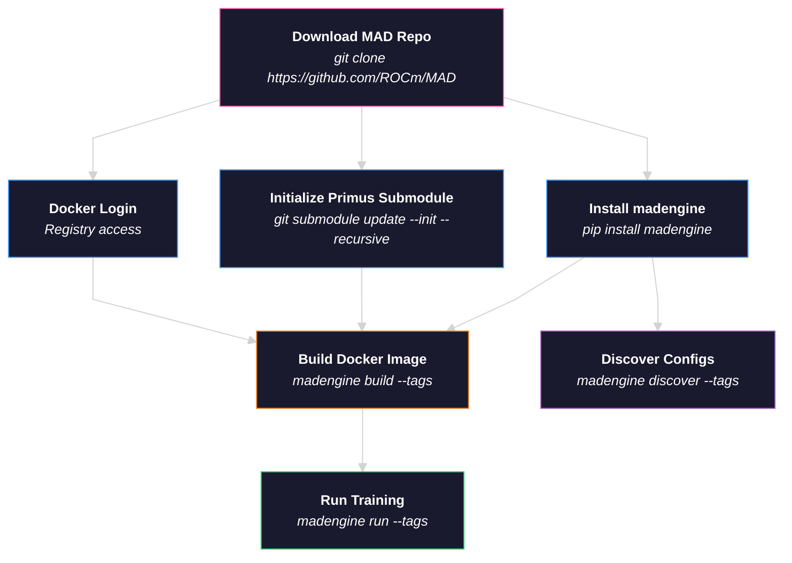

# Performance Validation of Primus on AMD Instinct Accelerators

## Primus

Primus is a unified training framework designed to enable efficient training of large-scale foundation models on AMD GPUs. It supports multiple backends including **Megatron**, **TorchTitan**, and **MaxText**, with full CLI support for container-based and bare-metal execution.

We recommend running directly within the Primus repository for best performance and full feature access. For setup instructions, CLI usage, and detailed documentation:

- **Primus Repo**: [github.com/AMD-AGI/Primus](https://github.com/AMD-AGI/Primus/blob/main/README.md)
- **Primus Documentation**: [rocm.docs.amd.com/projects/primus](https://rocm.docs.amd.com/projects/primus/en/latest)

The sections below explain how to run Primus training through the MAD/madengine workflow for automated benchmarking and CI integration.

---

## Training Flow Diagram

The following diagram illustrates the end-to-end flow of how a Primus model is trained using madengine, from user CLI commands through the internal container invocation chain.

### User Workflow (madengine CLI)



---

# Training Procedure

The following set of instructions depends on the [madengine](https://github.com/ROCm/madengine) library to simplify model training and benchmarking with Primus.

## 1. Prerequisites

Install `madengine` and ensure you are running commands from the MAD repository root directory (where `models.json` is located).

```bash
pip install git+https://github.com/ROCm/madengine.git
```

Log in to Docker for image registry access:

```bash
docker login
```

> **Note:** If this is your first time running with the Primus submodule, initialize it from the
> MAD repository root (`git submodule update` refuses to run anywhere else):
>
> ```bash
> cd /path/to/MAD
> git submodule update --init --recursive scripts/Primus
> ```

---

## 2. Single Node Training

Training with madengine is a two-step process: build the Docker image, then run the model.

First, navigate to the MAD repository root:

```bash
cd /path/to/MAD/
```

### Step 1: Build the Docker image

Build the Docker image with the model config file of choice:

**Megatron backend:**
```bash
madengine build --tags primus_train/megatron_MI300X_llama3.1_8B-BF16-pretrain --additional-context '{"gpu_vendor": "AMD", "guest_os": "UBUNTU"}'
```

**TorchTitan backend:**
```bash
madengine build --tags primus_train/torchtitan_MI300X_llama3.1_8B-BF16-pretrain --additional-context '{"gpu_vendor": "AMD", "guest_os": "UBUNTU"}'
```

The base Docker image is defined in `docker/primus.ubuntu.amd.Dockerfile`. To use a different base image (e.g., a newer Primus release), edit the `BASE_DOCKER` argument at the top of that file:

```dockerfile
ARG BASE_DOCKER=rocm/primus:v26.6
```

> **Note:** `MAD_SYSTEM_GPU_ARCHITECTURE` is automatically detected at runtime via `rocminfo`. You do not need to provide it during the build step.

### Step 2: Run the model

Run the model with the built image:

**Megatron backend:**
```bash
madengine run --tags primus_train/megatron_MI300X_llama3.1_8B-BF16-pretrain --live-output
```

**TorchTitan backend:**
```bash
madengine run --tags primus_train/torchtitan_MI300X_llama3.1_8B-BF16-pretrain --live-output
```

> **Note:** `--live-output` is optional. It streams the training logs to your terminal in real time.

The tag follows the naming convention `primus_train/<backend>_<GPU_ARCH>_<MODEL_CONFIG>`, where:
- `<backend>` is the Primus launcher: `megatron`, `torchtitan`, `megatron_bridge`, `maxtext`,
  `maxdiffusion`, `nemo_automodel`, `diffusion`, or `moe_package`
- `<GPU_ARCH>` is the target accelerator (`MI300X`, `MI325X`, or `MI355X`)
- `<MODEL_CONFIG>` matches the YAML filename under `examples/<backend>/configs/<GPU_ARCH>/`

Tags are discovered from the Primus submodule at run time by
`scripts/primus_train/get_models_json.py`, so any config present in the pinned Primus
checkout is runnable even if it is not listed below.

### Passing Environment Variables to the Container

To pass environment variables into the running container, use the `docker_env_vars` field in `--additional-context`:

```bash
madengine run --tags primus_train/megatron_MI300X_llama3.1_8B-BF16-pretrain --live-output --additional-context '{"docker_env_vars": {"MAD_SECRETS_HFTOKEN": "<your_hf_token>", "HSA_NO_SCRATCH_RECLAIM": "1"}}'
```

> **Note:** `MAD_SECRETS_HFTOKEN` is only required when training with real data (i.e., `mock_data: false` in the config). The default configs use mock data and do not require a token. Inside the container, this is automatically mapped to `HF_TOKEN`.

---

## 3. Multi-node Training

> **Not yet supported.** Multi-node training via madengine is not yet available. Multi-node support is planned for a future release.

---

## 4. Model Discovery / Supported Configs

To discover all supported model configurations, use the model discover feature:

```bash
# List all Primus model configs
madengine discover --tags primus

# List all MI300X model configs
madengine discover --tags MI300X

# List all Megatron configs
madengine discover --tags megatron

# List all TorchTitan configs
madengine discover --tags torchtitan
```

---

## 5. Supported Models

Tables below are generated from the pinned Primus submodule (`release/v26.6`) and list every
config `madengine discover` will report. The `Model` column is derived from the config filename
(with precision appended when the config has one); the `Tag` column is what you pass to
`madengine build` / `madengine run`.

> **Changed in v26.6**
> - Zebra-Llama (`zebra_llama_1B/3B/8B`) configs were removed upstream; those tags no longer resolve.
> - TorchTitan `deepseek_v3_16b-pretrain` split into `-BF16-pretrain` and `-FP8-pretrain`.
> - MaxText configs renamed from `<model>-pretrain` to explicit `<model>-bf16-pretrain` /
>   `<model>-fp8-pretrain` (`-nanoo_fp8-pretrain` on MI300X).
> - New Megatron families: GDN, KDA, Hylo hybrids (`hylo_llama_*`), and Kimi-K3.
> - Two new launchers: MaxDiffusion and NeMo-AutoModel.

---

### Megatron Backend

You can also check the Primus repository directly for the latest supported configs:

- [MI300X configs](https://github.com/AMD-AGI/Primus/tree/release/v26.6/examples/megatron/configs/MI300X)
- [MI325X configs](https://github.com/AMD-AGI/Primus/tree/release/v26.6/examples/megatron/configs/MI325X)
- [MI355X configs](https://github.com/AMD-AGI/Primus/tree/release/v26.6/examples/megatron/configs/MI355X)

#### MI300X Configs (88)

| Model | Tag |
| --- | --- |
| Deepseek v2 BF16 | `primus_train/megatron_MI300X_deepseek_v2-BF16-pretrain` |
| Deepseek v2 FP8 | `primus_train/megatron_MI300X_deepseek_v2-FP8-pretrain` |
| Deepseek v2 lite BF16 | `primus_train/megatron_MI300X_deepseek_v2_lite-BF16-pretrain` |
| Deepseek v2 lite FP8 | `primus_train/megatron_MI300X_deepseek_v2_lite-FP8-pretrain` |
| Deepseek v3 BF16 | `primus_train/megatron_MI300X_deepseek_v3-BF16-pretrain` |
| Deepseek v3 FP8 | `primus_train/megatron_MI300X_deepseek_v3-FP8-pretrain` |
| Flux 12b ddp energon schnell resample local spec FP8 | `primus_train/megatron_MI300X_flux_12b_ddp_energon_schnell_resample_local_spec_fp8` |
| Flux 12b ddp energon schnell resample te spec | `primus_train/megatron_MI300X_flux_12b_ddp_energon_schnell_resample_te_spec` |
| Flux 12b ddp energon schnell resample te spec FP8 | `primus_train/megatron_MI300X_flux_12b_ddp_energon_schnell_resample_te_spec_fp8` |
| Flux 12b fsdp2 energon schnell resample local spec | `primus_train/megatron_MI300X_flux_12b_fsdp2_energon_schnell_resample_local_spec` |
| Flux 12b fsdp2 energon schnell resample local spec FP8 | `primus_train/megatron_MI300X_flux_12b_fsdp2_energon_schnell_resample_local_spec_fp8` |
| Flux 535m | `primus_train/megatron_MI300X_flux_535m_pretrain` |
| Flux 535m pretrain FP8 | `primus_train/megatron_MI300X_flux_535m_pretrain_fp8` |
| Flux 535m with guidance embed | `primus_train/megatron_MI300X_flux_535m_with_guidance_embed` |
| Gdn 1B-100B BF16 | `primus_train/megatron_MI300X_gdn_1B_BF16-100B-pretrain` |
| Gdn 1B-exp7-fsdp-overlap BF16 | `primus_train/megatron_MI300X_gdn_1B_BF16-exp7-fsdp-overlap` |
| Gdn 1B BF16 | `primus_train/megatron_MI300X_gdn_1B_BF16-pretrain` |
| Gdn 300M BF16 | `primus_train/megatron_MI300X_gdn_300M_BF16-pretrain` |
| Gpt oss 20B BF16 | `primus_train/megatron_MI300X_gpt_oss_20B-BF16-pretrain` |
| Gpt oss 20B FP8 | `primus_train/megatron_MI300X_gpt_oss_20B-FP8-pretrain` |
| Grok1 BF16 | `primus_train/megatron_MI300X_grok1-BF16-pretrain` |
| Grok1 FP8 | `primus_train/megatron_MI300X_grok1-FP8-pretrain` |
| Grok2 BF16 | `primus_train/megatron_MI300X_grok2-BF16-pretrain` |
| Grok2 FP8 | `primus_train/megatron_MI300X_grok2-FP8-pretrain` |
| Hylo llama gdn 1B BF16 | `primus_train/megatron_MI300X_hylo_llama_gdn_1B_BF16-pretrain` |
| Hylo llama gdn 300M BF16 | `primus_train/megatron_MI300X_hylo_llama_gdn_300M_BF16-pretrain` |
| Hylo llama kda 1B BF16 | `primus_train/megatron_MI300X_hylo_llama_kda_1B_BF16-pretrain` |
| Hylo llama mamba 1B BF16 | `primus_train/megatron_MI300X_hylo_llama_mamba_1B_BF16-pretrain` |
| Hylo llama mamba 300M BF16 | `primus_train/megatron_MI300X_hylo_llama_mamba_300M_BF16-pretrain` |
| Hylo llama mamba 3B BF16 | `primus_train/megatron_MI300X_hylo_llama_mamba_3B_BF16-pretrain` |
| Hylo llama mamba 8B BF16 | `primus_train/megatron_MI300X_hylo_llama_mamba_8B_BF16-pretrain` |
| Kda 1B BF16 | `primus_train/megatron_MI300X_kda_1B_BF16-pretrain` |
| Kda 300M BF16 | `primus_train/megatron_MI300X_kda_300M_BF16-pretrain` |
| Llama2 13B BF16 | `primus_train/megatron_MI300X_llama2_13B-BF16-pretrain` |
| Llama2 13B FP8 | `primus_train/megatron_MI300X_llama2_13B-FP8-pretrain` |
| Llama2 70B BF16 | `primus_train/megatron_MI300X_llama2_70B-BF16-pretrain` |
| Llama2 70B FP8 | `primus_train/megatron_MI300X_llama2_70B-FP8-pretrain` |
| Llama2 7B BF16 | `primus_train/megatron_MI300X_llama2_7B-BF16-pretrain` |
| Llama2 7B FP8 | `primus_train/megatron_MI300X_llama2_7B-FP8-pretrain` |
| Llama3.1 405B BF16 | `primus_train/megatron_MI300X_llama3.1_405B-BF16-pretrain` |
| Llama3.1 405B FP8 | `primus_train/megatron_MI300X_llama3.1_405B-FP8-pretrain` |
| Llama3.1 70B BF16 | `primus_train/megatron_MI300X_llama3.1_70B-BF16-pretrain` |
| Llama3.1 70B FP8 | `primus_train/megatron_MI300X_llama3.1_70B-FP8-pretrain` |
| Llama3.1 8B BF16 | `primus_train/megatron_MI300X_llama3.1_8B-BF16-pretrain` |
| Llama3.1 8B FP8 | `primus_train/megatron_MI300X_llama3.1_8B-FP8-pretrain` |
| Llama3.2 1B BF16 | `primus_train/megatron_MI300X_llama3.2_1B-BF16-pretrain` |
| Llama3.2 1B FP8 | `primus_train/megatron_MI300X_llama3.2_1B-FP8-pretrain` |
| Llama3.2 3B BF16 | `primus_train/megatron_MI300X_llama3.2_3B-BF16-pretrain` |
| Llama3.2 3B FP8 | `primus_train/megatron_MI300X_llama3.2_3B-FP8-pretrain` |
| Llama3.3 70B BF16 | `primus_train/megatron_MI300X_llama3.3_70B-BF16-pretrain` |
| Llama3.3 70B FP8 | `primus_train/megatron_MI300X_llama3.3_70B-FP8-pretrain` |
| Llama3 70B BF16 | `primus_train/megatron_MI300X_llama3_70B-BF16-pretrain` |
| Llama3 70B FP8 | `primus_train/megatron_MI300X_llama3_70B-FP8-pretrain` |
| Llama3 8B BF16 | `primus_train/megatron_MI300X_llama3_8B-BF16-pretrain` |
| Llama3 8B FP8 | `primus_train/megatron_MI300X_llama3_8B-FP8-pretrain` |
| Llama4 17B128E BF16 | `primus_train/megatron_MI300X_llama4_17B128E-BF16-pretrain` |
| Llama4 17B128E FP8 | `primus_train/megatron_MI300X_llama4_17B128E-FP8-pretrain` |
| Llama4 17B16E BF16 | `primus_train/megatron_MI300X_llama4_17B16E-BF16-pretrain` |
| Llama4 17B16E FP8 | `primus_train/megatron_MI300X_llama4_17B16E-FP8-pretrain` |
| Mamba 370M | `primus_train/megatron_MI300X_mamba_370M-pretrain` |
| Mixtral 8x22B v0.1 BF16 | `primus_train/megatron_MI300X_mixtral_8x22B_v0.1-BF16-pretrain` |
| Mixtral 8x22B v0.1 FP8 | `primus_train/megatron_MI300X_mixtral_8x22B_v0.1-FP8-pretrain` |
| Mixtral 8x7B v0.1 BF16 | `primus_train/megatron_MI300X_mixtral_8x7B_v0.1-BF16-pretrain` |
| Mixtral 8x7B v0.1 FP8 | `primus_train/megatron_MI300X_mixtral_8x7B_v0.1-FP8-pretrain` |
| Qwen2.5 14B BF16 | `primus_train/megatron_MI300X_qwen2.5_14B-BF16-pretrain` |
| Qwen2.5 14B FP8 | `primus_train/megatron_MI300X_qwen2.5_14B-FP8-pretrain` |
| Qwen2.5 32B BF16 | `primus_train/megatron_MI300X_qwen2.5_32B-BF16-pretrain` |
| Qwen2.5 32B FP8 | `primus_train/megatron_MI300X_qwen2.5_32B-FP8-pretrain` |
| Qwen2.5 3B BF16 | `primus_train/megatron_MI300X_qwen2.5_3B-BF16-pretrain` |
| Qwen2.5 3B FP8 | `primus_train/megatron_MI300X_qwen2.5_3B-FP8-pretrain` |
| Qwen2.5 72B BF16 | `primus_train/megatron_MI300X_qwen2.5_72B-BF16-pretrain` |
| Qwen2.5 72B FP8 | `primus_train/megatron_MI300X_qwen2.5_72B-FP8-pretrain` |
| Qwen2.5 7B BF16 | `primus_train/megatron_MI300X_qwen2.5_7B-BF16-pretrain` |
| Qwen2.5 7B FP8 | `primus_train/megatron_MI300X_qwen2.5_7B-FP8-pretrain` |
| Qwen3 14B BF16 | `primus_train/megatron_MI300X_qwen3_14B-BF16-pretrain` |
| Qwen3 14B FP8 | `primus_train/megatron_MI300X_qwen3_14B-FP8-pretrain` |
| Qwen3 235B A22B BF16 | `primus_train/megatron_MI300X_qwen3_235B_A22B-BF16-pretrain` |
| Qwen3 235B A22B FP8 | `primus_train/megatron_MI300X_qwen3_235B_A22B-FP8-pretrain` |
| Qwen3 30B A3B BF16 | `primus_train/megatron_MI300X_qwen3_30B_A3B-BF16-pretrain` |
| Qwen3 30B A3B FP8 | `primus_train/megatron_MI300X_qwen3_30B_A3B-FP8-pretrain` |
| Qwen3 32B BF16 | `primus_train/megatron_MI300X_qwen3_32B-BF16-pretrain` |
| Qwen3 32B FP8 | `primus_train/megatron_MI300X_qwen3_32B-FP8-pretrain` |
| Qwen3 4B BF16 | `primus_train/megatron_MI300X_qwen3_4B-BF16-pretrain` |
| Qwen3 4B FP8 | `primus_train/megatron_MI300X_qwen3_4B-FP8-pretrain` |
| Qwen3 5 35B A3B BF16 | `primus_train/megatron_MI300X_qwen3_5_35B_A3B-BF16-pretrain` |
| Qwen3 5 35B A3B FP8 | `primus_train/megatron_MI300X_qwen3_5_35B_A3B-FP8-pretrain` |
| Qwen3 8B BF16 | `primus_train/megatron_MI300X_qwen3_8B-BF16-pretrain` |
| Qwen3 8B FP8 | `primus_train/megatron_MI300X_qwen3_8B-FP8-pretrain` |

#### MI325X Configs (68)

| Model | Tag |
| --- | --- |
| Deepseek v2 BF16 | `primus_train/megatron_MI325X_deepseek_v2-BF16-pretrain` |
| Deepseek v2 FP8 | `primus_train/megatron_MI325X_deepseek_v2-FP8-pretrain` |
| Deepseek v2 lite BF16 | `primus_train/megatron_MI325X_deepseek_v2_lite-BF16-pretrain` |
| Deepseek v2 lite FP8 | `primus_train/megatron_MI325X_deepseek_v2_lite-FP8-pretrain` |
| Deepseek v3 BF16 | `primus_train/megatron_MI325X_deepseek_v3-BF16-pretrain` |
| Deepseek v3 FP8 | `primus_train/megatron_MI325X_deepseek_v3-FP8-pretrain` |
| Gpt oss 20B BF16 | `primus_train/megatron_MI325X_gpt_oss_20B-BF16-pretrain` |
| Gpt oss 20B FP8 | `primus_train/megatron_MI325X_gpt_oss_20B-FP8-pretrain` |
| Grok1 BF16 | `primus_train/megatron_MI325X_grok1-BF16-pretrain` |
| Grok1 FP8 | `primus_train/megatron_MI325X_grok1-FP8-pretrain` |
| Grok2 BF16 | `primus_train/megatron_MI325X_grok2-BF16-pretrain` |
| Grok2 FP8 | `primus_train/megatron_MI325X_grok2-FP8-pretrain` |
| Hylo llama mamba 1B BF16 | `primus_train/megatron_MI325X_hylo_llama_mamba_1B_BF16-pretrain` |
| Hylo llama mamba 3B BF16 | `primus_train/megatron_MI325X_hylo_llama_mamba_3B_BF16-pretrain` |
| Hylo llama mamba 8B BF16 | `primus_train/megatron_MI325X_hylo_llama_mamba_8B_BF16-pretrain` |
| Llama2 13B BF16 | `primus_train/megatron_MI325X_llama2_13B-BF16-pretrain` |
| Llama2 13B FP8 | `primus_train/megatron_MI325X_llama2_13B-FP8-pretrain` |
| Llama2 70B BF16 | `primus_train/megatron_MI325X_llama2_70B-BF16-pretrain` |
| Llama2 70B FP8 | `primus_train/megatron_MI325X_llama2_70B-FP8-pretrain` |
| Llama2 7B BF16 | `primus_train/megatron_MI325X_llama2_7B-BF16-pretrain` |
| Llama2 7B FP8 | `primus_train/megatron_MI325X_llama2_7B-FP8-pretrain` |
| Llama3.1 405B BF16 | `primus_train/megatron_MI325X_llama3.1_405B-BF16-pretrain` |
| Llama3.1 405B FP8 | `primus_train/megatron_MI325X_llama3.1_405B-FP8-pretrain` |
| Llama3.1 70B BF16 | `primus_train/megatron_MI325X_llama3.1_70B-BF16-pretrain` |
| Llama3.1 70B FP8 | `primus_train/megatron_MI325X_llama3.1_70B-FP8-pretrain` |
| Llama3.1 8B BF16 | `primus_train/megatron_MI325X_llama3.1_8B-BF16-pretrain` |
| Llama3.1 8B FP8 | `primus_train/megatron_MI325X_llama3.1_8B-FP8-pretrain` |
| Llama3.2 1B BF16 | `primus_train/megatron_MI325X_llama3.2_1B-BF16-pretrain` |
| Llama3.2 1B FP8 | `primus_train/megatron_MI325X_llama3.2_1B-FP8-pretrain` |
| Llama3.2 3B BF16 | `primus_train/megatron_MI325X_llama3.2_3B-BF16-pretrain` |
| Llama3.2 3B FP8 | `primus_train/megatron_MI325X_llama3.2_3B-FP8-pretrain` |
| Llama3.3 70B BF16 | `primus_train/megatron_MI325X_llama3.3_70B-BF16-pretrain` |
| Llama3.3 70B FP8 | `primus_train/megatron_MI325X_llama3.3_70B-FP8-pretrain` |
| Llama3 70B BF16 | `primus_train/megatron_MI325X_llama3_70B-BF16-pretrain` |
| Llama3 70B FP8 | `primus_train/megatron_MI325X_llama3_70B-FP8-pretrain` |
| Llama3 8B BF16 | `primus_train/megatron_MI325X_llama3_8B-BF16-pretrain` |
| Llama3 8B FP8 | `primus_train/megatron_MI325X_llama3_8B-FP8-pretrain` |
| Llama4 17B128E BF16 | `primus_train/megatron_MI325X_llama4_17B128E-BF16-pretrain` |
| Llama4 17B128E FP8 | `primus_train/megatron_MI325X_llama4_17B128E-FP8-pretrain` |
| Llama4 17B16E BF16 | `primus_train/megatron_MI325X_llama4_17B16E-BF16-pretrain` |
| Llama4 17B16E FP8 | `primus_train/megatron_MI325X_llama4_17B16E-FP8-pretrain` |
| Mamba 370M | `primus_train/megatron_MI325X_mamba_370M-pretrain` |
| Mixtral 8x22B v0.1 BF16 | `primus_train/megatron_MI325X_mixtral_8x22B_v0.1-BF16-pretrain` |
| Mixtral 8x22B v0.1 FP8 | `primus_train/megatron_MI325X_mixtral_8x22B_v0.1-FP8-pretrain` |
| Mixtral 8x7B v0.1 BF16 | `primus_train/megatron_MI325X_mixtral_8x7B_v0.1-BF16-pretrain` |
| Mixtral 8x7B v0.1 FP8 | `primus_train/megatron_MI325X_mixtral_8x7B_v0.1-FP8-pretrain` |
| Qwen2.5 14B BF16 | `primus_train/megatron_MI325X_qwen2.5_14B-BF16-pretrain` |
| Qwen2.5 14B FP8 | `primus_train/megatron_MI325X_qwen2.5_14B-FP8-pretrain` |
| Qwen2.5 32B BF16 | `primus_train/megatron_MI325X_qwen2.5_32B-BF16-pretrain` |
| Qwen2.5 32B FP8 | `primus_train/megatron_MI325X_qwen2.5_32B-FP8-pretrain` |
| Qwen2.5 3B BF16 | `primus_train/megatron_MI325X_qwen2.5_3B-BF16-pretrain` |
| Qwen2.5 3B FP8 | `primus_train/megatron_MI325X_qwen2.5_3B-FP8-pretrain` |
| Qwen2.5 72B BF16 | `primus_train/megatron_MI325X_qwen2.5_72B-BF16-pretrain` |
| Qwen2.5 72B FP8 | `primus_train/megatron_MI325X_qwen2.5_72B-FP8-pretrain` |
| Qwen2.5 7B BF16 | `primus_train/megatron_MI325X_qwen2.5_7B-BF16-pretrain` |
| Qwen2.5 7B FP8 | `primus_train/megatron_MI325X_qwen2.5_7B-FP8-pretrain` |
| Qwen3 14B BF16 | `primus_train/megatron_MI325X_qwen3_14B-BF16-pretrain` |
| Qwen3 14B FP8 | `primus_train/megatron_MI325X_qwen3_14B-FP8-pretrain` |
| Qwen3 235B A22B BF16 | `primus_train/megatron_MI325X_qwen3_235B_A22B-BF16-pretrain` |
| Qwen3 235B A22B FP8 | `primus_train/megatron_MI325X_qwen3_235B_A22B-FP8-pretrain` |
| Qwen3 30B A3B BF16 | `primus_train/megatron_MI325X_qwen3_30B_A3B-BF16-pretrain` |
| Qwen3 30B A3B FP8 | `primus_train/megatron_MI325X_qwen3_30B_A3B-FP8-pretrain` |
| Qwen3 32B BF16 | `primus_train/megatron_MI325X_qwen3_32B-BF16-pretrain` |
| Qwen3 32B FP8 | `primus_train/megatron_MI325X_qwen3_32B-FP8-pretrain` |
| Qwen3 4B BF16 | `primus_train/megatron_MI325X_qwen3_4B-BF16-pretrain` |
| Qwen3 4B FP8 | `primus_train/megatron_MI325X_qwen3_4B-FP8-pretrain` |
| Qwen3 8B BF16 | `primus_train/megatron_MI325X_qwen3_8B-BF16-pretrain` |
| Qwen3 8B FP8 | `primus_train/megatron_MI325X_qwen3_8B-FP8-pretrain` |

#### MI355X Configs (124)

| Model | Tag |
| --- | --- |
| Deepseek1.5B-odc-lbmini | `primus_train/megatron_MI355X_deepseek1.5B-odc-lbmini` |
| Deepseek v2 BF16 | `primus_train/megatron_MI355X_deepseek_v2-BF16-pretrain` |
| Deepseek v2 FP8 | `primus_train/megatron_MI355X_deepseek_v2-FP8-pretrain` |
| Deepseek v2 lite BF16 | `primus_train/megatron_MI355X_deepseek_v2_lite-BF16-pretrain` |
| Deepseek v2 lite-sft-packed-bridge aligned BF16 | `primus_train/megatron_MI355X_deepseek_v2_lite-BF16-sft-packed-bridge_aligned` |
| Deepseek v2 lite-sft-packed BF16 | `primus_train/megatron_MI355X_deepseek_v2_lite-BF16-sft-packed` |
| Deepseek v2 lite-sft BF16 | `primus_train/megatron_MI355X_deepseek_v2_lite-BF16-sft` |
| Deepseek v2 lite FP8 | `primus_train/megatron_MI355X_deepseek_v2_lite-FP8-pretrain` |
| Deepseek v3 BF16 | `primus_train/megatron_MI355X_deepseek_v3-BF16-pretrain` |
| Deepseek v3 FP8 | `primus_train/megatron_MI355X_deepseek_v3-FP8-pretrain` |
| Deepseek v4 flash BF16 | `primus_train/megatron_MI355X_deepseek_v4_flash-BF16-pretrain` |
| Deepseek v4 flash FP8 | `primus_train/megatron_MI355X_deepseek_v4_flash-FP8-pretrain` |
| Flux 12b ddp energon schnell resample local spec FP8 | `primus_train/megatron_MI355X_flux_12b_ddp_energon_schnell_resample_local_spec_fp8` |
| Flux 12b ddp energon schnell resample local spec mlperf FP8 | `primus_train/megatron_MI355X_flux_12b_ddp_energon_schnell_resample_local_spec_fp8_mlperf` |
| Flux 12b ddp energon schnell resample local spec mxfp4 | `primus_train/megatron_MI355X_flux_12b_ddp_energon_schnell_resample_local_spec_mxfp4` |
| Flux 12b ddp energon schnell resample te spec | `primus_train/megatron_MI355X_flux_12b_ddp_energon_schnell_resample_te_spec` |
| Flux 12b ddp energon schnell resample te spec FP8 | `primus_train/megatron_MI355X_flux_12b_ddp_energon_schnell_resample_te_spec_fp8` |
| Flux 12b ddp energon schnell resample te spec mlperf FP8 | `primus_train/megatron_MI355X_flux_12b_ddp_energon_schnell_resample_te_spec_fp8_mlperf` |
| Flux 12b ddp energon schnell resample te spec mxfp4 | `primus_train/megatron_MI355X_flux_12b_ddp_energon_schnell_resample_te_spec_mxfp4` |
| Flux 12b fsdp2 energon schnell resample local spec | `primus_train/megatron_MI355X_flux_12b_fsdp2_energon_schnell_resample_local_spec` |
| Flux 12b fsdp2 energon schnell resample local spec FP8 | `primus_train/megatron_MI355X_flux_12b_fsdp2_energon_schnell_resample_local_spec_fp8` |
| Flux 535m | `primus_train/megatron_MI355X_flux_535m_pretrain` |
| Flux 535m pretrain FP8 | `primus_train/megatron_MI355X_flux_535m_pretrain_fp8` |
| Flux 535m with guidance embed | `primus_train/megatron_MI355X_flux_535m_with_guidance_embed` |
| Gdn 1B BF16 | `primus_train/megatron_MI355X_gdn_1B_BF16-pretrain` |
| Gdn 300M BF16 | `primus_train/megatron_MI355X_gdn_300M_BF16-pretrain` |
| Glm5 BF16 | `primus_train/megatron_MI355X_glm5-BF16-pretrain` |
| Glm5 FP8 | `primus_train/megatron_MI355X_glm5-FP8-pretrain` |
| Gpt oss 120B BF16 | `primus_train/megatron_MI355X_gpt_oss_120B-BF16-pretrain` |
| Gpt oss 120B FP8 | `primus_train/megatron_MI355X_gpt_oss_120B-FP8-pretrain` |
| Gpt oss 20B BF16 | `primus_train/megatron_MI355X_gpt_oss_20B-BF16-pretrain` |
| Gpt oss 20B-mlperf FP8 | `primus_train/megatron_MI355X_gpt_oss_20B-FP8-mlperf-pretrain` |
| Gpt oss 20B FP8 | `primus_train/megatron_MI355X_gpt_oss_20B-FP8-pretrain` |
| Grok1 BF16 | `primus_train/megatron_MI355X_grok1-BF16-pretrain` |
| Grok1 FP8 | `primus_train/megatron_MI355X_grok1-FP8-pretrain` |
| Grok2 BF16 | `primus_train/megatron_MI355X_grok2-BF16-pretrain` |
| Grok2 FP8 | `primus_train/megatron_MI355X_grok2-FP8-pretrain` |
| Hylo llama gdn 1B BF16 | `primus_train/megatron_MI355X_hylo_llama_gdn_1B_BF16-pretrain` |
| Hylo llama kda 1B BF16 | `primus_train/megatron_MI355X_hylo_llama_kda_1B_BF16-pretrain` |
| Hylo llama mamba 1B BF16 | `primus_train/megatron_MI355X_hylo_llama_mamba_1B_BF16-pretrain` |
| Hylo llama mamba 3B BF16 | `primus_train/megatron_MI355X_hylo_llama_mamba_3B_BF16-pretrain` |
| Hylo llama mamba 8B BF16 | `primus_train/megatron_MI355X_hylo_llama_mamba_8B_BF16-pretrain` |
| Kda 1B BF16 | `primus_train/megatron_MI355X_kda_1B_BF16-pretrain` |
| Kda 300M BF16 | `primus_train/megatron_MI355X_kda_300M_BF16-pretrain` |
| Kimi k2 BF16 | `primus_train/megatron_MI355X_kimi_k2-BF16-pretrain` |
| Kimi k2 FP8 | `primus_train/megatron_MI355X_kimi_k2-FP8-pretrain` |
| Kimi k3-8L-official BF16 | `primus_train/megatron_MI355X_kimi_k3-BF16-8L-official` |
| Kimi k3-curve BF16 | `primus_train/megatron_MI355X_kimi_k3-BF16-curve` |
| Lfm2 8B A1B BF16 | `primus_train/megatron_MI355X_lfm2_8B_A1B-BF16-pretrain` |
| Lfm2 8B A1B FP8 | `primus_train/megatron_MI355X_lfm2_8B_A1B-FP8-pretrain` |
| Lfm2 8B A1B-te-precision FP8 | `primus_train/megatron_MI355X_lfm2_8B_A1B-FP8-te-precision` |
| Llama2 13B BF16 | `primus_train/megatron_MI355X_llama2_13B-BF16-pretrain` |
| Llama2 13B FP8 | `primus_train/megatron_MI355X_llama2_13B-FP8-pretrain` |
| Llama2 70B BF16 | `primus_train/megatron_MI355X_llama2_70B-BF16-pretrain` |
| Llama2 70B-sft-packed-bridge aligned BF16 | `primus_train/megatron_MI355X_llama2_70B-BF16-sft-packed-bridge_aligned` |
| Llama2 70B-sft-packed-mlperf aligned BF16 | `primus_train/megatron_MI355X_llama2_70B-BF16-sft-packed-mlperf_aligned` |
| Llama2 70B FP8 | `primus_train/megatron_MI355X_llama2_70B-FP8-pretrain` |
| Llama2 70B-sft-packed-perf FP8 | `primus_train/megatron_MI355X_llama2_70B-FP8-sft-packed-perf` |
| Llama2 7B BF16 | `primus_train/megatron_MI355X_llama2_7B-BF16-pretrain` |
| Llama2 7B FP8 | `primus_train/megatron_MI355X_llama2_7B-FP8-pretrain` |
| Llama3.1 405B BF16 | `primus_train/megatron_MI355X_llama3.1_405B-BF16-pretrain` |
| Llama3.1 405B FP8 | `primus_train/megatron_MI355X_llama3.1_405B-FP8-pretrain` |
| Llama3.1 70B BF16 | `primus_train/megatron_MI355X_llama3.1_70B-BF16-pretrain` |
| Llama3.1 70B FP8 | `primus_train/megatron_MI355X_llama3.1_70B-FP8-pretrain` |
| Llama3.1 8B BF16 | `primus_train/megatron_MI355X_llama3.1_8B-BF16-pretrain` |
| Llama3.1 8B FP8 | `primus_train/megatron_MI355X_llama3.1_8B-FP8-pretrain` |
| Llama3.1 8B MXFP4 | `primus_train/megatron_MI355X_llama3.1_8B-MXFP4-pretrain` |
| Llama3.1 8B MXFP8 | `primus_train/megatron_MI355X_llama3.1_8B-MXFP8-pretrain` |
| Llama3.2 1B BF16 | `primus_train/megatron_MI355X_llama3.2_1B-BF16-pretrain` |
| Llama3.2 1B FP8 | `primus_train/megatron_MI355X_llama3.2_1B-FP8-pretrain` |
| Llama3.2 3B BF16 | `primus_train/megatron_MI355X_llama3.2_3B-BF16-pretrain` |
| Llama3.2 3B FP8 | `primus_train/megatron_MI355X_llama3.2_3B-FP8-pretrain` |
| Llama3.3 70B BF16 | `primus_train/megatron_MI355X_llama3.3_70B-BF16-pretrain` |
| Llama3.3 70B FP8 | `primus_train/megatron_MI355X_llama3.3_70B-FP8-pretrain` |
| Llama3 70B BF16 | `primus_train/megatron_MI355X_llama3_70B-BF16-pretrain` |
| Llama3 70B FP8 | `primus_train/megatron_MI355X_llama3_70B-FP8-pretrain` |
| Llama3 8B-lora-sft BF16 | `primus_train/megatron_MI355X_llama3_8B-BF16-lora-sft` |
| Llama3 8B BF16 | `primus_train/megatron_MI355X_llama3_8B-BF16-pretrain` |
| Llama3 8B-sft-packed-bridge aligned BF16 | `primus_train/megatron_MI355X_llama3_8B-BF16-sft-packed-bridge_aligned` |
| Llama3 8B-sft-packed-squad BF16 | `primus_train/megatron_MI355X_llama3_8B-BF16-sft-packed-squad` |
| Llama3 8B-sft-packed BF16 | `primus_train/megatron_MI355X_llama3_8B-BF16-sft-packed` |
| Llama3 8B-sft BF16 | `primus_train/megatron_MI355X_llama3_8B-BF16-sft` |
| Llama3 8B FP8 | `primus_train/megatron_MI355X_llama3_8B-FP8-pretrain` |
| Llama4 17B128E BF16 | `primus_train/megatron_MI355X_llama4_17B128E-BF16-pretrain` |
| Llama4 17B128E FP8 | `primus_train/megatron_MI355X_llama4_17B128E-FP8-pretrain` |
| Llama4 17B16E BF16 | `primus_train/megatron_MI355X_llama4_17B16E-BF16-pretrain` |
| Llama4 17B16E FP8 | `primus_train/megatron_MI355X_llama4_17B16E-FP8-pretrain` |
| Mamba 370M | `primus_train/megatron_MI355X_mamba_370M-pretrain` |
| Minimax m2.5 BF16 | `primus_train/megatron_MI355X_minimax_m2.5-BF16-pretrain` |
| Minimax m2.5 FP8 | `primus_train/megatron_MI355X_minimax_m2.5-FP8-pretrain` |
| Mixtral 8x22B v0.1 BF16 | `primus_train/megatron_MI355X_mixtral_8x22B_v0.1-BF16-pretrain` |
| Mixtral 8x22B v0.1 FP8 | `primus_train/megatron_MI355X_mixtral_8x22B_v0.1-FP8-pretrain` |
| Mixtral 8x7B v0.1 BF16 | `primus_train/megatron_MI355X_mixtral_8x7B_v0.1-BF16-pretrain` |
| Mixtral 8x7B v0.1 FP8 | `primus_train/megatron_MI355X_mixtral_8x7B_v0.1-FP8-pretrain` |
| Native hf to megatron sft.template | `primus_train/megatron_MI355X_native_hf_to_megatron_sft.template` |
| Qwen14B-odc-dn | `primus_train/megatron_MI355X_qwen14B-odc-dn` |
| Qwen2.5 14B BF16 | `primus_train/megatron_MI355X_qwen2.5_14B-BF16-pretrain` |
| Qwen2.5 14B FP8 | `primus_train/megatron_MI355X_qwen2.5_14B-FP8-pretrain` |
| Qwen2.5 32B BF16 | `primus_train/megatron_MI355X_qwen2.5_32B-BF16-pretrain` |
| Qwen2.5 32B FP8 | `primus_train/megatron_MI355X_qwen2.5_32B-FP8-pretrain` |
| Qwen2.5 3B BF16 | `primus_train/megatron_MI355X_qwen2.5_3B-BF16-pretrain` |
| Qwen2.5 3B FP8 | `primus_train/megatron_MI355X_qwen2.5_3B-FP8-pretrain` |
| Qwen2.5 72B BF16 | `primus_train/megatron_MI355X_qwen2.5_72B-BF16-pretrain` |
| Qwen2.5 72B FP8 | `primus_train/megatron_MI355X_qwen2.5_72B-FP8-pretrain` |
| Qwen2.5 7B BF16 | `primus_train/megatron_MI355X_qwen2.5_7B-BF16-pretrain` |
| Qwen2.5 7B FP8 | `primus_train/megatron_MI355X_qwen2.5_7B-FP8-pretrain` |
| Qwen3 14B BF16 | `primus_train/megatron_MI355X_qwen3_14B-BF16-pretrain` |
| Qwen3 14B FP8 | `primus_train/megatron_MI355X_qwen3_14B-FP8-pretrain` |
| Qwen3 235B A22B BF16 | `primus_train/megatron_MI355X_qwen3_235B_A22B-BF16-pretrain` |
| Qwen3 235B A22B-sft BF16 | `primus_train/megatron_MI355X_qwen3_235B_A22B-BF16-sft` |
| Qwen3 235B A22B FP8 | `primus_train/megatron_MI355X_qwen3_235B_A22B-FP8-pretrain` |
| Qwen3 235B A22B 4layer-sft BF16 | `primus_train/megatron_MI355X_qwen3_235B_A22B_4layer-BF16-sft` |
| Qwen3 30B A3B BF16 | `primus_train/megatron_MI355X_qwen3_30B_A3B-BF16-pretrain` |
| Qwen3 30B A3B-sft-packed-bridge aligned BF16 | `primus_train/megatron_MI355X_qwen3_30B_A3B-BF16-sft-packed-bridge_aligned` |
| Qwen3 30B A3B-sft-packed BF16 | `primus_train/megatron_MI355X_qwen3_30B_A3B-BF16-sft-packed` |
| Qwen3 30B A3B FP8 | `primus_train/megatron_MI355X_qwen3_30B_A3B-FP8-pretrain` |
| Qwen3 32B BF16 | `primus_train/megatron_MI355X_qwen3_32B-BF16-pretrain` |
| Qwen3 32B FP8 | `primus_train/megatron_MI355X_qwen3_32B-FP8-pretrain` |
| Qwen3 4B BF16 | `primus_train/megatron_MI355X_qwen3_4B-BF16-pretrain` |
| Qwen3 4B FP8 | `primus_train/megatron_MI355X_qwen3_4B-FP8-pretrain` |
| Qwen3 5 35B A3B BF16 | `primus_train/megatron_MI355X_qwen3_5_35B_A3B-BF16-pretrain` |
| Qwen3 5 35B A3B FP8 | `primus_train/megatron_MI355X_qwen3_5_35B_A3B-FP8-pretrain` |
| Qwen3 8B BF16 | `primus_train/megatron_MI355X_qwen3_8B-BF16-pretrain` |
| Qwen3 8B FP8 | `primus_train/megatron_MI355X_qwen3_8B-FP8-pretrain` |

---

### TorchTitan Backend

You can also check the Primus repository directly for the latest supported configs:

- [MI300X configs](https://github.com/AMD-AGI/Primus/tree/release/v26.6/examples/torchtitan/configs/MI300X)
- [MI325X configs](https://github.com/AMD-AGI/Primus/tree/release/v26.6/examples/torchtitan/configs/MI325X)
- [MI355X configs](https://github.com/AMD-AGI/Primus/tree/release/v26.6/examples/torchtitan/configs/MI355X)

#### MI300X Configs (25)

| Model | Tag |
| --- | --- |
| Deepseek v3 16b BF16 | `primus_train/torchtitan_MI300X_deepseek_v3_16b-BF16-pretrain` |
| Deepseek v3 16b FP8 | `primus_train/torchtitan_MI300X_deepseek_v3_16b-FP8-pretrain` |
| Deepseek v3 236b BF16 | `primus_train/torchtitan_MI300X_deepseek_v3_236b-BF16-pretrain` |
| Deepseek v3 236b FP8 | `primus_train/torchtitan_MI300X_deepseek_v3_236b-FP8-pretrain` |
| Deepseek v3 671b | `primus_train/torchtitan_MI300X_deepseek_v3_671b-pretrain` |
| Gpt oss 120B BF16 | `primus_train/torchtitan_MI300X_gpt_oss_120B-BF16-pretrain` |
| Gpt oss 120B FP8 | `primus_train/torchtitan_MI300X_gpt_oss_120B-FP8-pretrain` |
| Gpt oss 20B BF16 | `primus_train/torchtitan_MI300X_gpt_oss_20B-BF16-pretrain` |
| Gpt oss 20B FP8 | `primus_train/torchtitan_MI300X_gpt_oss_20B-FP8-pretrain` |
| Llama3.1 405B BF16 | `primus_train/torchtitan_MI300X_llama3.1_405B-BF16-pretrain` |
| Llama3.1 405B FP8 | `primus_train/torchtitan_MI300X_llama3.1_405B-FP8-pretrain` |
| Llama3.1 70B BF16 | `primus_train/torchtitan_MI300X_llama3.1_70B-BF16-pretrain` |
| Llama3.1 70B FP8 | `primus_train/torchtitan_MI300X_llama3.1_70B-FP8-pretrain` |
| Llama3.1 8B BF16 | `primus_train/torchtitan_MI300X_llama3.1_8B-BF16-pretrain` |
| Llama3.1 8B FP8 | `primus_train/torchtitan_MI300X_llama3.1_8B-FP8-pretrain` |
| Llama4 17Bx128E BF16 | `primus_train/torchtitan_MI300X_llama4_17Bx128E-BF16-pretrain` |
| Llama4 17Bx128E FP8 | `primus_train/torchtitan_MI300X_llama4_17Bx128E-FP8-pretrain` |
| Llama4 17Bx16E BF16 | `primus_train/torchtitan_MI300X_llama4_17Bx16E-BF16-pretrain` |
| Llama4 17Bx16E FP8 | `primus_train/torchtitan_MI300X_llama4_17Bx16E-FP8-pretrain` |
| Qwen3 0.6B | `primus_train/torchtitan_MI300X_qwen3_0.6B-pretrain` |
| Qwen3 1.7B | `primus_train/torchtitan_MI300X_qwen3_1.7B-pretrain` |
| Qwen3 14B | `primus_train/torchtitan_MI300X_qwen3_14B-pretrain` |
| Qwen3 32B | `primus_train/torchtitan_MI300X_qwen3_32B-pretrain` |
| Qwen3 4B | `primus_train/torchtitan_MI300X_qwen3_4B-pretrain` |
| Qwen3 8B | `primus_train/torchtitan_MI300X_qwen3_8B-pretrain` |

#### MI325X Configs (25)

| Model | Tag |
| --- | --- |
| Deepseek v3 16b BF16 | `primus_train/torchtitan_MI325X_deepseek_v3_16b-BF16-pretrain` |
| Deepseek v3 16b FP8 | `primus_train/torchtitan_MI325X_deepseek_v3_16b-FP8-pretrain` |
| Deepseek v3 236b BF16 | `primus_train/torchtitan_MI325X_deepseek_v3_236b-BF16-pretrain` |
| Deepseek v3 236b FP8 | `primus_train/torchtitan_MI325X_deepseek_v3_236b-FP8-pretrain` |
| Deepseek v3 671b | `primus_train/torchtitan_MI325X_deepseek_v3_671b-pretrain` |
| Gpt oss 120B BF16 | `primus_train/torchtitan_MI325X_gpt_oss_120B-BF16-pretrain` |
| Gpt oss 120B FP8 | `primus_train/torchtitan_MI325X_gpt_oss_120B-FP8-pretrain` |
| Gpt oss 20B BF16 | `primus_train/torchtitan_MI325X_gpt_oss_20B-BF16-pretrain` |
| Gpt oss 20B FP8 | `primus_train/torchtitan_MI325X_gpt_oss_20B-FP8-pretrain` |
| Llama3.1 405B BF16 | `primus_train/torchtitan_MI325X_llama3.1_405B-BF16-pretrain` |
| Llama3.1 405B FP8 | `primus_train/torchtitan_MI325X_llama3.1_405B-FP8-pretrain` |
| Llama3.1 70B BF16 | `primus_train/torchtitan_MI325X_llama3.1_70B-BF16-pretrain` |
| Llama3.1 70B FP8 | `primus_train/torchtitan_MI325X_llama3.1_70B-FP8-pretrain` |
| Llama3.1 8B BF16 | `primus_train/torchtitan_MI325X_llama3.1_8B-BF16-pretrain` |
| Llama3.1 8B FP8 | `primus_train/torchtitan_MI325X_llama3.1_8B-FP8-pretrain` |
| Llama4 17Bx128E BF16 | `primus_train/torchtitan_MI325X_llama4_17Bx128E-BF16-pretrain` |
| Llama4 17Bx128E FP8 | `primus_train/torchtitan_MI325X_llama4_17Bx128E-FP8-pretrain` |
| Llama4 17Bx16E BF16 | `primus_train/torchtitan_MI325X_llama4_17Bx16E-BF16-pretrain` |
| Llama4 17Bx16E FP8 | `primus_train/torchtitan_MI325X_llama4_17Bx16E-FP8-pretrain` |
| Qwen3 0.6B | `primus_train/torchtitan_MI325X_qwen3_0.6B-pretrain` |
| Qwen3 1.7B | `primus_train/torchtitan_MI325X_qwen3_1.7B-pretrain` |
| Qwen3 14B | `primus_train/torchtitan_MI325X_qwen3_14B-pretrain` |
| Qwen3 32B | `primus_train/torchtitan_MI325X_qwen3_32B-pretrain` |
| Qwen3 4B | `primus_train/torchtitan_MI325X_qwen3_4B-pretrain` |
| Qwen3 8B | `primus_train/torchtitan_MI325X_qwen3_8B-pretrain` |

#### MI355X Configs (25)

| Model | Tag |
| --- | --- |
| Deepseek v3 16b BF16 | `primus_train/torchtitan_MI355X_deepseek_v3_16b-BF16-pretrain` |
| Deepseek v3 16b FP8 | `primus_train/torchtitan_MI355X_deepseek_v3_16b-FP8-pretrain` |
| Deepseek v3 236b BF16 | `primus_train/torchtitan_MI355X_deepseek_v3_236b-BF16-pretrain` |
| Deepseek v3 236b FP8 | `primus_train/torchtitan_MI355X_deepseek_v3_236b-FP8-pretrain` |
| Deepseek v3 671b | `primus_train/torchtitan_MI355X_deepseek_v3_671b-pretrain` |
| Gpt oss 120B BF16 | `primus_train/torchtitan_MI355X_gpt_oss_120B-BF16-pretrain` |
| Gpt oss 120B FP8 | `primus_train/torchtitan_MI355X_gpt_oss_120B-FP8-pretrain` |
| Gpt oss 20B BF16 | `primus_train/torchtitan_MI355X_gpt_oss_20B-BF16-pretrain` |
| Gpt oss 20B FP8 | `primus_train/torchtitan_MI355X_gpt_oss_20B-FP8-pretrain` |
| Llama3.1 405B BF16 | `primus_train/torchtitan_MI355X_llama3.1_405B-BF16-pretrain` |
| Llama3.1 405B FP8 | `primus_train/torchtitan_MI355X_llama3.1_405B-FP8-pretrain` |
| Llama3.1 70B BF16 | `primus_train/torchtitan_MI355X_llama3.1_70B-BF16-pretrain` |
| Llama3.1 70B FP8 | `primus_train/torchtitan_MI355X_llama3.1_70B-FP8-pretrain` |
| Llama3.1 8B BF16 | `primus_train/torchtitan_MI355X_llama3.1_8B-BF16-pretrain` |
| Llama3.1 8B FP8 | `primus_train/torchtitan_MI355X_llama3.1_8B-FP8-pretrain` |
| Llama4 17Bx128E BF16 | `primus_train/torchtitan_MI355X_llama4_17Bx128E-BF16-pretrain` |
| Llama4 17Bx128E FP8 | `primus_train/torchtitan_MI355X_llama4_17Bx128E-FP8-pretrain` |
| Llama4 17Bx16E BF16 | `primus_train/torchtitan_MI355X_llama4_17Bx16E-BF16-pretrain` |
| Llama4 17Bx16E FP8 | `primus_train/torchtitan_MI355X_llama4_17Bx16E-FP8-pretrain` |
| Qwen3 0.6B | `primus_train/torchtitan_MI355X_qwen3_0.6B-pretrain` |
| Qwen3 1.7B | `primus_train/torchtitan_MI355X_qwen3_1.7B-pretrain` |
| Qwen3 14B | `primus_train/torchtitan_MI355X_qwen3_14B-pretrain` |
| Qwen3 32B | `primus_train/torchtitan_MI355X_qwen3_32B-pretrain` |
| Qwen3 4B | `primus_train/torchtitan_MI355X_qwen3_4B-pretrain` |
| Qwen3 8B | `primus_train/torchtitan_MI355X_qwen3_8B-pretrain` |

---

### Other Backends

These launchers are discovered and runnable through the same `primus_train/` tags, but are not
tabulated here. Use `madengine discover --tags <backend>` for the full list, or browse the configs
in the Primus repository.

| Backend | MI300X | MI325X | MI355X | Configs |
| --- | --- | --- | --- | --- |
| Megatron-Bridge | 9 | — | 9 | [`examples/megatron_bridge/configs`](https://github.com/AMD-AGI/Primus/tree/release/v26.6/examples/megatron_bridge/configs) |
| MaxText | 22 | — | 25 | [`examples/maxtext/configs`](https://github.com/AMD-AGI/Primus/tree/release/v26.6/examples/maxtext/configs) |
| MaxDiffusion | 3 | — | 3 | [`examples/maxdiffusion/configs`](https://github.com/AMD-AGI/Primus/tree/release/v26.6/examples/maxdiffusion/configs) |
| NeMo-AutoModel | — | — | 4 | [`examples/nemo_automodel/configs`](https://github.com/AMD-AGI/Primus/tree/release/v26.6/examples/nemo_automodel/configs) |
| Diffusion | — | — | 6 | [`examples/diffusion/configs`](https://github.com/AMD-AGI/Primus/tree/release/v26.6/examples/diffusion/configs) |
| MoE-Package | — | — | 2 | [`examples/moe_package/configs`](https://github.com/AMD-AGI/Primus/tree/release/v26.6/examples/moe_package/configs) |

> **Note:** MaxDiffusion and MaxText are JAX backends and NeMo-AutoModel requires the
> `third_party/Automodel` submodule; see the Primus documentation for their prerequisites.
