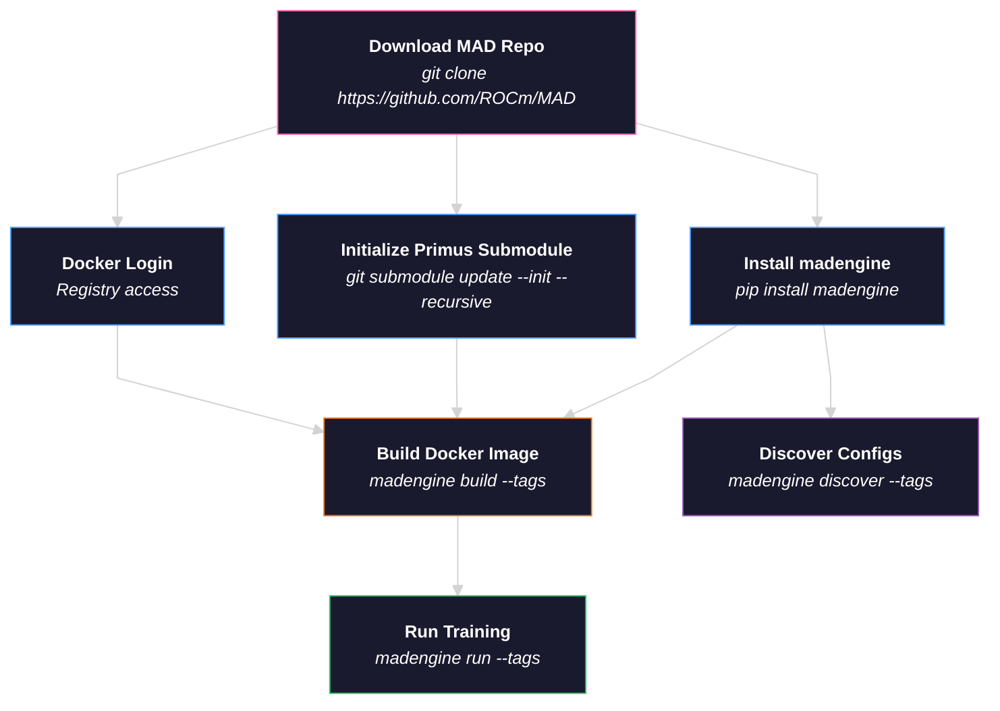

# Performance Validation of Primus on AMD Instinct Accelerators

## Primus

Primus is a unified training framework designed to enable efficient training of large-scale foundation models on AMD GPUs. It supports multiple backends including **Megatron**, **TorchTitan**, and **MaxText**, with full CLI support for container-based and bare-metal execution.

We recommend running directly within the Primus repository for best performance and full feature access. For setup instructions, CLI usage, and detailed documentation:

- **Primus Repo**: [github.com/AMD-AGI/Primus](https://github.com/AMD-AGI/Primus/blob/main/README.md)
- **Primus Documentation**: [rocm.docs.amd.com/projects/primus](https://rocm.docs.amd.com/projects/primus/en/latest)

The sections below explain how to run Primus training through the MAD/madengine workflow for automated benchmarking and CI integration.

---

## Training Flow Diagram

The following diagram illustrates the end-to-end flow of how a Primus model is trained using madengine, from user CLI commands through the internal container invocation chain.

### User Workflow (madengine CLI)



---

# Training Procedure

The following set of instructions depends on the [madengine](https://github.com/ROCm/madengine) library to simplify model training and benchmarking with Primus.

## 1. Prerequisites

Install `madengine` and ensure you are running commands from the MAD repository root directory (where `models.json` is located).

```bash
pip install git+https://github.com/ROCm/madengine.git
```

Log in to Docker for image registry access:

```bash
docker login
```

> **Note:** If this is your first time running with the Primus submodule, initialize with the following command:
>
> ```bash
> cd /path/to/MAD/scripts/Primus
> git submodule update --init --recursive
> ```

---

## 2. Single Node Training

Training with madengine is a two-step process: build the Docker image, then run the model.

First, navigate to the MAD repository root:

```bash
cd /path/to/MAD/
```

### Step 1: Build the Docker image

Build the Docker image with the model config file of choice:

**Megatron backend:**
```bash
madengine build --tags primus_train/megatron_MI300X_llama3.1_8B-BF16-pretrain --additional-context '{"gpu_vendor": "AMD", "guest_os": "UBUNTU"}'
```

**TorchTitan backend:**
```bash
madengine build --tags primus_train/torchtitan_MI300X_llama3.1_8B-BF16-pretrain --additional-context '{"gpu_vendor": "AMD", "guest_os": "UBUNTU"}'
```

The base Docker image is defined in `docker/primus.ubuntu.amd.Dockerfile`. To use a different base image (e.g., a newer Primus release), edit the `BASE_DOCKER` argument at the top of that file:

```dockerfile
ARG BASE_DOCKER=docker.io/rocm/primus:v26.4
```

> **Note:** `MAD_SYSTEM_GPU_ARCHITECTURE` is automatically detected at runtime via `rocminfo`. You do not need to provide it during the build step.

### Step 2: Run the model

Run the model with the built image:

**Megatron backend:**
```bash
madengine run --tags primus_train/megatron_MI300X_llama3.1_8B-BF16-pretrain --live-output
```

**TorchTitan backend:**
```bash
madengine run --tags primus_train/torchtitan_MI300X_llama3.1_8B-BF16-pretrain --live-output
```

> **Note:** `--live-output` is optional. It streams the training logs to your terminal in real time.

The tag follows the naming convention `primus_train/<backend>_<GPU_ARCH>_<MODEL_CONFIG>`, where:
- `<backend>` is `megatron` or `torchtitan`
- `<GPU_ARCH>` is the target accelerator (e.g., `MI300X`, `MI355X`)
- `<MODEL_CONFIG>` matches the YAML filename under `examples/<backend>/configs/`

### Passing Environment Variables to the Container

To pass environment variables into the running container, use the `docker_env_vars` field in `--additional-context`:

```bash
madengine run --tags primus_train/megatron_MI300X_llama3.1_8B-BF16-pretrain --live-output --additional-context '{"docker_env_vars": {"MAD_SECRET_HFTOKEN": "<your_hf_token>", "HSA_NO_SCRATCH_RECLAIM": "1"}}'
```

> **Note:** `MAD_SECRET_HFTOKEN` is only required when training with real data (i.e., `mock_data: false` in the config). The default configs use mock data and do not require a token. Inside the container, this is automatically mapped to `HF_TOKEN`.

---

## 3. Multi-node Training

> **Not yet supported.** Multi-node training via madengine is not yet available. Multi-node support is planned for a future release.

---

## 4. Model Discovery / Supported Configs

To discover all supported model configurations, use the model discover feature:

```bash
# List all Primus model configs
madengine discover --tags primus

# List all MI300X model configs
madengine discover --tags MI300X

# List all Megatron configs
madengine discover --tags megatron

# List all TorchTitan configs
madengine discover --tags torchtitan
```

---

## 5. Supported Models

### Megatron Backend

You can also check the Primus repository directly for the latest supported configs:

- [MI300X configs](https://github.com/AMD-AGI/Primus/tree/main/examples/megatron/configs/MI300X)
- [MI355X configs](https://github.com/AMD-AGI/Primus/tree/main/examples/megatron/configs/MI355X)

#### MI300X Configs

| Model                 | Tag                                                             |
| --------------------- | --------------------------------------------------------------- |
| Llama 2 7B BF16       | `primus_train/megatron_MI300X_llama2_7B-BF16-pretrain`          |
| Llama 2 7B FP8        | `primus_train/megatron_MI300X_llama2_7B-FP8-pretrain`           |
| Llama 2 70B BF16      | `primus_train/megatron_MI300X_llama2_70B-BF16-pretrain`         |
| Llama 2 70B FP8       | `primus_train/megatron_MI300X_llama2_70B-FP8-pretrain`          |
| Llama 3 8B BF16       | `primus_train/megatron_MI300X_llama3_8B-BF16-pretrain`          |
| Llama 3 8B FP8        | `primus_train/megatron_MI300X_llama3_8B-FP8-pretrain`           |
| Llama 3 70B BF16      | `primus_train/megatron_MI300X_llama3_70B-BF16-pretrain`         |
| Llama 3 70B FP8       | `primus_train/megatron_MI300X_llama3_70B-FP8-pretrain`          |
| Llama 3.1 8B BF16     | `primus_train/megatron_MI300X_llama3.1_8B-BF16-pretrain`        |
| Llama 3.1 8B FP8      | `primus_train/megatron_MI300X_llama3.1_8B-FP8-pretrain`         |
| Llama 3.1 70B BF16    | `primus_train/megatron_MI300X_llama3.1_70B-BF16-pretrain`       |
| Llama 3.1 70B FP8     | `primus_train/megatron_MI300X_llama3.1_70B-FP8-pretrain`        |
| Llama 3.3 70B BF16    | `primus_train/megatron_MI300X_llama3.3_70B-BF16-pretrain`       |
| Llama 3.3 70B FP8     | `primus_train/megatron_MI300X_llama3.3_70B-FP8-pretrain`        |
| DeepSeek-V2-Lite BF16 | `primus_train/megatron_MI300X_deepseek_v2_lite-BF16-pretrain`   |
| DeepSeek-V2-Lite FP8  | `primus_train/megatron_MI300X_deepseek_v2_lite-FP8-pretrain`    |
| DeepSeek-V3 BF16      | `primus_train/megatron_MI300X_deepseek_v3-BF16-pretrain`        |
| DeepSeek-V3 FP8       | `primus_train/megatron_MI300X_deepseek_v3-FP8-pretrain`         |
| Mixtral 8x7B BF16     | `primus_train/megatron_MI300X_mixtral_8x7B_v0.1-BF16-pretrain`  |
| Mixtral 8x7B FP8      | `primus_train/megatron_MI300X_mixtral_8x7B_v0.1-FP8-pretrain`   |
| Mixtral 8x22B BF16    | `primus_train/megatron_MI300X_mixtral_8x22B_v0.1-BF16-pretrain` |
| Mixtral 8x22B FP8     | `primus_train/megatron_MI300X_mixtral_8x22B_v0.1-FP8-pretrain`  |
| Qwen 2.5 7B BF16      | `primus_train/megatron_MI300X_qwen2.5_7B-BF16-pretrain`         |
| Qwen 2.5 7B FP8       | `primus_train/megatron_MI300X_qwen2.5_7B-FP8-pretrain`          |
| Qwen 2.5 72B BF16     | `primus_train/megatron_MI300X_qwen2.5_72B-BF16-pretrain`        |
| Qwen 2.5 72B FP8      | `primus_train/megatron_MI300X_qwen2.5_72B-FP8-pretrain`         |
| Qwen 3 30B-A3B BF16   | `primus_train/megatron_MI300X_qwen3_30B_A3B-BF16-pretrain`      |
| Qwen 3 30B-A3B FP8    | `primus_train/megatron_MI300X_qwen3_30B_A3B-FP8-pretrain`       |
| Qwen 3 32B BF16       | `primus_train/megatron_MI300X_qwen3_32B-BF16-pretrain`          |
| Qwen 3 32B FP8        | `primus_train/megatron_MI300X_qwen3_32B-FP8-pretrain`           |
| GPT-OSS 20B BF16      | `primus_train/megatron_MI300X_gpt_oss_20B-BF16-pretrain`        |
| GPT-OSS 20B FP8       | `primus_train/megatron_MI300X_gpt_oss_20B-FP8-pretrain`         |
| Zebra-Llama 1B        | `primus_train/megatron_MI300X_zebra_llama_1B-pretrain`          |
| Zebra-Llama 3B        | `primus_train/megatron_MI300X_zebra_llama_3B-pretrain`          |
| Zebra-Llama 8B        | `primus_train/megatron_MI300X_zebra_llama_8B-pretrain`          |
| Mamba 370M            | `primus_train/megatron_MI300X_mamba_370M-pretrain`              |

#### MI355X Configs

| Model                 | Tag                                                             |
| --------------------- | --------------------------------------------------------------- |
| Llama 2 7B BF16       | `primus_train/megatron_MI355X_llama2_7B-BF16-pretrain`          |
| Llama 2 7B FP8        | `primus_train/megatron_MI355X_llama2_7B-FP8-pretrain`           |
| Llama 2 70B BF16      | `primus_train/megatron_MI355X_llama2_70B-BF16-pretrain`         |
| Llama 2 70B FP8       | `primus_train/megatron_MI355X_llama2_70B-FP8-pretrain`          |
| Llama 3 8B BF16       | `primus_train/megatron_MI355X_llama3_8B-BF16-pretrain`          |
| Llama 3 8B FP8        | `primus_train/megatron_MI355X_llama3_8B-FP8-pretrain`           |
| Llama 3 70B BF16      | `primus_train/megatron_MI355X_llama3_70B-BF16-pretrain`         |
| Llama 3 70B FP8       | `primus_train/megatron_MI355X_llama3_70B-FP8-pretrain`          |
| Llama 3.1 8B BF16     | `primus_train/megatron_MI355X_llama3.1_8B-BF16-pretrain`        |
| Llama 3.1 8B FP8      | `primus_train/megatron_MI355X_llama3.1_8B-FP8-pretrain`         |
| Llama 3.1 70B BF16    | `primus_train/megatron_MI355X_llama3.1_70B-BF16-pretrain`       |
| Llama 3.1 70B FP8     | `primus_train/megatron_MI355X_llama3.1_70B-FP8-pretrain`        |
| Llama 3.3 70B BF16    | `primus_train/megatron_MI355X_llama3.3_70B-BF16-pretrain`       |
| Llama 3.3 70B FP8     | `primus_train/megatron_MI355X_llama3.3_70B-FP8-pretrain`        |
| DeepSeek-V2-Lite BF16 | `primus_train/megatron_MI355X_deepseek_v2_lite-BF16-pretrain`   |
| DeepSeek-V2-Lite FP8  | `primus_train/megatron_MI355X_deepseek_v2_lite-FP8-pretrain`    |
| DeepSeek-V3 BF16      | `primus_train/megatron_MI355X_deepseek_v3-BF16-pretrain`        |
| DeepSeek-V3 FP8       | `primus_train/megatron_MI355X_deepseek_v3-FP8-pretrain`         |
| Mixtral 8x7B BF16     | `primus_train/megatron_MI355X_mixtral_8x7B_v0.1-BF16-pretrain`  |
| Mixtral 8x7B FP8      | `primus_train/megatron_MI355X_mixtral_8x7B_v0.1-FP8-pretrain`   |
| Mixtral 8x22B BF16    | `primus_train/megatron_MI355X_mixtral_8x22B_v0.1-BF16-pretrain` |
| Mixtral 8x22B FP8     | `primus_train/megatron_MI355X_mixtral_8x22B_v0.1-FP8-pretrain`  |
| Qwen 2.5 7B BF16      | `primus_train/megatron_MI355X_qwen2.5_7B-BF16-pretrain`         |
| Qwen 2.5 7B FP8       | `primus_train/megatron_MI355X_qwen2.5_7B-FP8-pretrain`          |
| Qwen 2.5 72B BF16     | `primus_train/megatron_MI355X_qwen2.5_72B-BF16-pretrain`        |
| Qwen 2.5 72B FP8      | `primus_train/megatron_MI355X_qwen2.5_72B-FP8-pretrain`         |
| Qwen 3 30B-A3B BF16   | `primus_train/megatron_MI355X_qwen3_30B_A3B-BF16-pretrain`      |
| Qwen 3 30B-A3B FP8    | `primus_train/megatron_MI355X_qwen3_30B_A3B-FP8-pretrain`       |
| Qwen 3 32B BF16       | `primus_train/megatron_MI355X_qwen3_32B-BF16-pretrain`          |
| Qwen 3 32B FP8        | `primus_train/megatron_MI355X_qwen3_32B-FP8-pretrain`           |
| GPT-OSS 20B BF16      | `primus_train/megatron_MI355X_gpt_oss_20B-BF16-pretrain`        |
| GPT-OSS 20B FP8       | `primus_train/megatron_MI355X_gpt_oss_20B-FP8-pretrain`         |
| Zebra-Llama 1B        | `primus_train/megatron_MI355X_zebra_llama_1B-pretrain`          |
| Zebra-Llama 3B        | `primus_train/megatron_MI355X_zebra_llama_3B-pretrain`          |
| Zebra-Llama 8B        | `primus_train/megatron_MI355X_zebra_llama_8B-pretrain`          |
| Mamba 370M            | `primus_train/megatron_MI355X_mamba_370M-pretrain`              |

---

### TorchTitan Backend

You can also check the Primus repository directly for the latest supported configs:

- [MI300X configs](https://github.com/AMD-AGI/Primus/tree/main/examples/torchtitan/configs/MI300X)
- [MI355X configs](https://github.com/AMD-AGI/Primus/tree/main/examples/torchtitan/configs/MI355X)

#### MI300X Configs

| Model              | Tag                                                              |
| ------------------ | ---------------------------------------------------------------- |
| Llama 3.1 8B BF16  | `primus_train/torchtitan_MI300X_llama3.1_8B-BF16-pretrain`      |
| Llama 3.1 8B FP8   | `primus_train/torchtitan_MI300X_llama3.1_8B-FP8-pretrain`       |
| Llama 3.1 70B BF16 | `primus_train/torchtitan_MI300X_llama3.1_70B-BF16-pretrain`     |
| Llama 3.1 70B FP8  | `primus_train/torchtitan_MI300X_llama3.1_70B-FP8-pretrain`      |
| DeepSeek-V3 16B    | `primus_train/torchtitan_MI300X_deepseek_v3_16b-pretrain`       |

#### MI355X Configs

| Model              | Tag                                                              |
| ------------------ | ---------------------------------------------------------------- |
| Llama 3.1 8B BF16  | `primus_train/torchtitan_MI355X_llama3.1_8B-BF16-pretrain`      |
| Llama 3.1 8B FP8   | `primus_train/torchtitan_MI355X_llama3.1_8B-FP8-pretrain`       |
| Llama 3.1 70B BF16 | `primus_train/torchtitan_MI355X_llama3.1_70B-BF16-pretrain`     |
| Llama 3.1 70B FP8  | `primus_train/torchtitan_MI355X_llama3.1_70B-FP8-pretrain`      |
| DeepSeek-V3 16B    | `primus_train/torchtitan_MI355X_deepseek_v3_16b-pretrain`       |
