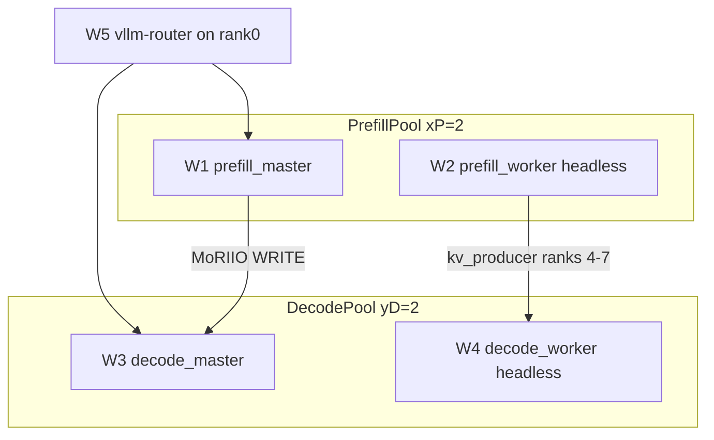

# Kimi-K3

This page covers Kimi-K3 in MAD end to end: single-node serving on MI350X / MI355X, multinode
serving on MI300X (colocated and disaggregated), the disaggregated recipes, the image, the known
failure modes, and the results.

[Kimi-K3](https://huggingface.co/moonshotai/Kimi-K3) is Moonshot AI's open-source Mixture-of-Experts
(MoE) model: 2.8T parameters, 896 experts, natively MXFP4 (quantization-aware trained), a hybrid
attention stack of MLA and Kimi-Delta-Attention (KDA), and a 1M-token context window. The checkpoint
is about 1.5 TB (1.56 TB per the single-node README).

Terms used below:

| Term | Meaning |
|---|---|
| TP, PP, DP, EP | Tensor, pipeline, data and expert parallelism. `TP2 x DP8` means 8 data-parallel ranks, each spanning 2 GPUs. |
| Colocated | One serving instance spans all nodes; prefill and decode run on the same GPUs. |
| Disaggregated (P/D) | Prefill nodes and decode nodes are separate pools. The KV cache moves from prefill to decode over RDMA. `2P/2D` is 2 prefill and 2 decode nodes. |
| MoRIIO | The vLLM KV connector that moves KV cache over MoRI. |
| MoRI-EP | MoRI's expert-parallel all-to-all. |
| NIAH | Needle-in-a-haystack: a long-context retrieval test. |

## Which recipe for which hardware

| Hardware | Why | Recipes |
|---|---|---|
| 8x MI350X or MI355X (gfx950), one node | The checkpoint fits one node at TP8 | [Single-node on MI350X / MI355X](#single-node-on-mi350x--mi355x): vLLM, SGLang, ATOM |
| MI300X (gfx942), 2 or 4 nodes | MI300X has 192 GB per GPU, so the checkpoint does not fit one 8-GPU node | [Multinode on MI300X](#multinode-on-mi300x): 3 colocated cards, 2 disaggregated cards |
| MI355X (gfx950), 4 nodes, disaggregated | Bring-up recipe, not yet run | [Kimi-K3-MXFP4-MI355X](#kimi-k3-mxfp4-mi355x-bring-up) |

Every card is written for one GPU and says so. The single-node cards carry `skip_gpu_arch: gfx942`;
the MI300X cards carry `skip_gpu_arch: gfx950`; the MI355X disaggregated card carries
`skip_gpu_arch: gfx942`. The disaggregated recipes also declare `GPU_ARCHS`, which the launcher
checks on the allocated nodes (see [configuration.md](configuration.md#gpu-architecture-check)).

---

## Single-node on MI350X / MI355X

MAD supports Kimi-K3 day-0 inference in three serving frameworks on MI350X / MI355X (gfx950):

| Framework | Card | Docker image | Recipe |
|---|---|---|---|
| vLLM | `pyt_vllm_kimi-k3` | `vllm/vllm-openai-rocm:kimi-k3` | [recipes.vllm.ai](https://recipes.vllm.ai/moonshotai/Kimi-K3?hardware=mi355x) |
| SGLang | `pyt_sglang_kimi-k3` | `lmsysorg/sglang-rocm:rocm720-mi35x-k3-20260727` | [SGLang cookbook](https://docs.sglang.io/cookbook/autoregressive/Moonshotai/Kimi-K3) |
| ATOM | `pyt_atom_kimi-k3` | `rocm/atom-dev:rocm7.2.4_ubuntu24.04_py3.12_pytorch2.10.0_20260727_kimi_k3` | ROCm ATOM |

A fourth card, `pyt_sglang_kimi-k3_dspark`, serves the same model with SGLang plus the DSpark draft
checkpoint (speculative decoding). All four carry `skip_gpu_arch: gfx942`: the checkpoint does not
fit a single 8-GPU MI300X node, so K3 needs multinode sharding there.

### Hardware

- 8x MI350X or MI355X (TP8).
- The checkpoint is about 1.56 TB. Make sure the model cache volume has room.

### Quick start

Install [madengine](https://github.com/ROCm/madengine) and clone this repository, then run any
framework with one command:

```sh
# vLLM
madengine run --tags pyt_vllm_kimi-k3 --keep-model-dir --live-output

# SGLang
madengine run --tags pyt_sglang_kimi-k3 --keep-model-dir --live-output

# ATOM
madengine run --tags pyt_atom_kimi-k3 --keep-model-dir --live-output
```

To use pre-downloaded weights instead of downloading from Hugging Face:

```sh
madengine run --tags pyt_vllm_kimi-k3 --keep-model-dir --live-output \
  --additional-context '{"docker_mounts": {"/model_weights": "/path/to/Kimi-K3"}, "docker_env_vars": {"MAD_DATAHOME": "/model_weights"}}'
```

### Framework details

| | vLLM | SGLang | ATOM |
|---|---|---|---|
| Card | `pyt_vllm_kimi-k3` | `pyt_sglang_kimi-k3`, `pyt_sglang_kimi-k3_dspark` | `pyt_atom_kimi-k3` |
| Dockerfile | [`docker/pyt_vllm_kimi_k3.ubuntu.amd.Dockerfile`](../docker/pyt_vllm_kimi_k3.ubuntu.amd.Dockerfile) | [`docker/pyt_sglang_kimi_k3.ubuntu.amd.Dockerfile`](../docker/pyt_sglang_kimi_k3.ubuntu.amd.Dockerfile) | [`docker/pyt_atom.ubuntu.amd.Dockerfile`](../docker/pyt_atom.ubuntu.amd.Dockerfile) |
| Base image | `vllm/vllm-openai-rocm:kimi-k3` | `lmsysorg/sglang-rocm:rocm720-mi35x-k3-20260727` | `rocm/atom-dev:latest` (Dockerfile default) |
| Config | [`scripts/vllm/configs/default.yaml`](../scripts/vllm/configs/default.yaml) (Kimi-K3 block) | [`scripts/sglang/configs/kimi_k3.yaml`](../scripts/sglang/configs/kimi_k3.yaml) (variants `nospec`, `dspark`) | [`scripts/atom/configs/default.yaml`](../scripts/atom/configs/default.yaml) |
| Script | `scripts/vllm/run.sh` | `scripts/sglang/run_kimi_k3.sh` | `scripts/atom/run.sh` |
| Results | `perf_Kimi-K3.csv` | `perf_Kimi-K3.csv` | `perf_Kimi-K3.csv` |

The vLLM single-node image is separate from the multinode one because Kimi-K3 needs vLLM 0.27.0 or
later, which is not in a tagged `vllm-openai-rocm` release yet. The model-specific `:kimi-k3` image
is the only ROCm build with the KDA, Gated MLA and Stable LatentMoE support the checkpoint needs.
It is kept apart from `docker/pyt_vllm` so the other vLLM cards stay on the tagged release.

The ATOM README names the image `rocm/atom-dev:...kimi_k3`, while the card builds `docker/pyt_atom`,
whose `BASE_DOCKER` defaults to `rocm/atom-dev:latest`. To build on the named image, pass
`{"docker_build_arg": {"BASE_DOCKER": "<image>"}}` in `--additional-context`.

**Benchmark shape.** The single-node README describes these sweeps:

| Framework | Concurrency | Input | Output |
|---|---|---|---|
| vLLM | 1 / 8 / 32 / 128 | 1024 | 1024 |
| SGLang | 2 / 4 / 8 / 16 / 32 | 8192 | 1024 |
| ATOM | 64 / 128 / 256 | 1024 and 4096 | 1024 |

The config files now use one shared K3 sweep for all three frameworks: input 8192, output 1024,
concurrency `1 4 8 16 32 64 128 256`, TP8. The SGLang config explains the input length: the
tracking issue's tables do not state it, but `(E2EL - TTFT) / TPOT + 1` gives about 1024 output
tokens on every row, and `concurrency * (inp + out) / E2EL` reproduces the reported total
throughput only at 8192 input. The shared sweep is a superset of the issue's rows except
concurrency 2.

vLLM config highlights: env `VLLM_ROCM_USE_AITER=1`, `SAFETENSORS_FAST_GPU=1`,
`AITER_SITUV2_A8W4=1` (selects the AITER a8w4 MoE path; `0` falls back to a16w4),
`AITER_BF16_FP8_MOE_BOUND=0`, `VLLM_USE_BREAKABLE_CUDAGRAPH=0`; flags `--moe-backend auto`,
`--load-format auto`, `--gpu-memory-utilization 0.95`, `--mm-encoder-tp-mode data` (the MoonViT-V2
vision encoder is only 401M parameters, so TP on it is pure communication overhead),
`--max-num-seqs 256`, `--max-num-batched-tokens 4096`, `--reasoning-parser kimi_k3` (K3 always
thinks and returns `reasoning_content`), `--language-model-only` (text-only; skips loading MoonViT
and frees memory for KV cache). Accuracy (`gsm8k`) is off, because over `/v1/completions` the
always-on reasoning exhausts the 2048-token generation budget.

### Performance and enablement details

- vLLM: [Kimi K3 Is Here: Efficient Day-0 Support on vLLM](https://vllm.ai/blog/2026-07-27-k3)
- SGLang: [Kimi-K3 Day-0 Support on SGLang](https://github.com/sgl-project/sglang/issues/32548)
- ATOM: [Kimi-K3 on AMD Instinct GPUs](https://www.amd.com/en/developer/resources/technical-articles/2026/kimi-k3-on-amd-instinct-gpus.html)

### Standalone benchmarking

You can run the serving benchmarks inside a container without madengine.

#### vLLM

1. Launch the container:

```sh
docker pull vllm/vllm-openai-rocm:kimi-k3

docker run -it --device=/dev/kfd --device=/dev/dri \
  --group-add video --shm-size 16G --network host \
  --security-opt seccomp=unconfined --security-opt apparmor=unconfined \
  --cap-add=SYS_PTRACE \
  -v /path/to/Kimi-K3:/model_weights \
  --env VLLM_ROCM_USE_AITER=1 --env SAFETENSORS_FAST_GPU=1 \
  --env AITER_SITUV2_A8W4=1 --env AITER_BF16_FP8_MOE_BOUND=0 \
  --env VLLM_USE_BREAKABLE_CUDAGRAPH=0 \
  --entrypoint bash vllm/vllm-openai-rocm:kimi-k3
```

2. Start the server:

```sh
vllm serve /model_weights \
  --dtype auto -tp 8 --trust-remote-code \
  --no-enable-prefix-caching --load-format auto \
  --gpu-memory-utilization 0.95 --moe-backend auto \
  --mm-encoder-tp-mode data --max-num-seqs 128 \
  --max-num-batched-tokens 4096 --reasoning-parser kimi_k3 \
  --language-model-only --disable-uvicorn-access-log
```

3. Run the benchmark from another terminal:

```sh
docker exec -it <container> bash

# Wait for the server
until curl -s http://localhost:8000/v1/models; do sleep 30; done

# Run the serving benchmark
vllm bench serve --model /model_weights \
  --percentile-metrics ttft,tpot,itl,e2el \
  --dataset-name random --ignore-eos --temperature 0 \
  --trust-remote-code --max-concurrency 128 \
  --num-prompts 1280 --random-input-len 1024 \
  --random-output-len 1024 --save-result \
  --result-filename kimi_k3_vllm_serving.json
```

#### SGLang

1. Launch the container:

```sh
docker pull lmsysorg/sglang-rocm:rocm720-mi35x-k3-20260727

docker run -it --device=/dev/kfd --device=/dev/dri \
  --group-add video --shm-size 16G --network host \
  --security-opt seccomp=unconfined --security-opt apparmor=unconfined \
  --cap-add=SYS_PTRACE \
  -v /path/to/Kimi-K3:/model_weights \
  --env SGLANG_USE_AITER=1 --env SGLANG_AITER_K3_OPT=1 \
  --env AITER_FLYDSL_FORCE=1 --env AITER_SITUV2_A8W4=1 \
  --entrypoint bash lmsysorg/sglang-rocm:rocm720-mi35x-k3-20260727
```

2. Start the server:

```sh
sglang serve --model-path /model_weights \
  --trust-remote-code --tp-size 8 \
  --attention-backend triton --dtype bfloat16 \
  --mem-fraction-static 0.85 --cuda-graph-max-bs-decode 256 \
  --host 127.0.0.1 --port 30000 \
  --disable-radix-cache \
  --reasoning-parser kimi_k3 --tool-call-parser kimi_k3
```

3. Run the benchmark from another terminal:

```sh
docker exec -it <container> bash

# Wait for the server
until curl -sf http://localhost:30000/health; do sleep 30; done

# Run the serving benchmark
python3 -m sglang.benchmark.serving \
  --backend sglang --host 127.0.0.1 --port 30000 \
  --model /model_weights --dataset-name random \
  --random-input-len 8192 --random-output-len 1024 \
  --random-range-ratio 1.0 --max-concurrency 8 \
  --num-prompts 80 --output-file kimi_k3_sglang_serving.jsonl
```

#### ATOM

1. Launch the container:

```sh
docker pull rocm/atom-dev:rocm7.2.4_ubuntu24.04_py3.12_pytorch2.10.0_20260727_kimi_k3

docker run -it --device=/dev/kfd --device=/dev/dri \
  --group-add video --shm-size 16G --network host \
  --security-opt seccomp=unconfined --security-opt apparmor=unconfined \
  --cap-add=SYS_PTRACE \
  -v /path/to/Kimi-K3:/model_weights \
  --env ATOM_LOADER_USE_THREADPOOL=1 --env ATOM_LOADER_THREADPOOL_WORKERS=16 \
  --env ATOM_SYNC_AFTER_LOAD=1 --env ATOM_DIST_TIMEOUT_SECONDS=3600 \
  --env ATOM_USE_TRITON_GEMM=1 --env AITER_USE_GROUPED_GEMM=0 \
  --env ATOM_USE_TRITON_MOE=0 --env AITER_FLYDSL_FORCE=1 \
  --env AITER_FORCE_GFX1250=0 --env ATOM_USE_UNIFIED_ATTN=1 \
  --env ATOM_FORCE_ATTN_TRITON=1 \
  --entrypoint bash rocm/atom-dev:rocm7.2.4_ubuntu24.04_py3.12_pytorch2.10.0_20260727_kimi_k3
```

2. Start the server:

```sh
python -m atom.entrypoints.openai_server \
  --model /model_weights --kv_cache_dtype fp8 -tp 8 \
  --trust-remote-code --max-model-len 16384 \
  --max-num-seqs 64 --max-num-batched-tokens 10240 \
  --gpu-memory-utilization 0.93 --block-size 128 \
  --no-enable_prefix_caching
```

3. Run the benchmark from another terminal:

```sh
docker exec -it <container> bash

# Wait for the server
until curl -s http://localhost:8000/v1/models; do sleep 30; done

# Run the serving benchmark
python -m atom.benchmarks.benchmark_serving \
  --model /model_weights --backend vllm \
  --base-url http://localhost:8000 \
  --percentile-metrics ttft,tpot,itl,e2el \
  --dataset-name random --ignore-eos \
  --request-rate inf --random-range-ratio 0.8 \
  --trust-remote-code --max-concurrency 64 \
  --num-prompts 640 --random-input-len 1024 \
  --random-output-len 1024 --save-result \
  --result-dir ./ --result-filename kimi_k3_atom_serving.json
```

### References

- [moonshotai/Kimi-K3 on Hugging Face](https://huggingface.co/moonshotai/Kimi-K3)
- [vLLM Kimi-K3 recipe (MI355X)](https://recipes.vllm.ai/moonshotai/Kimi-K3?hardware=mi355x)
- [vLLM day-0 blog post](https://vllm.ai/blog/2026-07-27-k3)
- [SGLang Kimi-K3 cookbook](https://docs.sglang.io/cookbook/autoregressive/Moonshotai/Kimi-K3)
- [SGLang day-0 tracking issue](https://github.com/sgl-project/sglang/issues/32548)

### Licensing

Your use of this application is subject to the terms of the applicable component-level license.
See the framework benchmark pages ([vLLM](../benchmark/vllm/README.md), [SGLang](../benchmark/sglang/README.md))
for licensing details.

---

## Multinode on MI300X

The single-node recipes target gfx950 at TP8 and are skipped on gfx942. MI300X has 192 GB per GPU,
so the checkpoint does not fit one 8-GPU node, and every MI300X recipe is multinode. Same model,
different hardware, different sharding.

### Models

| Card | Nodes | Parallelism | Expert all-to-all | Use when |
|---|---|---|---|---|
| `pyt_vllm_kimi-k3_mi300x_pp2xtp8` | 2 | PP2 x TP8, no EP | none | Simplest baseline; lowest single-user latency |
| `pyt_vllm_kimi-k3_mi300x_wideep_allgather` | 2 | PP2 x TP8, EP8 per node | `allgather_reducescatter` | Expert parallel without MoRI kernels |
| `pyt_vllm_kimi-k3_mi300x_wideep_moriep` | 2 | PP2 x TP8, EP8 per node | `mori_low_latency` (MoRI-EP) | MoRI-EP expert dispatch |
| `pyt_vllm_disagg_mori_kimi-k3` | 4 | 2P/2D, TP2 x DP8, EP16 per pool | MoRI-EP + MoRIIO KV transfer | Highest concurrent throughput |
| `pyt_vllm_disagg_mori_kimi-k3-mxfp4` | 4 | 2P/2D, TP2 x DP8, EP16 per pool | MoRI-EP + MoRIIO KV transfer | The `Kimi-K3-MXFP4` recipe (see below) |

There is also `pyt_vllm_kimi-k3_mi300x_pp2xtp8_way4`, a twin of the first card that gets its
environment from a layered config file (see [Colocated cards](#colocated-cards)).

The first three are colocated: one instance spans 2 nodes, with no prefill/decode split, and one
request uses all 16 GPUs. The disaggregated cards use 2 prefill and 2 decode nodes joined by the
MoRIIO connector.

**Pick by workload.** Colocated gives the lowest single-request latency. Disaggregated gives 5.7x
throughput at concurrency 8 (7.3x at 16) plus decode-latency isolation, at about 4x higher
single-stream latency, because one request runs on 2 GPUs instead of all 16. That trade is
architectural, not a tuning defect.

**EP scope (colocated).** The 896 experts split 8 ways across each node's 8 GPUs (112 experts per
GPU), and that EP8 group is replicated on each of the 2 pipeline stages. The expert all-to-all runs
inside a node; the only cross-node traffic is the PP activation hand-off over NCCL. "16" is the GPU
count, not the EP width. TP8 within each node and PP across nodes puts about 102 GB on each GPU of a
2-node allocation.

### Hardware

- 16x MI300X (2 nodes) colocated, or 32x MI300X (4 nodes) disaggregated.
- An RDMA fabric between nodes. The defaults assume 8 NICs per node.
- The checkpoint is about 1.5 TB. Local NVMe on every node is strongly recommended; the cards set
  `REQUIRE_LOCAL_WEIGHTS=1` (see [Weights](#weights)).
- Docker on the compute nodes. The launchers call `docker run` under `srun`; podman or
  apptainer-only clusters will not work without editing the launcher.

### Quick start

Run from a SLURM login node. You need an image: the cards carry
`DOCKER_IMAGE_NAME: "<supply-your-image>"` as a fill-me-in marker, which no node can pull. Give
madengine a real image with `--use-image`, or build and push one with `--registry`.

The cards, madengine's SLURM presets and `scripts/common/cluster.sh` already supply the node
count, partition, GPUs per node, exclusivity, and the model and log paths. The one value to pass
on a typical cluster is the time limit, because the cards ask for 24:00:00. If your cluster
differs in anything else, add only those keys (see [Site configuration](#site-configuration)).

Then build (here: use a pre-built image) and run:

```sh
IMG=<your-registry>/<repo>:<tag>

# prefill/decode disaggregated, 4 nodes
madengine build --tags pyt_vllm_disagg_mori_kimi-k3 --use-image "$IMG" \
  --additional-context '{"slurm": {"time": "06:00:00"}}'
madengine run --manifest-file build_manifest.json --live-output

# colocated, 2 nodes
madengine build --tags pyt_vllm_kimi-k3_mi300x_pp2xtp8 --use-image "$IMG" \
  --additional-context '{"slurm": {"time": "04:00:00"}}'
madengine run --manifest-file build_manifest.json --live-output
```

The additional context is only needed on `build`. Its `slurm` and `env_vars` blocks are written into
the manifest's `deployment_config` and merged back on `run`. The time is the only setting these
cards need from you on a cluster like the one they were written for: the cards say 24:00:00, which
exceeds most partition limits. Everything else already has a source; see
[Site configuration](#site-configuration).

To build and distribute the image instead of supplying one, replace `--use-image "$IMG"` with
`--registry <your-registry>` and give the GPU arch, because a login node cannot detect it:

```sh
madengine build --tags pyt_vllm_disagg_mori_kimi-k3 --registry <your-registry> \
  --additional-context '{"slurm": {"time": "06:00:00"}, "docker_build_arg": {"MAD_SYSTEM_GPU_ARCHITECTURE": "gfx942"}}'
```

The launcher then pulls the image onto every node in parallel.

**How madengine runs these cards.** All of them are `slurm_multi` cards. madengine generates a
wrapper batch script that runs the card's `.slurm` script on the head node with `bash`, and that
script manages its own per-node containers through `srun`. The `#SBATCH` header inside the launcher
is inert; every allocation setting comes from madengine. Nothing is passed to the `.slurm` script
on its command line; the topology travels in `env_vars`.

The allocation is sized from the card's `slurm.nodes` (2 or 4), which madengine emits as
`#SBATCH --nodes`. The launcher then reads `SLURM_NNODES`. `distributed.nnodes` carries the same
number for launcher detection but does not size the allocation; madengine reads only `slurm.nodes`,
defaulting to 1. Keep the two in sync when you edit a card, or set `nodes` in your site settings,
where it wins over the card.

**Inside an allocation you already hold,** madengine runs the launcher synchronously and the node
count comes from the allocation:

```sh
salloc -N 4 --ntasks-per-node=1 --gres=gpu:8 -p <partition> -t 24:00:00
madengine run --manifest-file build_manifest.json --live-output
```

**With plain `sbatch`** (disaggregated; sbatch options, `--export` included, go before the script,
because anything after it is passed to the script as an argument and silently ignored):

```bash
cd MAD/scripts/vllm_dissag
sbatch -N 4 --partition=<your-partition> --time=24:00:00 \
  --export=ALL,MODEL_NAME=Kimi-K3-MXFP4,CONNECTOR=moriio,WIDE_EP=1,xP=2,yD=2,DOCKER_IMAGE_NAME=kimik3-wideep-disagg:latest \
  run_xPyD_models.slurm
```

The slurm script runs `docker pull` for the image on every node and tolerates a failed pull, so a
local-only tag must exist on every node or be pushed to a registry the nodes can reach.

### Site configuration

Each setting below already has a default, from madengine's SLURM presets, the card, or
`scripts/common/cluster.sh`. Pass a key in `--additional-context` only when your cluster differs.
Values there override the card: madengine only fills in a card key you did not set.

| Key | What it is | Default comes from | How to find your value |
|---|---|---|---|
| `slurm.partition` | GPU partition to submit to | madengine presets: `amd-rccl` | `sinfo -o '%20P %5D %14F %10G %11l'`: pick a partition whose `GRES` column shows GPUs and whose `A/I/O/T` counts show idle nodes |
| `slurm.gpus_per_node` | GPUs per node (8 on MI300X) | madengine presets: 8 | The `GRES` column above, or `scontrol show node <node> \| grep Gres` |
| `slurm.exclusive` | Whole nodes only | madengine presets: true | Leave it on; the launchers assume whole nodes |
| `slurm.nodes` | 2 colocated, 4 disaggregated | The card's `slurm.nodes` | Fixed by the recipe; must match `distributed.nnodes` |
| `slurm.time` | Wall clock | The card: 24:00:00 | The `TIMELIMIT` column above is the partition's cap; pass a value under it |
| `slurm.results_dir` | A fallback place madengine looks for `perf*.csv` | Unset; madengine first uses the card's `multiple_results` | Only needed if the declared CSV is not found: the launcher's directory, `./scripts/vllm_multinode` or `./scripts/vllm_dissag` |
| `env_vars.MODEL_DIR` | An extra directory to look for `Kimi-K3/` | `cluster.sh`: local NVMe `/mnt/m2m_nobackup/models_blog`, then shared `/shared_inference/models_blog` | Wherever the checkpoint lives; readable from every node |
| `env_vars.LOG_PATH` | Run logs and per-job `perf.csv` | `cluster.sh`: `/shared_inference/$USER/model_blog_logs` | Any shared, writable path |

`MODEL_DIR` is added as an extra candidate after the default roots. Override `MODEL_DIR` and
`LOG_PATH` only if your cluster does not have those paths. Every
key under `env_vars` becomes an `export` in the generated wrapper, so keep it to real variables.

Two settings cannot be set through the additional context on this launcher:

- **`--account` / `--qos`.** madengine emits these only for its templated launchers; the
  `slurm_multi` header omits them on older madengine. If your cluster needs an account, export
  `SBATCH_ACCOUNT` (and `SBATCH_QOS`) before `madengine run`. `sbatch` honours those environment
  variables and no directive conflicts with them.
- **`slurm.results_dir` from a card.** It is settable in the additional context, but not from a
  card: it is absent from the keys madengine copies out of `models.json`.

### Cluster prerequisites beyond the card

A card cannot express these. They are site facts, and each one blocked a run until supplied:

- **Wall time** must fit your SLURM association limit, which can be lower than the partition's. The
  cards declare `24:00:00`; an association capped at `08:00:00` leaves the job
  `PENDING (AssocMaxWallDurationPerJobLimit)` forever rather than failing. Check with
  `sacctmgr show assoc user=$USER format=Account,QOS,MaxWall`.
- **An account** may be required (`--account`). Older madengine does not emit
  `#SBATCH --account` for `slurm_multi`; export `SBATCH_ACCOUNT`.
- **Docker on the compute nodes**, not only on the login node.
- **A way to distribute the image.** `--build-on-compute` requires `--registry`, so on a cluster
  without a registry neither madengine nor MAD can get an image onto the nodes. Building once,
  `docker save` to shared storage, then `docker load` on each node works and needs no registry.

### Weights

The launchers find the weights with `cluster_resolve_model_path` in
[`scripts/common/cluster.sh`](../scripts/common/cluster.sh). It probes `MODEL_DIR_CANDIDATES` (local
NVMe first, then shared NFS, then `MODEL_DIR`) for a directory named `MODEL_WEIGHTS_NAME` (default
`MODEL_NAME`) on every node, and rejects a candidate whose `config.json` differs between nodes. An
explicit `MODEL_PATH` skips the probe.

- **`REQUIRE_LOCAL_WEIGHTS=1`** is set by every MI300X card. At 1.5 TB, loading over shared storage
  does not fit the wall clock a partition allows, so the run fails at once rather than quietly using
  NFS.
- **The same checkpoint may be staged under two names.** On some nodes it is `Kimi-K3`, on others
  `Kimi-K3-MXFP4`, and on some one is a symlink to the other. Set `MODEL_WEIGHTS_NAME` to the
  directory name your nodes use. The `config.json` fingerprint check stops one job from loading two
  different variants on different nodes.

### The image

Every multinode Kimi-K3 vLLM card, colocated and disaggregated, MI300X and MI355X, builds one
Dockerfile:
[`docker/vllm_kimi_k3.ubuntu.amd.Dockerfile`](../docker/vllm_kimi_k3.ubuntu.amd.Dockerfile). The card
field is `"dockerfile": "../../docker/vllm_kimi_k3"`. It replaced three earlier per-arch and
per-launcher Dockerfiles that were the same stack apart from the GPU arch and a few pins.

It is built for exactly one GPU, `MAD_SYSTEM_GPU_ARCHITECTURE` (`gfx942` or `gfx950`). There is no
default; any other value fails the build. madengine passes it (see
[configuration.md](configuration.md#8-mad_system_gpu_architecture-for-images-built-per-gpu)).
MoRI's JIT target, the vLLM compile, and (with `WITH_NIXL=1`) rocSHMEM and DeepEP follow it.
Runtime differences between the arches (AITER MLA on gfx950 only, the int4 MoE requant on gfx942)
are recipe settings in `models.yaml`, not build steps.

Build by hand, from the repository root:

```bash
docker build -f docker/vllm_kimi_k3.ubuntu.amd.Dockerfile \
  --build-arg MAD_SYSTEM_GPU_ARCHITECTURE=gfx942 \
  -t <registry>/vllm-kimi-k3:gfx942 .
```

Build once per cluster, and again after a vLLM pin change. Operators building by hand tag the image
themselves and pass `DOCKER_IMAGE_NAME` to the slurm script.

What it builds, every source pinned to an immutable commit SHA on the open ROCm vLLM CI base
(`rocm/vllm-dev:ci_base-0fcd9b99cc9d63202da4c858d8ebc6582c9e2491`):

| Component | Pin | Notes |
|---|---|---|
| MoRI | v1.2.2 (`fe12a11a`) | The shared disagg image pins v1.2.1. Do not disable NIC backends (`USE_IONIC=OFF`, `USE_BNXT=OFF`): that produced a MoRI that deadlocked at the cross-node EP all-to-all init. |
| AITER | `ROCm/aiter` `68e42f5f` (0.1.17.dev395), built from source | The commit the Kimi-K3 release images ship. Carries the Kimi-K3 tuned MoE configs (`kimik3_{a8w4,fp4}_tuned_fmoe`), `aiter.ops.triton.conv` (K3's vision tower), and the top_k_top_p fix DP-EP disaggregation needs. |
| flydsl | 0.2.4 | K3's int4 SiTUv2 path on gfx942 needs flydsl 0.2.4 or later. |
| vLLM | fork commit `862bfd8` (branch `kimi-k3-wideep-disagg-fullsource-v3`) | Full source compile of the K3 + MoRIIO branch, with all K3 connector fixes committed (see [The three fixes](#the-three-fixes-behind-these-numbers)). |
| vllm-router | commit `82dc9811` | DP-rank round robin plus the 2P2D KV-notify fix (`remote_dp_rank_override`, `remote_dp_size`). Without it a 2P2D EP16 run wedges on "remote blocks never arrived" expiries, because decode's notify targets the wrong DP rank. |
| UCX / RIXL / rocSHMEM / DeepEP | with `WITH_NIXL=1` (default) | For the rixl connector. The Kimi recipes use moriio, so `WITH_NIXL=0` is a faster build with the same serving path. |

Why the AITER commit matters: without the K3 tuned MoE configs, K3's MoE profiling shape finds no
tuned FlyDSL config, falls back to a heuristic kernel, and aborts LLVM inside
`determine_available_memory`. The worker dies natively with no Python traceback. The two earlier
donor images carried this same AITER build; building it here replaces copying their site-packages
over a separately installed AITER, so the image has one base and no second image to pull.

Other build facts:

- **No runtime patchers.** All K3 MoRIIO connector fixes are in the vLLM source the image builds.
  Nothing patches site-packages at start.
- **No runtime recipe env.** The image ships only cache locations
  (`AITER_JIT_DIR`, `VLLM_CACHE_ROOT`, `TRITON_CACHE_DIR`, `COMGR_CACHE_DIR` under
  `/opt/vllm_cache`). The K3 serving recipe lives in `scripts/vllm_dissag/models.yaml`, and the
  ROCm 7.2.3 GPU-RDMA platform env and MoRI fabric tuning in
  `scripts/vllm_dissag/connectors/moriio.env`. The same image serves any cluster without a rebuild.
- **Build-time MoRI JIT state is scrubbed.** Verifying `import mori` during the build leaves stale
  `.hsaco.lock` files under `/root/.mori/jit`. At run time MoRI would wait on a build whose owner is
  gone and deadlock at `ep:0` init, so the image ships `/root/.mori` empty.
- **The build pins its toolchain, not only its sources.** pip resolves build dependencies in an
  isolated environment from PyPI at build time, so a newer setuptools can break a build whose
  sources have not moved. setuptools 80 added `assert isinstance(self.compiler, CCompiler)` to
  distutils' `build_ext.build_extension`, which MoRI's legacy `Cython.Distutils.build_ext` path
  violates: the `amd_mori` wheel failed with `AssertionError: run() must precede build_extension()`
  while every pinned SHA was still correct. The Dockerfile sets `PIP_CONSTRAINT` globally
  (`setuptools<80`). That is the only mechanism that reaches inside pip's build isolation; a plain
  `pip install setuptools==X` in the image does not.

Build arguments:

| Arg | Default | Meaning |
|---|---|---|
| `MAD_SYSTEM_GPU_ARCHITECTURE` | none (required) | `gfx942` or `gfx950` |
| `BASE_IMAGE` | `rocm/vllm-dev:ci_base-0fcd9b99cc9d63202da4c858d8ebc6582c9e2491` | Open ROCm vLLM CI base |
| `WITH_NIXL` | `1` | Build UCX/RIXL/rocSHMEM/DeepEP |
| `NIC_COMPILATION_ARCH` | `cx7` | |
| `MAX_JOBS`, `NVCC_THREADS` | `32`, `8` | Build parallelism |
| `SETUPTOOLS_CONSTRAINT` | `setuptools<80` | Written to the global pip constraint |
| `MORI_REF`, `AITER_REF`, `VLLM_REF`, `ROUTER_REF`, `ROCSHMEM_REF` | the pins above | Commit pins |

**Status.** gfx942 (MI300X) is the stack the Kimi-K3 cards run today; single-needle NIAH passed
from 10K to 900K on 2 prefill and 2 decode nodes with these pins (PR #193), with AITER from the same
68e42f5f build. gfx950 (MI355X) is bring-up and not validated: nothing shows MoRIIO disaggregation
with Kimi-K3 has run on gfx950, and the vLLM ref is the fork's gfx942 branch. The same stack has run
MoRIIO and MoRI-EP on gfx950 for GLM, which needed EP16 start-up deadlock gates and a MoRI combine
fix that are not in this vLLM ref, and ionic NICs needed a patched MoRI. Expect the first gfx950
runs to hit those.

### Known failure modes

Each of these was hit on a real MI300X cluster and is fixed in the tree. They are recorded because
in every case the symptom is far from the cause.

| Symptom | Cause | Fix |
|---|---|---|
| `AssertionError: run() must precede build_extension()` building `amd_mori` | Unpinned build toolchain (above) | `PIP_CONSTRAINT` in the Dockerfile |
| `OCI runtime create failed: ... not a directory`, then the surviving node loops on `Waiting for nodes. . .` forever | Docker creates a directory at a missing bind-mount source, so the first run on a node lacking an RDMA library poisons it for all later runs; a `[ -e ]` test matches that directory | The launchers test with `[ -f ]` |
| `LLVM ERROR: Do not know how to expand this operator's operand!` in `determine_available_memory`, `quantization_config=None` | gfx942 cannot codegen the a16w4 SiTUv2 heuristic kernel; the MoE must be requantized to int4 | All colocated cards set `AITER_SITUV2_A8W4=1` and `--quantization-config` |
| The job reports COMPLETED with `0 successful, 0 failed` and no `perf.csv` | The launchers warned but returned 0, so a crash looked like a clean run | The launchers `exit 1` when no perf CSV is produced |

The RDMA one deserves emphasis: it is per-node and self-propagating, so it presents as an
intermittent multinode failure. A node that has never run the launcher works; one that has, and
lacked the library, fails every time after.

### Where the configuration lives

Nothing K3-specific is baked into the image.

| What | Where |
|---|---|
| Model serving recipe (gfx942 settings, KV cache, cudagraph modes, MoE quant) | `scripts/vllm_dissag/models.yaml`, entries `Kimi-K3`, `Kimi-K3-MXFP4`, `Kimi-K3-MXFP4-MI355X` |
| Per-variant topology (TP / PP / EP, node count, benchmark) | The card's `env_vars` in `models.json` |
| ROCm platform and MoRI / RDMA fabric env | `scripts/vllm_dissag/connectors/moriio.env` |
| Fabric detection, weight roots, ports | `scripts/common/cluster.sh` |
| Allocation (partition, nodes, time) | madengine presets and your additional context |

The colocated launcher reads the same `models.yaml` `env:` block as the disaggregated one. See
[configuration.md](configuration.md) for the precedence between these layers.

### gfx942 specifics

- **`VLLM_ROCM_USE_AITER_MLA=0` is required.** The AITER MLA kernel is gfx950 only.
- **The MoE is requantized to int4.** gfx942 has no scaled-MXFP4 MFMA, and the a16w4 SiTUv2
  heuristic FlyDSL kernel cannot codegen there. So the MoE is requantized to packed int4 and run
  through SiTUv2: `AITER_SITUV2_A8W4=1` (the a8w4 path, fp8 activations and int4 weights) plus
  `--quantization-config '{"moe":{"weight":"int4_per_group_32"}}'`.
- **`--max-num-batched-tokens` stays at 2048.** 8192 corrupts generation on this stack, and the
  16384 profiling shape crashes LLVM codegen in the heuristic kernel.
- **`KV_CACHE_MEMORY_BYTES=40e9`** gives a 2.84M-token GPU KV cache. It is required for single
  requests beyond about 600K tokens, and it also skips the boot profiling forward. The lower 8e9
  value used during bring-up was a `profile_run` hang workaround, not a memory limit.
- **Why TP2 in the disaggregated recipe.** K3's replicated weight (attention plus shared expert) is
  106.5 GiB. At TP1/DP16 that is 190.7 GiB per GPU before KV cache or the 16 GiB MoRI heap, which
  does not fit 192 GB. TP2 shards it to 53.3 GiB per GPU; with 84.2 GiB of expert shard that is
  137.5 GiB, plus the 16 GiB MoRI heap, leaving room for KV. So each pool is TP2 x DP8 = EP16 over
  16 GPUs (2 nodes): `xP=2 yD=2 EP_TP_SIZE=2`.

---

## The disaggregated recipes

The disaggregated cards run [`scripts/vllm_dissag`](../scripts/vllm_dissag) with
`CONNECTOR=moriio WIDE_EP=1` (combo 3: MoRIIO KV transfer with MoRI-EP wide expert parallel). All
three Kimi models are wideEP only and moriio only; the slurm gate rejects any other combination. See
[vllm-disagg.md](vllm-disagg.md) for the launcher in full.

| `MODEL_NAME` | GPU | Topology | Card | Status |
|---|---|---|---|---|
| `Kimi-K3` | MI300X gfx942 | 2P/2D, TP2 x DP8 (`EP_TP_SIZE=2`) | `pyt_vllm_disagg_mori_kimi-k3` | Validated (NIAH 10K to 900K) |
| `Kimi-K3-MXFP4` | MI300X gfx942 | 2P/2D, TP2 x DP8 (`EP_TP_SIZE=2`) | `pyt_vllm_disagg_mori_kimi-k3-mxfp4` | Recipe from the out-of-tree standalone launcher (PR #241) |
| `Kimi-K3-MXFP4-MI355X` | MI355X gfx950 | 2P/2D, TP1 x DP16 (`EP_TP_SIZE=1`) | `pyt_vllm_disagg_mori_kimi-k3-mxfp4_mi355x` | Bring-up, not yet run |

All three cards: `dockerfile ../../docker/vllm_kimi_k3`, launcher `run_xPyD_models.slurm`,
`slurm_multi` with 4 nodes, `slurm.time 24:00:00`, and `env_vars` `xP=2`, `yD=2`, `RUN_MORI=1`,
`WIDE_EP=1`, `BENCHMARK_SCRIPT=niah`, `NIAH_WORDS=10000,50000,100000,200000`,
`REQUIRE_LOCAL_WEIGHTS=1`. The MI355X card also sets `MODEL_WEIGHTS_NAME=Kimi-K3-MXFP4`. Results
go to `perf_Kimi-K3.csv`, `perf_Kimi-K3-MXFP4.csv` and `perf_Kimi-K3-MXFP4-MI355X.csv`.

`EP_TP_SIZE` comes from the model's `models.yaml` recipe; export it to override. `EP_TP_SIZE>1`
requires `CONNECTOR=moriio WIDE_EP=1`, must divide `GPUS_PER_NODE`, and needs equal pools
(`xP == yD`), because the router advertises one DP width for both pools. The launcher is generic
(`NUM_NODES = xP + yD`, any `xP + yD >= 2`); no K3-specific topology lock is enforced.

**GPU check.** Each Kimi recipe declares its GPU in `GPU_ARCHS` (`Kimi-K3`, `Kimi-K3-MXFP4`:
gfx942; `Kimi-K3-MXFP4-MI355X`: gfx950). The launcher detects the allocated nodes' GPU before
loading weights and refuses a mismatch (`cluster_require_gpu_arch`). `GPU_ARCH_CHECK=0` bypasses it
for bring-up. `scripts/common/check_gpu_arch_declarations.py` keeps each card's `skip_gpu_arch` in
step with its recipe.

**Network settings.** RDMA rails, GID index and socket interface are not part of any Kimi recipe.
They are facts about the cluster: `scripts/common/cluster.sh` detects the fabric from the adapters
present, and `connectors/moriio.env` and `moriio.sh` fill the rest. Export any of them to override.
A recipe that pinned them would silently break on a different fabric.

**Served model name.** `Kimi-K3-MXFP4` serves the model as `kimi-k3` (`--served-model-name
kimi-k3`). The launcher resolves that into `SERVED_MODEL_NAME`, which the NIAH client requests.
The other two recipes serve under `MODEL_PATH`.

### `Kimi-K3` (MI300X)

Serve flags (`prefill.dp` and `decode.dp`, both from one anchor):

```
--reasoning-parser kimi_k3
--mm-encoder-tp-mode data
--safetensors-load-strategy prefetch
--max-model-len 1000000
--max-num-seqs 8
--max-num-batched-tokens 2048
--quantization-config '{"moe":{"weight":"int4_per_group_32"}}'
```

`--max-model-len 1000000` is K3's full native context; drop it to 10240 for a quick smoke run.

Environment (`env:`):

| Variable | Value | Why |
|---|---|---|
| `EP_TP_SIZE` | `2` | TP2 x DP8 per pool |
| `GPU_ARCHS` | `gfx942` | The int4 requant and MLA-off are gfx942 workarounds |
| `VLLM_USE_V1` | `1` | |
| `VLLM_ROCM_USE_AITER` | `1` | |
| `VLLM_ROCM_USE_AITER_MOE` | `1` | |
| `VLLM_ROCM_USE_AITER_MLA` | `0` | Required on gfx942 |
| `VLLM_ROCM_USE_AITER_RMSNORM` | `1` | |
| `VLLM_ROCM_USE_AITER_FUSION_SHARED_EXPERTS` | `0` | |
| `VLLM_USE_AITER_TRITON_SILU_MUL` | `0` | |
| `AITER_SITUV2_A8W4` | `1` | a8w4 SiTU MoE path |
| `VLLM_SSM_CONV_STATE_LAYOUT` | `DS` | KDA conv state layout |
| `KV_BLOCK_SIZE` | `16` | |
| `KV_CACHE_DTYPE` | `fp8` | |
| `KV_CACHE_MEMORY_BYTES` | `40000000000` | 2.84M-token KV cache, needed above 600K context |
| `GPU_MEMORY_UTILIZATION` | `0.88` | Leaves the 16 GiB MoRI heap |
| `PREFILL_CUDAGRAPH_MODE` | `NONE` | |
| `DECODE_CUDAGRAPH_MODE` | `PIECEWISE` | |
| `VLLM_ALL2ALL_BACKEND` | `mori_high_throughput` | |
| `PREFILL_MORI_BACKEND` | `mori_high_throughput` | |
| `DECODE_MORI_BACKEND` | `mori_low_latency` | |
| `MORI_SHMEM_HEAP_SIZE` | `17179869184` | 16 GiB |
| `MORI_NUM_QP_PER_PE` | `8` | |
| `VLLM_MORIIO_QP_PER_TRANSFER` | `2` | |
| `VLLM_MORIIO_NUM_WORKERS` | `4` | |
| `VLLM_ENGINE_READY_TIMEOUT_S` | `3600` | |
| `DISTRIBUTED_TIMEOUT_SECONDS` | `7200` | |

### `Kimi-K3-MXFP4` (MI300X)

Recipe knobs proven by the out-of-tree standalone Kimi-K3 disaggregated launcher (PR #241); the
vLLM connector fixes are in the image's vLLM source. It differs from `Kimi-K3` as follows.

Serve flags (`prefill.dp` and `decode.dp`):

```
--served-model-name kimi-k3 --reasoning-parser kimi_k3 --mm-encoder-tp-mode data
--safetensors-load-strategy prefetch --max-model-len 320000 --max-num-seqs 8
--quantization-config '{"moe":{"weight":"int4_per_group_32"}}'
```

Environment that differs from, or adds to, `Kimi-K3`:

| Variable | Value | Why |
|---|---|---|
| `NCCL_DEBUG`, `NCCL_DEBUG_SUBSYS` | `WARN`, `INIT,NET` | |
| `NCCL_IB_DISABLE` | `0` | |
| `NCCL_IGNORE_CPU_AFFINITY` | `1` | |
| `VLLM_ROCM_USE_AITER_MOE_SITUV2_A8W4` | `1` | |
| `VLLM_SPARSE_INDEXER_MAX_LOGITS_MB` | `64` | |
| `K3_MLA_SINGLE_SPLIT`, `K3_MLA_FULL_PREFILL`, `K3_GROUP_ROUTING` | `1` | |
| `KV_CACHE_MEMORY_BYTES` | `8000000000` | |
| `GPU_MEMORY_UTILIZATION` | `0.68` | The validated value; higher starves decode warm-up activation |
| `MAX_NUM_BATCHED_TOKENS` | `2048` | |
| `MAX_MODEL_LEN` | `320000` | |
| `DECODE_CUDAGRAPH_MODE` | `FULL_AND_PIECEWISE` | The validated launch captures decode cudagraphs; prefill stays `NONE` |
| `VLLM_ALL2ALL_BACKEND` | `mori_low_latency` | |
| `MORI_SHMEM_HEAP_SIZE` | `8589934592` | 8 GiB |
| `K3_WRITE_READBACK`, `K3_WRITE_READBACK_BYTES` | `1`, `8` | Deterministic RDMA read-after-write barrier (below) |
| `K3_WRITE_FENCE`, `K3_WRITE_DEVSYNC` | `0`, `0` | Superseded by the readback |
| `K3_WRITE_FENCE_MS` | `20` | Inert while `K3_WRITE_FENCE=0` |
| `NCCL_IB_TIMEOUT` | `22` | NCCL reliability |
| `TORCH_NCCL_ENABLE_MONITORING` | `0` | Watchdog |
| `TORCH_NCCL_HEARTBEAT_TIMEOUT_SEC` | `1800` | |
| `TORCH_NCCL_DUMP_ON_TIMEOUT`, `TORCH_NCCL_BLOCKING_WAIT` | `0`, `0` | |
| `TORCH_NCCL_ASYNC_ERROR_HANDLING` | `1` | |
| `VLLM_ROCM_USE_AITER_MHA` | `1` | `moriio.sh` does not set it |
| `MORI_IB_ENABLE_RELAXED_ORDERING`, `MORI_IO_SL` | `1`, `1` | |
| `K3_CHUNK_GATE_SLACK` | `2` | K3 gate knob |

It does not set `VLLM_MORIIO_NUM_WORKERS`, `VLLM_ENGINE_READY_TIMEOUT_S` or
`DISTRIBUTED_TIMEOUT_SECONDS`; those come from `moriio.env` and the connector defaults.

**The read-after-write barrier.** `K3_WRITE_READBACK=1` forces the written KV to be globally visible
in the receiver's memory before `write_done`. It fixes a prefill-to-decode write race seen as
`unmap MISS table_size=0` or `missing remote notify address` on repeat requests, after which KV
blocks leak on prefill and the run stalls. On an earlier image a MoRI binding bug made the readback
throw on every request, so the fence never ran; that is fixed in the current image, and the sleep
fence and device sync are therefore off.

**Why some `moriio.env` values are repeated here.** `connectors/moriio.env` is only sourced by
`run_xPyD_models.slurm`. The interactive test path (`tests/drive_cell.sh`) does not source it, so
values that must also reach the container on that path are set in the recipe too. On the slurm path
the forwarded `moriio.env` values are already set when the recipe is read, so they take precedence
(see [configuration.md](configuration.md#per-model-env-layering-vllm-disaggregated)).

### `Kimi-K3-MXFP4-MI355X` (bring-up)

A bring-up recipe, not validated. MoRIIO disaggregation with Kimi-K3 has only run on MI300X. The
launcher refuses it on any GPU but gfx950, as the MI300X recipes refuse gfx950.

What changes from the MI300X recipes, and why:

- **No `--quantization-config`.** gfx950 has scaled-MXFP4 MFMA and the vLLM fork picks the native
  path itself. The int4 requant is a gfx942 workaround.
- **AITER MLA on** (the `moriio.sh` default, set explicitly). It is gfx950 only, which is why MI300X
  turns it off.
- **`EP_TP_SIZE=1`.** MI355X has 288 GB per GPU. TP1/DP16 needs 106.5 GiB replicated + 84.2 GiB
  expert shard + 16 GiB MoRI heap = 206.7 GiB, leaving about 81 GiB for KV and activations: about
  twice the MI300X TP2 headroom. MLA's latent KV is replicated across TP anyway, so TP1 costs no KV
  per token. TP1/DP16 is also the reference MoRIIO topology and what upstream's MI355X
  prefill/decode recipe uses. `EP_TP_SIZE=2` remains a one-setting fallback.
- **`--max-num-batched-tokens 4096`**, the single-node MI355X card's value. The MI300X 2048 cap works
  around gfx942 codegen and corruption bugs.

Everything else is the `Kimi-K3` recipe, plus these from the single-node MI355X card:
`AITER_BF16_FP8_MOE_BOUND=0`, `SAFETENSORS_FAST_GPU=1`, `VLLM_USE_BREAKABLE_CUDAGRAPH=0`.
`GPU_MEMORY_UTILIZATION` is `0.88` (the budget needs at least about 0.82 and leaves the 16 GiB
heap), `GPU_ARCHS` is `gfx950`, `VLLM_ROCM_USE_AITER_MLA` is `1`.

Serve flags:

```
--reasoning-parser kimi_k3
--mm-encoder-tp-mode data
--safetensors-load-strategy prefetch
--max-model-len 320000
--max-num-seqs 8
--max-num-batched-tokens 4096
```

The card sets `MODEL_WEIGHTS_NAME=Kimi-K3-MXFP4`, so it loads the directory named `Kimi-K3-MXFP4`.

`connectors/moriio.env` pins `MORI_GPU_ARCHS=gfx942`. On MI355X that would build MoRI kernels for the
wrong GPU, so the slurm script replaces it with the detected arch unless you set it yourself.

### Worker taxonomy (W1 to W5)

K3 disaggregation uses TP2 x DP8, giving EP16 per pool (not DeepSeek's TP1 x DP16). Five logical
workers map onto four SLURM tasks plus a router co-located on rank 0.



| Worker | Recipe `ROLE=` | `NODE_RANK` | Headless | KV role | K3-specific |
|---|---|---|---|---|---|
| W1 | `prefill_master` | 0 (plus W5, the router) | no | `kv_producer` | `--tensor-parallel-size 2`, `--api-server-count 8` |
| W2 | `prefill_worker` | 1 | yes, start rank 4 | `kv_producer` | Must carry `--kv-transfer-config` |
| W3 | `decode_master` | `xP` (2) | no | `kv_consumer` | Same TP2, plus pod hosts |
| W4 | `decode_worker` | `xP+1` (3) | yes, start rank 4 | `kv_consumer` | Must carry `--kv-transfer-config` |
| W5 | router | 0 only | | | `--moriio-dp-size 8`, `--intra-node-data-parallel-size 4` |

Example topology (K3 2P/2D): `xP=2`, `yD=2`, 4 nodes.

**Topology math.** On the wideEP path, `dp_per_node = GPUS_PER_NODE / EP_TP_SIZE` DP ranks run on
one node, and a pool's DP size is `nodes_in_pool * dp_per_node`. The EP width is the pool DP size
times `EP_TP_SIZE`. For K3 on MI300X: 4 DP ranks per node, DP8 per pool, EP16.

**Pod hosts.** `PREFILL_POD_HOSTS` and `DECODE_POD_HOSTS` come from `IPADDRS` (the first `xP` IPs,
then the next `yD`). They go into each rank's KV-transfer JSON as `moriio_pod_hosts`. They are only
needed when `EP_TP_SIZE>1`, because only then does the router address the whole pool's DP ranks
(`--moriio-dp-size`). The connector maps a rank to
`pod_hosts[rank // (remote_dp_size / len(pod_hosts))]`.

**JIT cache.** K3 prefill (MoRI high-throughput and low-latency, cudagraph `NONE`) and decode
(low-latency, `PIECEWISE`) compile different kernel variants. When `EP_TP_SIZE>1`, the slurm script
mounts separate `.../prefill` and `.../decode` cache directories under the image key. This is gated
by `JIT_CACHE_SPLIT_ROLE` (default `1`). The persistent cache itself is on by default
(`JIT_CACHE_PERSIST=1`, host directory `JIT_CACHE_HOST`).

---

## Colocated cards

The three colocated cards run [`scripts/vllm_multinode/run_multinode.slurm`](../scripts/vllm_multinode/run_multinode.slurm),
which starts one vLLM instance across 2 nodes. It reuses the `scripts/vllm_dissag` recipe file
(`env:` of `Kimi-K3`), barrier, benchmarks and CSV parser.

| Variable | Default | Meaning |
|---|---|---|
| `MODEL_NAME` | | Key into `scripts/vllm_dissag/models.yaml` |
| `DOCKER_IMAGE_NAME` | | Image to run |
| `TP_SIZE` | `GPUS_PER_NODE` | Tensor parallel within a node |
| `PP_SIZE` | `NNODES` | Pipeline parallel across nodes |
| `ENABLE_EP` | `0` | `1` adds `--enable-expert-parallel` |
| `ALL2ALL_BACKEND` | | For example `allgather_reducescatter` or `mori_low_latency` |
| `COLOCATED_EXTRA_ARGS` | | Extra serve flags. JSON values must carry their own quotes |
| `BENCHMARK_SCRIPT` | `sweep` | `sweep`, `long_context` or `niah` |

Card `env_vars`:

| | `_pp2xtp8` | `_wideep_allgather` | `_wideep_moriep` |
|---|---|---|---|
| `MODEL_NAME` | `Kimi-K3` | `Kimi-K3` | `Kimi-K3` |
| `TP_SIZE`, `PP_SIZE` | `8`, `2` | `8`, `2` | `8`, `2` |
| `ENABLE_EP` | `0` | `1` | `1` |
| `ALL2ALL_BACKEND` | | `allgather_reducescatter` | `mori_low_latency` |
| `AITER_SITUV2_A8W4` | `1` | `1` | `1` |
| `GPU_ARCHS` | `gfx942` | `gfx942` | `gfx942` |
| `BENCHMARK_SCRIPT`, `NIAH_WORDS` | `niah`, `10000,50000,100000,200000` | same | same |
| `REQUIRE_LOCAL_WEIGHTS` | `1` | `1` | `1` |

All three pass `COLOCATED_EXTRA_ARGS`:

```
--reasoning-parser kimi_k3 --mm-encoder-tp-mode data --safetensors-load-strategy prefetch
--max-model-len 1000000 --max-num-seqs 8 --max-num-batched-tokens 2048
--quantization-config '{"moe":{"weight":"int4_per_group_32"}}'
```

The three colocated variants share one launcher and differ only in `ENABLE_EP`, `ALL2ALL_BACKEND`
and `AITER_SITUV2_A8W4`.

**The `_way4` twin.** `pyt_vllm_kimi-k3_mi300x_pp2xtp8_way4` carries only `GPU_ARCHS`,
`DOCKER_IMAGE_NAME`, `MAD_CONFIG=mad-config.kimi-k3.yaml` and `BENCHMARK_SCRIPT=niah`. madengine
resolves the rest from
[`scripts/vllm_multinode/mad-config.kimi-k3.yaml`](../scripts/vllm_multinode/mad-config.kimi-k3.yaml),
which holds the same values split by owner: `model.env` for the model's settings (including
`REQUIRE_LOCAL_WEIGHTS`, a fact about Kimi-K3 being 1.5 TB), and a `benchmark` entry of kind `niah`.
A run of each card must produce the same environment and the same `perf_Kimi-K3.csv`. It only works
through madengine. See [configuration.md](configuration.md#9-mad-configyaml-a-models-env-and-its-measurement-by-layer).

---

## Results: single-needle NIAH (disaggregated 2P/2D)

Needle `HELIOTROPE-7492`, greedy (temperature 0), depths 0.1 / 0.5 / 0.9. All pass,
deterministically, across the full native context range.

| Context | Result | Eval time per request |
|---|---|---|
| 10K to 200K | 3/3 PASS | 5 to 88 s |
| 300K | 3/3 PASS | about 150 s |
| 500K | 3/3 PASS | about 301 s |
| 750K | 3/3 PASS | about 542 s |
| 900K | 3/3 PASS | about 717 s |

Scaling is sub-quadratic. Reaching the top of the range needs `--max-model-len 1000000` (in the
`Kimi-K3` recipe's `dp:` block) and `KV_CACHE_MEMORY_BYTES=40000000000` (in its `env:` block). Both
are the defaults.

**Context units.** The NIAH harness sizes its haystack in words (`NIAH_WORDS`), and a word is about
1.3 tokens for this filler. The table above is in tokens; the CSV rows from a
`BENCHMARK_SCRIPT=niah` run are labelled in words. Do not compare the two directly.

**One-time warm-up.** A fresh server pays one AITER MLA kernel JIT compile (`fmha_fwd_hd192x128`,
about 15 minutes) on the first request of 200K tokens or more; it is cached after that. The times
above are warm.

**Known residual.** The stricter 10-needle stress dips to about 9/10 at 20K and above. It is an RDMA
write-visibility race. Single-needle retrieval is unaffected.

### The three fixes behind these numbers

All three are committed in the vLLM the image builds (pinned by SHA). Nothing is patched at run
time.

1. **4-KV-cache-group block routing.** K3's hybrid attention allocates 4 KV cache groups (3
   KDA/mamba and 1 MLA). The stock connector hardcoded 2-group indices and sent MLA KV to mamba block
   ids, so decode read empty blocks and generated fluent but context-free text. Each layer is now
   routed by its own group index.
2. **Multi-chunk prefill transfer.** The final-chunk gate used block count, which fires after chunk 1
   when a prompt fits in one padded block or less. So only `max_num_batched_tokens` of KV ever
   crossed, a sharp cliff at 2048. The gate now keys on compute progress from `scheduler_output`.
3. **KDA gather made sync-free.** `gather_initial_states` ran a diagnostic
   `bool((indices >= n).any())` per KDA layer per prefill chunk, each forcing a device-to-CPU sync:
   about 25,000 full stream drains at 750K, which looked like a hang for contexts above about 500K.
   The index clamp already made the address safe, so the diagnostic is now behind
   `K3_KDA_GATHER_LOG=1` (default off). Correctness is unchanged; 750K and 900K went from hanging to
   passing.

## Benchmarks and results reporting

Both launchers accept `BENCHMARK_SCRIPT`:

| Value | Script | Reports |
|---|---|---|
| `sweep` | `benchmark_xPyD.sh` | Throughput sweep, tok/s per (ISL, OSL, concurrency) |
| `long_context` | `benchmark_long_context.sh` | Per-shape warm-up, concurrency 1 first |
| `niah` (the Kimi cards' setting) | `benchmark_niah.sh` | Retrieval accuracy, needles found out of 10 per context size |

NIAH knobs, with the script defaults: `NIAH_WORDS` (`2000,8000,20000,35000`), `NIAH_SEEDS`
(`0,1,2`), `NIAH_MAXTOK` (`2048`), `NIAH_TIMEOUT` (`1800`), `NIAH_WARMUP` (`1`: first-hit JIT
compiles run off the scored path). `NIAH_MODEL` defaults to `SERVED_MODEL_NAME`.

All three land in madengine's `perf.csv` through `parse_to_csv.py`, so the NIAH numbers are a
CI-visible metric, not only a table in a document. A context size whose request errors is recorded
as a `FAILURE` row with performance 0, so a pass-to-crash regression shows up instead of silently
disappearing.

The launcher copies that CSV to `perf_<MODEL_NAME>.csv` beside itself (`perf_Kimi-K3.csv` for the
`Kimi-K3` cards), which is the name each card declares as `multiple_results`. madengine's
`slurm_multi` collector does not resolve `multiple_results`: it globs `perf*.csv` under
`slurm.results_dir`, then falls back to `/shared_inference/$USER/model_blog_logs/$SLURM_JOB_ID/perf.csv`
and a few other conventional paths. That is why the site settings set `results_dir` to the
launcher's own directory (`scripts/vllm_multinode` or `scripts/vllm_dissag`): it makes the declared
file findable. `multiple_results` still carries the name for the non-SLURM paths.

### What the workload reports and what madengine reports

The CSV is narrow: the benchmark reports only what it measured, and madengine adds the run metadata
it already owns. The templated launchers use the same contract, so the gfx942 multinode rows and the
gfx950 single-node rows describe themselves the same way in `perf.csv`.

| From the benchmark | From madengine |
|---|---|
| `model`, `performance`, `metric`, `status` | `nnodes`, `n_gpus`, `gpus_per_node`, `launcher` |
| `benchmark`, `context_words` | `docker_image`, `base_docker`, `docker_sha` |
| `tp`, `pp`, `ep_backend`, `prefill_decode` | Tags, pipeline, build number, machine name |

The right-hand column used to be written by `parse_to_csv.py` from `xP` / `yD`. That is why a
colocated 2-node, 16-GPU run once reported itself as a 1-node, 8-GPU `disagg_1P0D` on a `nixl`
backend it never used: the colocated launcher sets `xP=1 yD=0` only to keep the shared log file
names unique. A workload cannot reliably know its own topology; madengine can.

`status` is reported explicitly because performance alone cannot express this benchmark's failure
mode: a context size whose request errors scores 0, which is a real measurement, and deriving status
from it would file the failure as a success.

`BENCHMARK_SCRIPT=sweep` still uses the older full-schema CSV (the disaggregated cards that declare
no `multiple_results` depend on it). Pass `--narrow` to `parse_to_csv.py` to put a sweep on the same
contract.

See [benchmarks-and-results.md](benchmarks-and-results.md) for the general picture.

## Relationship to PR #193

These recipes originate in [PR #193](https://github.com/ROCm/MAD/pull/193), which shipped them as
standalone shell scripts under `scripts/vllm/kimik3_mi300x/`. The MAD integration keeps the recipes
and the findings and drops the duplicated machinery:

- The 2P/2D topology is expressed as `xP=2 yD=2` with TP2 inside each EP pool (now `EP_TP_SIZE=2`)
  on the existing `scripts/vllm_dissag/` harness, instead of a bespoke ssh orchestrator.
- The three colocated variants share one launcher, differing only in `ENABLE_EP`,
  `ALL2ALL_BACKEND` and `AITER_SITUV2_A8W4`.
- The 32 runtime patchers are gone; their fixes are in the SHA-pinned vLLM.
- The NIAH probes are the harness's existing `benchmark_niah.py`.

A separate standalone Kimi-K3 disaggregated launcher (PR #241) is the reference for the
`Kimi-K3-MXFP4` recipe. It is out of tree and not part of MAD.

## See also

- [configuration.md](configuration.md): every configuration layer and which wins.
- [vllm-disagg.md](vllm-disagg.md): the vLLM disaggregated launcher.
- [multinode-running.md](multinode-running.md): running, logs, failures.
- [multinode-overview.md](multinode-overview.md): concepts and topology.
