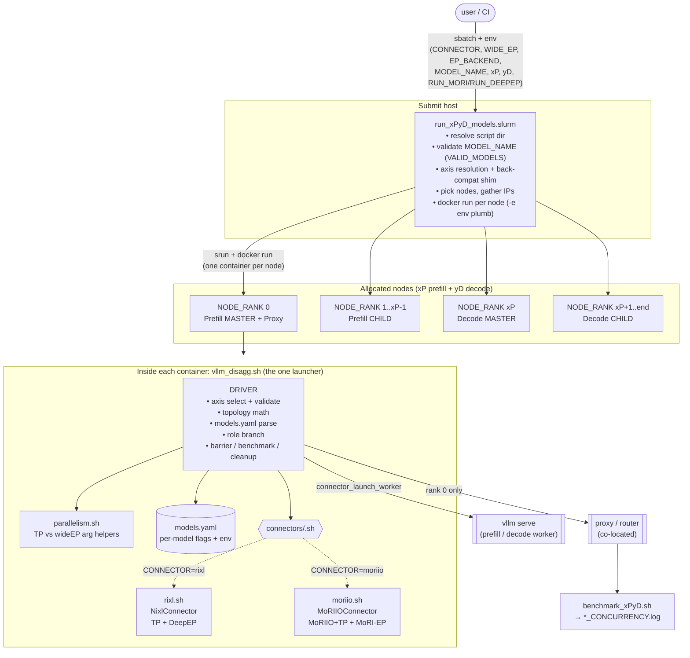
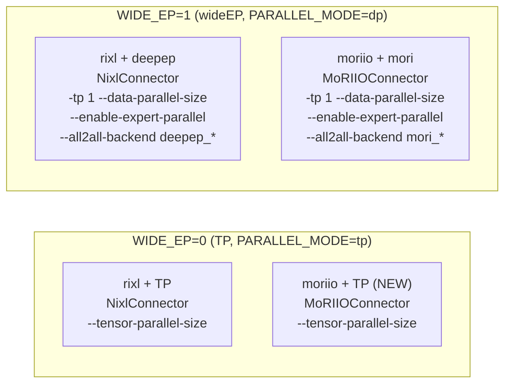
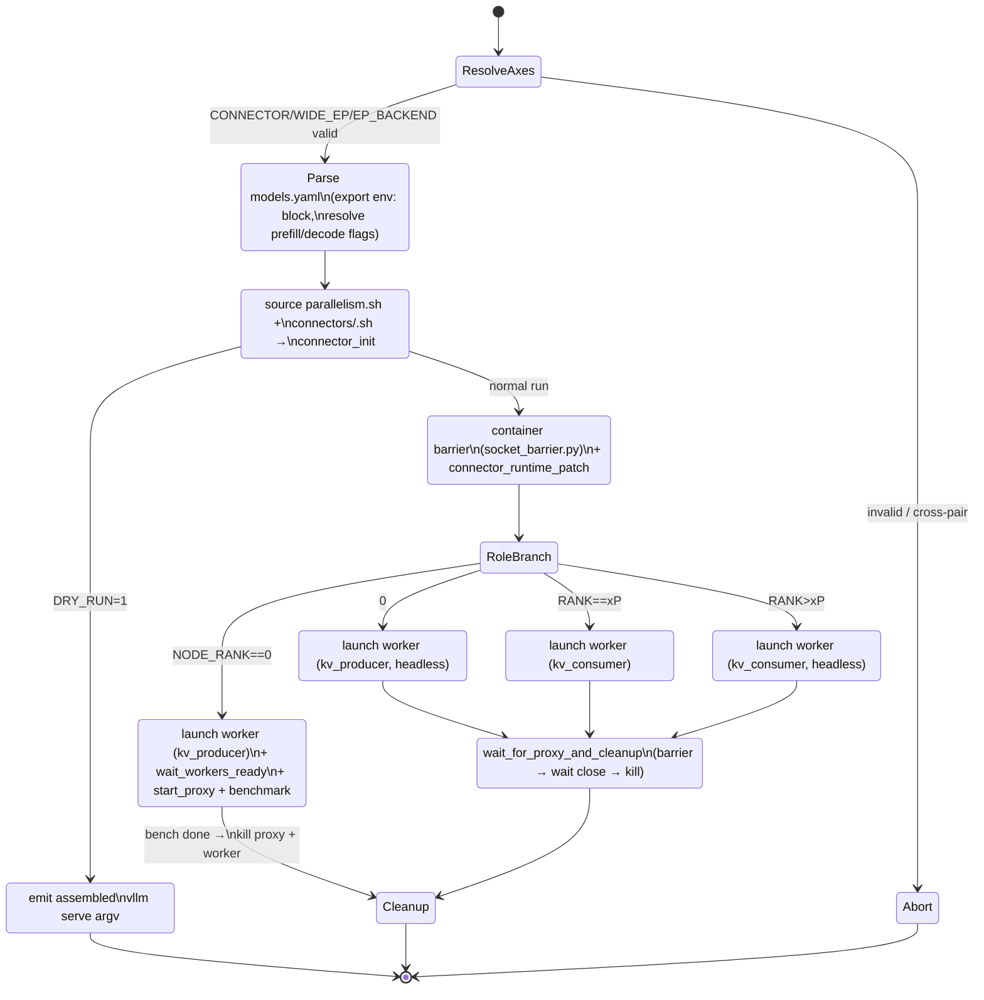
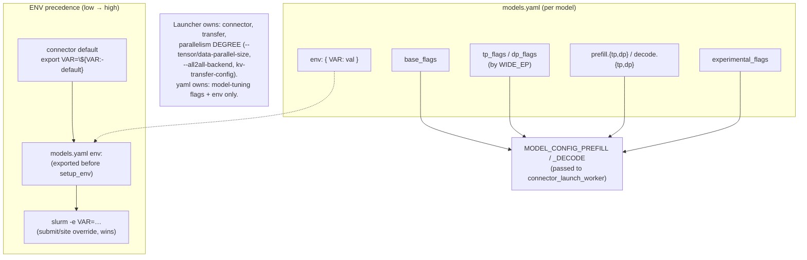
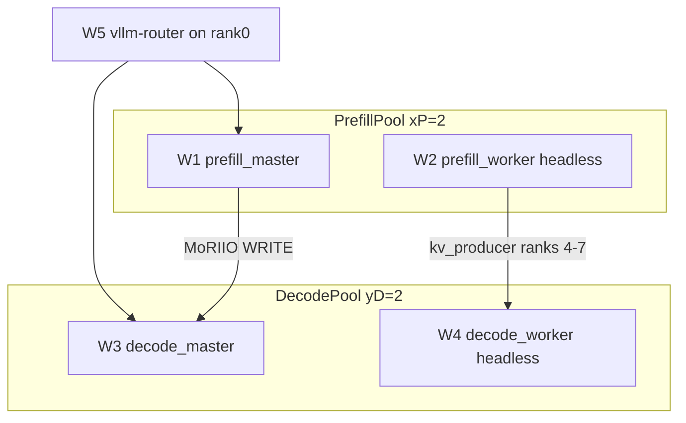

# Multinode inference: concepts

This page explains the ideas behind the multinode inference workloads in MAD. Read it
before [multinode-running.md](multinode-running.md), which shows how to run them, and
before the per-launcher references ([vllm-disagg.md](vllm-disagg.md),
[sglang-disagg.md](sglang-disagg.md)). For the words used across all docs pages, see the
glossary in [README.md](README.md).

## Contents

- [Why multinode](#why-multinode)
- [Prefill, decode and the KV cache](#prefill-decode-and-the-kv-cache)
- [Disaggregated prefill/decode](#disaggregated-prefilldecode)
- [Colocated multinode](#colocated-multinode)
- [Choosing between them](#choosing-between-them)
- [The three launchers](#the-three-launchers)
- [How madengine runs a launcher: slurm_multi](#how-madengine-runs-a-launcher-slurm_multi)
- [Parallelism terms](#parallelism-terms)
- [KV connectors and expert-parallel backends](#kv-connectors-and-expert-parallel-backends)
- [Topology: nodes, ranks and the router](#topology-nodes-ranks-and-the-router)
- [Architecture diagrams (vLLM disaggregated)](#architecture-diagrams-vllm-disaggregated)
- [Kimi-K3 worker taxonomy](#kimi-k3-worker-taxonomy)

## Why multinode

A node is one server with its GPUs, 8 GPUs per node on the clusters these launchers
target. Two things push inference past one node:

- **The model does not fit.** Kimi-K3 is a 2.8T-parameter Mixture-of-Experts model
  with a checkpoint of about 1.5 TB. An MI300X GPU has 192 GB, so the checkpoint does
  not fit one 8-GPU node. Every MI300X Kimi-K3 recipe is therefore multinode.
- **You want more throughput or steadier latency than one node gives.** Splitting the
  two phases of inference across separate nodes (disaggregation, below) raises
  concurrent throughput and isolates decode latency.

## Prefill, decode and the KV cache

A request to a language model runs in two phases:

- **Prefill** processes the whole input prompt at once and produces the first output
  token. Its result is the **KV cache**: the attention keys and values for every
  prompt token.
- **Decode** then generates the remaining output tokens one at a time. Each step reads
  the KV cache and appends to it.

Input sequence length (ISL) is the prompt length in tokens. Output sequence length
(OSL) is the number of generated tokens. Concurrency is the number of requests in
flight at once. The benchmarks in [benchmarks-and-results.md](benchmarks-and-results.md)
sweep all three.

## Disaggregated prefill/decode

In a **disaggregated** deployment (often written P/D or PD), prefill and decode run on
separate server instances on separate nodes:

- `xP` nodes form the **prefill pool**. Their servers are KV **producers**
  (`kv_producer`).
- `yD` nodes form the **decode pool**. Their servers are KV **consumers**
  (`kv_consumer`).
- A **KV connector** moves each request's KV cache from the prefill server that
  computed it to the decode server that continues it, over the RDMA fabric.
- A **proxy** or **router** is the single HTTP endpoint clients talk to. It sends each
  request to a prefill server and a decode server and returns the answer.

The job has `xP + yD` nodes; the minimum is 2 (`xP=1`, `yD=1`). A pool may span more
than one node.

What it buys, measured on Kimi-K3 on MI300X: disaggregated 2P/2D gives 5.7 times the
throughput of the colocated 2-node recipe at concurrency 8 (7.3 times at 16), plus
decode-latency isolation. The cost is roughly 4 times higher single-stream latency,
because one request runs on 2 GPUs instead of all 16. That trade is architectural, not
a tuning defect.

## Colocated multinode

In a **colocated** deployment, one vLLM instance spans several nodes. There is no
prefill/decode split and no KV connector. One request uses every GPU in the job.

The launcher is [`scripts/vllm_multinode/`](../scripts/vllm_multinode/). Its default
shape is the natural one:

- **TP within a node:** `TP_SIZE` defaults to the GPUs per node (8).
- **PP across nodes:** `PP_SIZE` defaults to the node count.
- **EP is opt-in** (`ENABLE_EP=1`). When on, the expert-parallel group is the TP group
  inside each node, so the expert all-to-all stays intra-node. The only cross-node
  traffic is the pipeline-parallel activation hand-off over NCCL.

The launcher refuses to start unless `TP_SIZE * PP_SIZE` equals nodes times GPUs per
node.

On Kimi-K3 on MI300X, PP2 x TP8 puts about 102 GB per GPU on a 2-node allocation. With
EP on, the 896 experts split 8 ways across each node's 8 GPUs (112 experts per GPU),
and that EP8 group is replicated on each of the 2 pipeline stages. "16" is the GPU
count, not the EP width.

Node roles inside the colocated job:

| `NODE_RANK` | Role |
|---|---|
| 0 | Head. Serves the OpenAI-compatible API on `SERVE_PORT` (default 8000), then runs the benchmark. |
| 1 .. N-1 | Worker. Runs `vllm serve --headless`, with no API server. |

The colocated launcher owns very little. Node discovery, the container launch and the
role split live in it. Everything else is reused from `scripts/vllm_dissag/`: the
`models.yaml` recipe (only its `env:` block), `socket_barrier.py`, the benchmark
scripts and `parse_to_csv.py`. That is why the whole `scripts/` directory is mounted
into its containers. Its knobs are listed in
[multinode-running.md](multinode-running.md#colocated-launcher-knobs).

## Choosing between them

| Want | Use |
|---|---|
| Lowest single-request latency | Colocated (`scripts/vllm_multinode`) |
| Highest concurrent throughput, decode-latency isolation | Disaggregated (`scripts/vllm_dissag` or `scripts/sglang_disagg`) |

The Kimi-K3 MI300X cards show the choice concretely:

| MAD tag | Nodes | Parallelism | Expert all2all | Use when |
|---|---|---|---|---|
| `pyt_vllm_kimi-k3_mi300x_pp2xtp8` | 2 | PP2 x TP8, no EP | none | Simplest baseline; lowest single-user latency |
| `pyt_vllm_kimi-k3_mi300x_wideep_allgather` | 2 | PP2 x TP8, EP8 per node | `allgather_reducescatter` | Expert-parallel without MoRI kernels |
| `pyt_vllm_kimi-k3_mi300x_wideep_moriep` | 2 | PP2 x TP8, EP8 per node | `mori_low_latency` (MoRI-EP) | MoRI-EP expert dispatch |
| `pyt_vllm_disagg_mori_kimi-k3` | 4 | 2P/2D, TP2 x DP8 = EP16 per pool | MoRI-EP + MoRIIO KV transfer | Highest concurrent throughput |

The first three are colocated. The fourth is disaggregated: 2 prefill and 2 decode
nodes joined by the MoRIIO connector. See [kimi-k3.md](kimi-k3.md) for the model.

## The three launchers

Each workload directory holds **model cards** in its `models.json`. A card names the
launcher script, the node count, the Dockerfile and the environment. The launcher is
one SLURM batch script.

| Directory | Launcher | What it runs | In-container entry point |
|---|---|---|---|
| [`scripts/vllm_dissag/`](../scripts/vllm_dissag/) | `run_xPyD_models.slurm` | vLLM disaggregated prefill/decode | `vllm_disagg.sh` |
| [`scripts/sglang_disagg/`](../scripts/sglang_disagg/) | `run_xPyD_models.slurm` | SGLang disaggregated prefill/decode | `sglang_disagg_mori_io_ep.sh` |
| [`scripts/vllm_multinode/`](../scripts/vllm_multinode/) | `run_multinode.slurm` | vLLM colocated, one instance across N nodes | `serve_colocated.sh` |

All three source [`scripts/common/cluster.sh`](../scripts/common/cluster.sh), the
site configuration: weight locations, fabric devices, ports and timeouts. Every value
there is `${VAR:-default}`, so anything you set in the environment wins. See
[configuration.md](configuration.md) for every layer.

Every launcher follows the same pattern:

1. It runs on the first node of the allocation (the batch host).
2. It validates the model and the topology, checks the GPU architecture, and finds the
   weights on every node.
3. It gathers the IP address of each node with `srun`.
4. It starts one container per node with `srun ... docker run`. Inside each container,
   `NODE_RANK` is the task's `SLURM_PROCID`, and the entry point branches on it.
5. When the benchmark finishes, it stops the containers. The two vLLM launchers then
   copy `perf.csv` to `perf_<MODEL_NAME>.csv` for madengine to collect, and exit 1 if
   there is none.

## How madengine runs a launcher: slurm_multi

[madengine](https://github.com/ROCm/madengine) is the tool that builds images and runs
MAD model cards. Most madengine launchers wrap a model script inside one container.
The multinode cards use a different launcher, **`slurm_multi`**, because their
`.slurm` script manages its own per-node containers. A card declares it like this:

```json
"distributed": { "launcher": "slurm_multi", "nnodes": 4 },
"slurm": { "nodes": 4, "gpus_per_node": 8, "time": "24:00:00" }
```

`slurm-multi` (with a hyphen) is accepted and normalised to `slurm_multi`.

What madengine does on `madengine run`:

1. It detects the `slurm_multi` launcher.
2. It generates a **wrapper SBATCH script** that exports the card's `env_vars`
   (shell-quoted) and runs the card's `.slurm` script with `bash` on the head node.
3. For registry images, it runs a parallel `srun docker pull` on all allocated nodes.
4. It submits the wrapper with `sbatch`. Inside an existing `salloc` allocation
   (`SLURM_JOB_ID` is set), it runs the wrapper synchronously with `bash` instead.
5. The `.slurm` script starts the per-node containers with `srun` and writes
   `perf.csv`.
6. madengine writes a completion marker and collects the results.

```
madengine build --use-image <image>   -> manifest with the image, card's slurm/distributed merged in
madengine run --manifest-file ...     -> wrapper SBATCH, parallel docker pull, sbatch (or bash in salloc)
card's .slurm script on the head node -> srun + docker run per node, writes perf.csv
```

Consequences worth knowing:

- **The launcher's own `#SBATCH` header is inert** under madengine. Every allocation
  setting comes from madengine. Nothing is passed to the `.slurm` script on its command
  line; the topology travels entirely through `env_vars`.
- **`slurm.nodes` sizes the allocation.** madengine emits it as `#SBATCH --nodes` and
  defaults it to 1. `distributed.nnodes` carries the same number for launcher detection
  but does not size the allocation. Keep the two in sync.
- **Allocation defaults** come from madengine's SLURM presets: partition `amd-rccl`,
  8 GPUs per node, exclusive. Override them in `--additional-context`.

How to run a card this way is in [multinode-running.md](multinode-running.md).

## Parallelism terms

| Term | Meaning here |
|---|---|
| TP (tensor parallel) | One layer's weights split across GPUs that compute together. |
| PP (pipeline parallel) | Layers split into stages on different GPUs or nodes; activations pass between stages. Used by the colocated launcher across nodes. |
| DP (data parallel) | Independent replicas (DP ranks), each serving its own requests. |
| EP (expert parallel) | The experts of a Mixture-of-Experts model split across GPUs. Tokens travel to their experts in an **all-to-all** exchange (dispatch and combine). |
| wideEP | The vLLM disagg launcher's DP+EP mode (`WIDE_EP=1`): one DP rank per GPU (or per `EP_TP_SIZE` GPUs), experts spread across the whole pool. |
| `EP_TP_SIZE` | TP degree inside each DP rank on the wideEP path. Default 1. |
| Master / child | In a pool that spans several nodes, the master node runs the API server; child nodes run `--headless` workers that join it. |

### TP within EP (`EP_TP_SIZE`)

On the wideEP path, each GPU is normally one DP rank (TP1). That fails when the
**replicated** weights, the non-expert part that every DP rank holds in full, do not
fit one GPU. Kimi-K3 on MI300X has 106.5 GiB of replicated attention and shared-expert
weight. At TP1/DP16 that is 190.7 GiB per GPU before the KV cache or the 16 GiB MoRI
heap, which does not fit 192 GB. TP2 shards it to 53.3 GiB per GPU, 137.5 GiB of
weights per GPU in all, with room to spare.

The launcher sizes the pools from it:

```
dp_per_node  = GPUS_PER_NODE / EP_TP_SIZE
pool DP size = nodes_in_pool * dp_per_node
EP width     = pool DP size * EP_TP_SIZE
```

So Kimi-K3 at 2P/2D with `EP_TP_SIZE=2` runs TP2 x DP8 = EP16 per pool, where
DeepSeek runs TP1 x DP16. Rules the launcher enforces:

- `EP_TP_SIZE > 1` requires `CONNECTOR=moriio WIDE_EP=1`.
- `EP_TP_SIZE` must divide `GPUS_PER_NODE`.
- `EP_TP_SIZE > 1` needs equal pools (`xP == yD`). The router advertises one DP width
  for both pools, and the connector derives each pool's ranks per node from it.

It is deliberately not called `TP_SIZE`: `cluster.sh` sets `TP_SIZE` to the GPUs per
node for the colocated launcher, and reading that on the wideEP path would silently
turn every TP1/DP16 recipe into TP8/DP2.

## KV connectors and expert-parallel backends

### vLLM: the 2 x 2 matrix

The vLLM disagg launcher is driven by two axes plus one validated sub-axis:

- **`CONNECTOR`**, the KV-transfer connector:
  - `rixl`: vLLM's NixlConnector (NIXL over UCX).
  - `moriio`: vLLM's MoRIIOConnector (MoRI IO).
- **`WIDE_EP`**, the parallelism mode: `0` is TP, `1` is wideEP (DP+EP).
- **`EP_BACKEND`**, the expert all-to-all, only when `WIDE_EP=1`:
  - `mori`: MoRI-EP kernels (`mori_*` all2all backends).
  - `deepep`: DeepEP kernels (`deepep_*` all2all backends).

wideEP pairs each connector with its own backend, so there are exactly four valid
combinations:

| # | `CONNECTOR` | `WIDE_EP` | `EP_BACKEND` | Valid | What it is |
|---|---|---|---|---|---|
| 1 | `rixl` | `0` (TP) | none | yes | NIXL + TP (dense, tensor-parallel) |
| 2 | `moriio` | `0` (TP) | none | yes | MoRIIO + TP (dense, tensor-parallel) |
| 3 | `moriio` | `1` (wideEP) | `mori` | yes | MoRI-EP (wideEP DP+EP, mori all2all) |
| 4 | `rixl` | `1` (wideEP) | `deepep` | yes | DeepEP (wideEP DP+EP, deepep all2all) |
| 5 | `moriio` | `1` (wideEP) | `deepep` | no | cross-pair, aborts |
| 6 | `rixl` | `1` (wideEP) | `mori` | no | cross-pair, aborts |

`EP_BACKEND` defaults to the connector's partner (`moriio` to `mori`, `rixl` to
`deepep`), so you rarely set it. With nothing set, the launcher runs combo 1.

The older flags still work and map onto the axes when `CONNECTOR` is not set:

| Legacy flag | Resolves to |
|---|---|
| `RUN_MORI=1` | `CONNECTOR=moriio WIDE_EP=1 EP_BACKEND=mori` (combo 3) |
| `RUN_DEEPEP=1` | `CONNECTOR=rixl WIDE_EP=1 EP_BACKEND=deepep` (combo 4) |
| neither | `CONNECTOR=rixl WIDE_EP=0` (combo 1) |

Setting both `RUN_MORI=1` and `RUN_DEEPEP=1` is an error.

Which models may run which combo, and every per-combo knob, are in
[vllm-disagg.md](vllm-disagg.md).

### Colocated vLLM

The colocated launcher has no KV connector. Its only transport choice is the expert
all-to-all when `ENABLE_EP=1`, set with `ALL2ALL_BACKEND` (for example
`allgather_reducescatter` or `mori_low_latency`).

### SGLang

The SGLang disagg launcher has its own two switches:

| `RUN_MORI` | `KV_TRANSFER_BACKEND` | KV transfer backend |
|---|---|---|
| `1` (default) | `mori` | MoRI IO |
| `0` | `mooncake` | Mooncake |

The backend is passed to SGLang as `--disaggregation-transfer-backend`. It is kept out
of `models.yaml` so model configs stay backend-agnostic.

| `DP_MODE` | `PARALLEL_MODE` | Flags applied | Models |
|---|---|---|---|
| `0` (default) | `tp` | `base_flags` + `tp_flags` + `prefill.tp` / `decode.tp` | All |
| `1` | `dp` | `base_flags` + `dp_flags` (`--moe-a2a-backend mori`, DP attention) + `prefill.dp` / `decode.dp` | DeepSeek-V3, DeepSeek-R1 only |

`DP_MODE=1` enables MoRI expert parallelism with DP attention and requires
`RUN_MORI=1`. An allowlist (`MORI_DP_MODE1_ALLOWED_MODELS`) enforces the model
restriction. The SGLang cards are named after the combination: `mori_io` (MoRI IO,
TP), `mori_dp` (MoRI IO, DP_MODE=1) and `mooncake`. Details are in
[sglang-disagg.md](sglang-disagg.md).

## Topology: nodes, ranks and the router

`NODE_RANK` is each node's position in the allocation, from 0. The vLLM disagg
launcher assigns roles like this, in every mode:

```
Node 0          -> Prefill MASTER + Proxy (co-located)
Nodes 1..xP-1   -> Prefill CHILD (if xP > 1, wideEP)
Node xP         -> Decode MASTER
Nodes xP+1..end -> Decode CHILD (if yD > 1, wideEP)
```

- `num_nodes = xP + yD`.
- The proxy or router runs on the prefill master (node 0). It is CPU-only and listens
  on its own port, separate from the vLLM server.
- Child nodes exist only when a pool spans more than one node. In TP 1P/1D there is
  just rank 0 (prefill master and proxy) and rank `xP` (decode master).
- Only rank 0 runs the benchmark. The other ranks wait for the proxy to come up, then
  wait for it to close, then stop their servers.

The SGLang launcher also co-locates its router (`sglang_router`, port 2322) on
`NODE_RANK` 0, the first prefill node, so it needs no extra node either.

The colocated launcher has no pools: rank 0 is the head, the rest are headless
workers.

## Architecture diagrams (vLLM disaggregated)

These diagrams come from
[`scripts/vllm_dissag/ARCHITECTURE.md`](../scripts/vllm_dissag/ARCHITECTURE.md). They
are Mermaid, which GitHub renders.

### Component architecture

How the pieces fit, from `sbatch` down to the per-node `vllm serve` workers.



### Axis resolution

The driver collapses the legacy flags and the explicit axes into
`CONNECTOR x WIDE_EP (x EP_BACKEND)`, then validates. This is the decision flow at the
top of `vllm_disagg.sh`. The batch script `run_xPyD_models.slurm` runs the same shim
first, so a direct run and an `sbatch` run agree.

```mermaid
flowchart TD
    start([env in]) --> q0{CONNECTOR set?}

    q0 -->|no| shim{legacy flag?}
    shim -->|RUN_MORI=1| m["CONNECTOR=moriio\nWIDE_EP=1\nEP_BACKEND=mori"]
    shim -->|RUN_DEEPEP=1| d["CONNECTOR=rixl\nWIDE_EP=1\nEP_BACKEND=deepep"]
    shim -->|neither| def["CONNECTOR=rixl\nWIDE_EP=0  (TP)"]
    q0 -->|yes| explicit["use explicit\nCONNECTOR / WIDE_EP / EP_BACKEND"]

    m --> vconn
    d --> vconn
    def --> vconn
    explicit --> vconn

    vconn{validate CONNECTOR\nin rixl|moriio}
    vconn -->|invalid| err1[["abort: invalid CONNECTOR"]]
    vconn -->|valid| vwide{validate WIDE_EP\nin 0|1}
    vwide -->|invalid| err2[["abort: invalid WIDE_EP"]]
    vwide -->|valid| qwide{WIDE_EP == 1?}

    qwide -->|no  (TP)| okTP["EP_BACKEND = n/a"]
    qwide -->|yes wideEP| qpair{connector ↔ EP_BACKEND}
    qpair -->|moriio + mori| okM["OK: all2all = mori_*"]
    qpair -->|rixl + deepep| okD["OK: all2all = deepep_*"]
    qpair -->|moriio + deepep| err3[["abort: cross-pair"]]
    qpair -->|rixl + mori| err4[["abort: cross-pair"]]

    okTP --> done([source connector + parallelism])
    okM --> done
    okD --> done
```

### The 2 x 2 capability matrix

What each valid combination puts on the `vllm serve` command line.



With `EP_TP_SIZE > 1` the wideEP workers run `--tensor-parallel-size <EP_TP_SIZE>`
instead of `-tp 1`.

### Per-node runtime state machine

What one container does after the driver resolves the axes. The branch is on
`NODE_RANK`; rank 0 also runs the proxy and the benchmark.



PrefillChild and DecodeChild exist only when `xP > 1` or `yD > 1` (wideEP, multinode
DP). In TP 1P/1D there is just rank 0 (prefill master and proxy) and rank `xP` (decode
master).

### Driver and connector hook contract

Every connector implements the same six hooks, and the driver calls them in a fixed
order. That is what makes a new backend a mostly self-contained file.

```mermaid
sequenceDiagram
    participant D as vllm_disagg.sh (driver)
    participant Y as models.yaml
    participant P as parallelism.sh
    participant C as connectors/<CONNECTOR>.sh
    participant V as vllm serve / proxy

    D->>Y: parse env: + prefill/decode flags (by PARALLEL_MODE)
    D->>P: source (parallelism_is_wide_ep, role_args)
    D->>C: source + connector_init()  ⟶ ports, PROXY_TYPE, CONTAINER_BARRIER_PORT
    D->>C: connector_runtime_patch()  (moriio: no-op, fixes in-source; rixl: no-op, deepep seds in setup_env)
    Note over D: branch on NODE_RANK
    D->>C: connector_launch_worker(role, dp_size, dp_addr, kv_role, log_prefix[, start_rank])
    C->>C: connector_setup_env(EP_BACKEND)  ⟶ fabric env (MoRI/RDMA or UCX/NIXL)
    C->>C: build kv-transfer-config (MoRIIO vs Nixl shape)
    C->>V: vllm serve … (assembled argv)  ⟶ WORKER_PID
    alt NODE_RANK == 0
        D->>C: connector_wait_workers_ready()  (grep "Application startup complete")
        D->>C: connector_start_proxy()  ⟶ proxy_pid (+ curl probe for moriio)
        D->>V: benchmark_xPyD.sh → *_CONCURRENCY.log
    else child / decode-master
        D->>D: wait_for_proxy_and_cleanup(WORKER_PID)
    end
```

The per-connector responsibilities of each hook are tabled in
[vllm-disagg.md](vllm-disagg.md#connector-hooks).

### Per-model configuration and environment layering

Where each piece of configuration lives, and which wins when they overlap.



The full precedence across all layers, including `cluster.sh`, the card's `env_vars`
and madengine, is in [configuration.md](configuration.md).

## Kimi-K3 worker taxonomy

Kimi-K3 disagg uses TP2 x DP8 = EP16 per pool, not DeepSeek's TP1 x DP16. Five logical
workers (W1 to W5) map onto four SLURM tasks plus a router co-located on rank 0.



| Worker | Recipe `ROLE=` | `NODE_RANK` | Headless | KV role | Kimi-K3 specific |
|---|---|---|---|---|---|
| W1 | `prefill_master` | 0 (plus the W5 router) | no | `kv_producer` | `--tensor-parallel-size 2`, `--api-server-count 8` |
| W2 | `prefill_worker` | 1 | yes, start-rank 4 | `kv_producer` | must carry `--kv-transfer-config` |
| W3 | `decode_master` | `xP` (2) | no | `kv_consumer` | same TP2, plus pod hosts |
| W4 | `decode_worker` | `xP+1` (3) | yes, start-rank 4 | `kv_consumer` | must carry `--kv-transfer-config` |
| W5 | (router) | 0 only | n/a | n/a | `--moriio-dp-size 8`, `--intra-node-data-parallel-size 4` |

- **Example topology (2P/2D):** `xP=2`, `yD=2`, 4 nodes. The launcher itself is
  generic (`NUM_NODES = xP + yD`, any `xP + yD >= 2`); `run_xPyD_models.slurm`
  enforces no Kimi-K3-specific topology lock.
- **Pod hosts:** `PREFILL_POD_HOSTS` and `DECODE_POD_HOSTS` are the first `xP` and the
  next `yD` IPs from `IPADDRS`. They go into each rank's KV-transfer JSON as
  `moriio_pod_hosts`. They are set only when `EP_TP_SIZE > 1`, because only then does
  the router address the whole pool's DP ranks (`--moriio-dp-size`). At
  `EP_TP_SIZE=1` the router only targets the master node's ranks, and a host list
  would misroute them, so it is left empty.
- **JIT cache:** Kimi-K3 prefill (mori HT/LL, cudagraph `NONE`) and decode (LL,
  `PIECEWISE`) compile different kernel variants. When `EP_TP_SIZE > 1`, the launcher
  mounts separate `.../prefill` and `.../decode` cache directories under the image key.
  `JIT_CACHE_SPLIT_ROLE=0` turns the split off.

More on Kimi-K3 is in [kimi-k3.md](kimi-k3.md).
