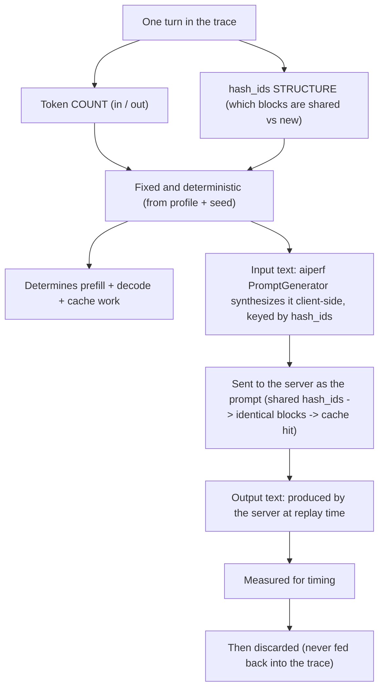
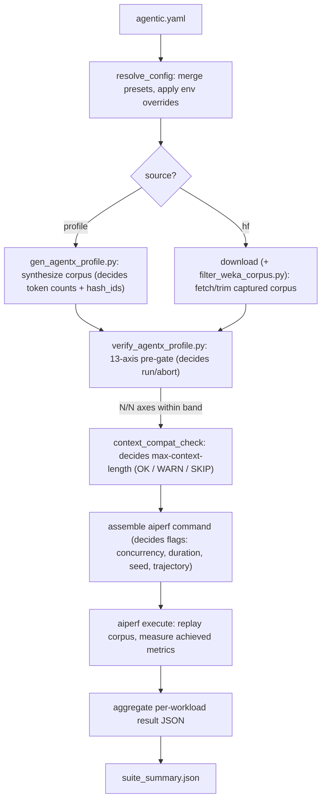
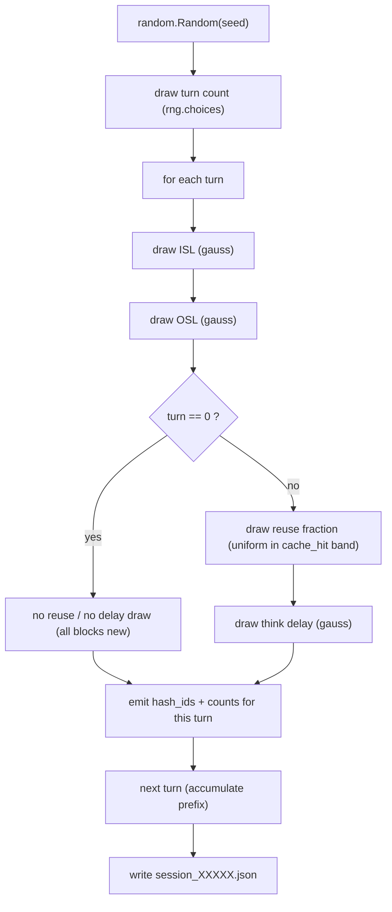
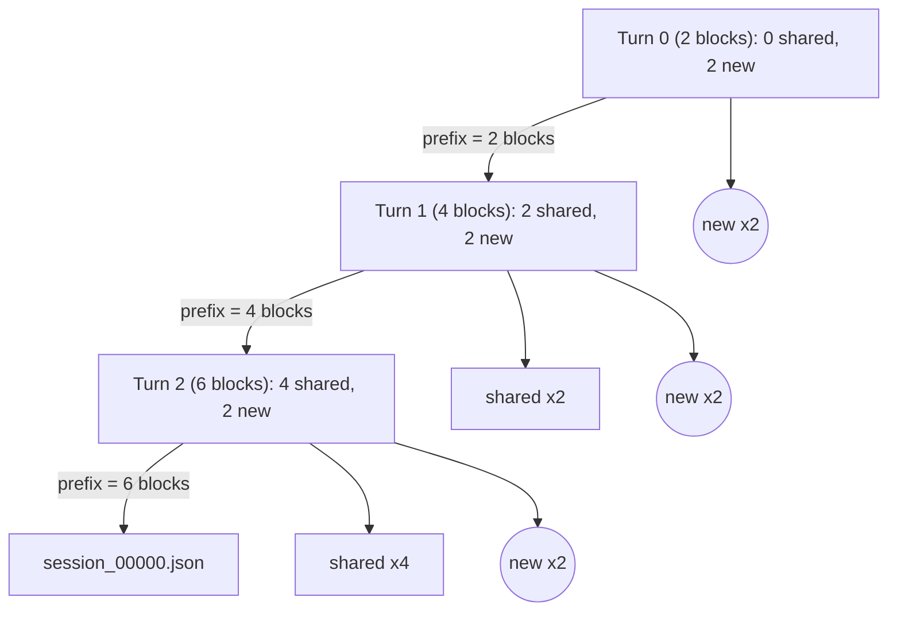
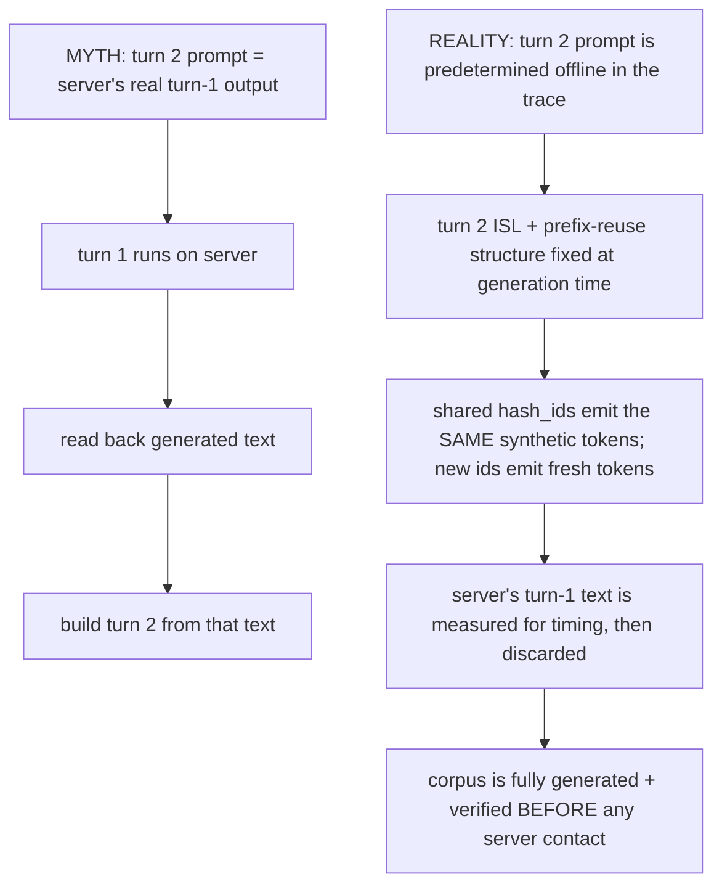
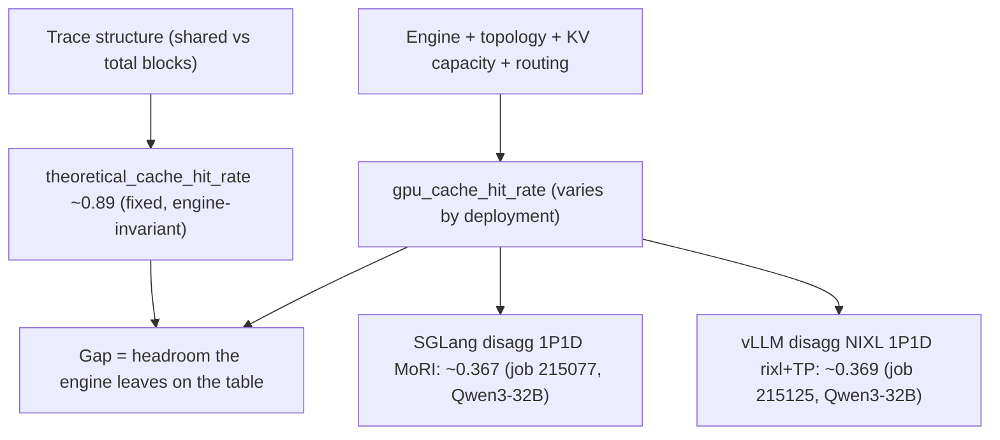

# How AgentX works (and why it is accurate)

This is the *how/why* companion to the AgentX docs. The other three answer
different questions:

- [README.md](README.md) - the config schema and Tier 1 / Tier 2 knobs.
- [profiles/README.md](profiles/README.md) - how to author a profile/preset.
- [SCENARIOS.md](SCENARIOS.md) - copy-paste `agentic.yaml` recipes.

This doc explains the **mechanism**: what the trace actually contains, why a
synthetic corpus measures a real engine faithfully, and how each knob moves
prefill/decode/cache/latency. Diagrams use a deliberately tiny **toy profile**
so the block and cache math is countable by hand, then Section 9 maps the toy
numbers back to the real `conformance_256k` preset.

**Toy profile (used throughout):**

```yaml
block_size: 64
seed: 42
n_sessions: 4
isl_p:   [128, 256, 384]     # P50 / P90 / P99 input tokens
osl_p:   [16, 48, 96]        # P50 / P90 / P99 output tokens
delay_p: [1, 3, 8]           # P50 / P90 / P99 inter-turn delay (s)
turns:
  values:  [1, 2, 3]
  weights: [2, 2, 1]
cache_hit: [0.88, 0.90]      # per-turn prefix-reuse band -> ~89%
```

## 1. Mental model

AgentX offers a **fixed, reproducible load** to a serving engine and measures the
**achieved metrics** that engine produces. The *offered* side - how many input
and output tokens each turn carries, how many turns per session, how much of each
turn's prompt is a reused prefix, and how long the client "thinks" between turns -
is fully determined by the profile plus its `seed`, so it is **byte-identical on
every run and every engine**. The *achieved* side - throughput, time-to-first-token
(TTFT), inter-token latency, and the GPU-observed cache-hit rate - is what varies
by engine, topology, and configuration. Holding offered load fixed is exactly what
makes cross-engine comparisons fair: any difference in the achieved metrics is a
property of the engine, not of the workload.

## 2. Core idea: content-independence

Serving cost is driven by token **counts** and cache **structure**, not by token
**content**. A request of a given ISL and OSL with a given prefix-reuse pattern
does the same prefill and decode work whether the tokens spell real English or are
synthetic. AgentX exploits this: each turn in the trace carries a **token count**
(`in` / `out`) and a **hash_ids** list (the block-level structure that tells the
engine which KV blocks are shared prefix vs new). The **actual token text** is not
in the trace at all. Two different actors materialize text at replay time:

- **Input (prompt) text** is synthesized **client-side by aiperf**, not the server.
  aiperf's `PromptGenerator` is keyed by the turn's `hash_ids` (shared ids emit the
  **same** tokens across turns, new ids emit fresh tokens), so the prompt is
  deterministic filler whose block structure matches the trace. This is what makes
  prefix reuse real: identical `hash_ids` produce byte-identical prompt blocks the
  engine can serve from KV cache.
- **Output text** is produced by the **server** during decode; its timing is
  measured (TTFT, inter-token latency) and then the text itself is discarded.



Because the parts that determine serving cost (counts + structure) are fixed
offline, a synthetic corpus exercises the engine identically to a captured trace
of the same shape - while *guaranteeing* the target distribution.

## 3. End-to-end pipeline

The suite resolves one `agentic.yaml` into N workloads and, per workload, either
generates or downloads a corpus, verifies it as a hard pre-gate, assembles the
replay command, runs aiperf, and rolls the result into a suite summary. Each stage
below is annotated with *what it decides*.



The entire corpus is generated **and** verified before any server contact - the
verify pre-gate aborts the run unless the corpus matches the profile's own targets.

## 4. Corpus generation internals

`generate_corpus()` in [gen_agentx_profile.py](gen_agentx_profile.py) draws every
random value from a single `random.Random(seed)` in a **fixed call order**. Per
session it first draws the turn count, then walks the turns; within each turn it
draws ISL, then OSL, then (only for turns after the first) the reuse fraction and
the think delay:



Fixing `seed` makes the corpus **byte-identical** because every choice is a pure
function of that seed and the fixed call order: the same `random.Random(42)`
produces the same sequence of draws, `hash_ids` are `blake2b` hashes of
`"<seed>:<idx>:<turn>:<block>"`, and the session id is a `blake2b` hash of
`"<id_prefix>-<seed>-<idx>"`. No wall-clock, no server, no floating-point
nondeterminism from the engine enters the corpus. Change `seed` (or `id_prefix`)
and you get a different-but-still-deterministic corpus; keep them and you can
regenerate the exact same bytes anywhere.

## 5. Multi-turn replay mechanics (the key visual)

This is the part most people picture incorrectly. Take one toy session of 3 turns
where the ISL draws land on the P50 / P90 / P99 values (`128`, `256`, `384`
tokens). With `block_size 64`:

- **Turn 0** - ISL `128` = **2 blocks**. Turn 0 has no prior context, so all
  **2 blocks are new** (`0 shared + 2 new`). The accumulated prefix is now 2 blocks.
- **Turn 1** - ISL `256` = **4 blocks**. Wanted reuse `floor(4 * 0.89) = 3`, but
  only 2 prefix blocks exist, so reuse is capped at `min(2, 3) = 2`:
  **2 shared + 2 new = 4**. Prefix grows to 4 blocks.
- **Turn 2** - ISL `384` = **6 blocks**. Wanted reuse `floor(6 * 0.89) = 5`, capped
  at `min(4, 5) = 4`: **4 shared + 2 new = 6**. Prefix grows to 6 blocks.

Every turn's counts add up exactly (`0+2=2`, `2+2=4`, `4+2=6`). The per-turn reuse
is capped by the available prefix (`min(len(prefix_blocks), floor(total * reuse))`),
so short early turns sit below the `0.88-0.90` band; over long sessions the prefix
saturates and the corpus-wide reuse converges into that band (Section 6).



Shared blocks (rectangles labeled `shared`) reuse the *same* `hash_ids` as prior
turns, so the engine can serve them from KV cache; new blocks (circles labeled
`new`) carry fresh `hash_ids` that force fresh prefill.

### The code that does this

All of the above is one loop in `make_session()` in
[gen_agentx_profile.py](gen_agentx_profile.py). Note how `prefix_blocks`
accumulates across turns and each turn's `hash_ids` is `reuse_slice + new_ids`:

```python
prefix_blocks = []                 # accumulated shared prefix (block hashes)
salt = f"{seed}:{idx}"
for turn in range(n_turns):
    isl = samp(ISL_mu, ISL_sig, isl_lo, isl_hi)
    osl = samp(OSL_mu, OSL_sig, osl_lo, osl_hi)
    total_blocks = max(1, isl // block)
    if turn == 0:
        new_blocks = total_blocks                       # turn 0: everything is new
    else:
        reuse = min(len(prefix_blocks),                 # cap reuse at prefix we have
                    int(total_blocks * rng.uniform(cache_lo, cache_hi)))
        new_blocks = max(1, total_blocks - reuse)       # always >=1 fresh block
    reuse_slice = prefix_blocks[:total_blocks - new_blocks]   # SHARED ids (same as prior turns)
    new_ids = []
    for b in range(new_blocks):
        h = int(hashlib.blake2b(f"{salt}:{turn}:{b}".encode(),
                                digest_size=8).hexdigest(), 16) & 0x7FFFFFFFFFFFFFFF
        new_ids.append(h)                               # fresh ids -> force prefill
    hash_ids = reuse_slice + new_ids
    prefix_blocks = hash_ids                            # grow the prefix for next turn
```

Three details make the mechanics deterministic and structural:

- **`prefix_blocks = hash_ids`** at the end of each turn is what grows the shared
  prefix; turn `N` can only reuse the blocks turns `0..N-1` laid down, which is why
  early short turns fall below the `cache_hit` band.
- **`reuse_slice = prefix_blocks[:...]`** takes the *first* K prior block ids
  verbatim, so shared blocks carry the identical `hash_ids` the engine already has
  cached - reuse is by structure, not by content.
- **`new_ids`** are `blake2b` of `"<seed>:<idx>:<turn>:<block>"`, so they are fresh
  (force prefill) yet fully reproducible from `seed` - no server, no wall-clock.

### What people think vs what actually happens

The common misconception is that turn 2's prompt is assembled from the server's
*actual* turn-1 output text - i.e. that replay is a live conversation. It is not.



Because the whole corpus exists and passes the verify pre-gate **before** the
server is ever contacted, turn 2 cannot depend on the server's turn-1 output. The
prefix reuse is structural (shared `hash_ids`), not semantic.

## 6. Theoretical vs achieved cache-hit

Two different cache-hit numbers show up in results, and they mean different things:

- **theoretical_cache_hit_rate** is computed purely from the **trace structure**
  (the ratio of shared to total blocks the profile lays down). It is a property of
  the corpus, so it is **engine-invariant** - the same corpus yields the same
  theoretical rate everywhere. For `conformance_256k` this sits at ~`0.89`
  (`cache_hit: [0.88, 0.90]`, `cache_target: 89`).
- **gpu_cache_hit_rate** is what the engine *actually* achieves at runtime. It
  depends on engine, KV-cache capacity, routing, and prefill/decode topology, so it
  **varies** and is typically well below the theoretical ceiling.



Both anchor runs above have `error_rate 0.0` against the same theoretical ~`0.89`
corpus, yet each achieves only ~`0.37` GPU cache-hit - the gap is an engine/topology
property surfaced by holding the offered load fixed.

## 7. Parameter -> effect map

Each bullet reads "**increase** the knob -> effect on prefill / decode / cache /
latency / measurement." Grouped by what the knob controls.

**Offered load**

- **`isl_p`** - increase -> more input tokens per turn -> more prefill work and
  more blocks -> higher TTFT; grows the prefix so later turns have more to reuse.
- **`osl_p`** - increase -> more output tokens per turn -> more decode steps ->
  higher end-to-end latency and inter-token time; little effect on prefill/cache.
- **`turns`** - shift weight to higher values -> longer sessions -> prefix
  saturates, so corpus-wide reuse climbs toward the `cache_hit` band.
- **`delay_p`** - increase -> longer client think-time between turns -> lower
  request pressure per session; can let cached prefixes age out on capacity-bound
  engines (lowering achieved cache-hit).
- **`n_sessions`** - increase -> more concurrent session trees and tighter
  percentiles (closer match to targets) -> bigger corpus and longer generation.

**Cache structure**

- **`block_size`** - increase -> fewer, coarser blocks per turn -> coarser reuse
  granularity (a single changed token invalidates a larger block); changes the
  block accounting behind both cache-hit numbers.
- **`cache_hit`** - raise the `[lo, hi]` band -> more shared blocks per turn ->
  higher theoretical cache-hit and less new prefill per late turn.
- **`hash_ids`** - not a user knob; it is the emitted per-block structure. Shared
  ids across turns are exactly what makes prefix reuse measurable.

**Determinism**

- **`seed`** - change it -> a completely different but still reproducible corpus;
  keep it -> byte-identical regeneration everywhere.
- **`id_prefix`** - change it -> different session ids (corpus identity) with the
  same distribution; used to byte-match a committed corpus.

**Validation (verify bands)**

- **ISL band `0.80-1.20`** - measured ISL percentiles must land within +/-20% of
  target or the axis is `off`.
- **OSL band `0.70-1.40`** - wider tolerance for the longer-tailed output lengths.
- **Turns band `0.60-1.60`** - widest, since the discrete turn distribution is
  coarse at small `n_sessions`.
- **Delay band `0.50-2.00`** - very wide; delay does not affect served token work.
- **Cache band `0.97-1.03`** - tightest; the cache-hit P50 must be within +/-3% of
  target, so structural reuse is held to close tolerance.

**Cosmetic / routing**

- **`model_tag`** - written into `requests[].model` and `models[]`; retag per
  served model. No effect on token work.
- **Tier-2 `max_isl`** - drop sessions with any turn over N input tokens (trims the
  ISL tail of a downloaded corpus).
- **Tier-2 `max_turns`** - truncate each session to its first N turns (caps session
  length / prefix growth).
- **Tier-2 `sample`** - randomly keep N sessions (fixed `seed=42`) to shrink a
  downloaded corpus.

## 8. Example metrics output

An illustrative per-workload result block (values are illustrative, not from a
specific run) with each field mapped to the knob that drives it:

```
theoretical_cache_hit_rate : 0.89     # trace structure: cache_hit + turns + block_size (fixed)
gpu_cache_hit_rate         : 0.37     # engine + topology + KV capacity + routing (varies)
error_rate                 : 0.00     # request health; gated by --failed-request-threshold
output_token_throughput    : 1850 tok/s  # decode capacity: osl_p + concurrency + engine
time_to_first_token_p50    : 640 ms   # prefill cost: isl_p + block_size + achieved cache-hit
inter_token_latency_p50    : 18 ms    # decode step cost: osl_p + engine + concurrency
```

Reading it: the two cache-hit lines are the theoretical (fixed by the corpus) vs
achieved (engine-dependent) pair from Section 6; `error_rate` should be `0.00`
for a valid run; throughput and inter-token latency track output work (`osl_p`,
concurrency, engine); TTFT tracks input work (`isl_p`, `block_size`) minus whatever
the engine reuses from cache.

## 9. Mapping the toy to `conformance_256k`

The toy is the same shape as the shipped [conformance_256k.yaml](profiles/conformance_256k.yaml)
preset - just scaled down so the block math is hand-countable. To connect them:

- **`isl_p`** toy `[128, 256, 384]` -> real `[74000, 155000, 235000]` (hundreds of
  blocks per turn instead of a handful).
- **`osl_p`** toy `[16, 48, 96]` -> real `[320, 3300, 17000]` (long, heavy-tailed
  outputs).
- **`delay_p`** toy `[1, 3, 8]` -> real `[4, 31, 240]` seconds.
- **`turns`** toy `values [1,2,3]` -> real long-tail `values [1,2,3,4,6,10,20,45,103]`,
  so real sessions run long enough for prefix reuse to saturate into the band.
- **`cache_hit`** `[0.88, 0.90]` - identical in both (the reuse band that yields the
  ~`0.89` theoretical cache-hit).
- **`seed`** `42` and **`block_size`** `64` - identical in both, so the same
  regeneration guarantees apply.

Everything the toy demonstrates - content-independence, deterministic generation,
structural prefix reuse, and the theoretical-vs-achieved cache-hit split - holds
unchanged at conformance scale; only the counts get bigger.
