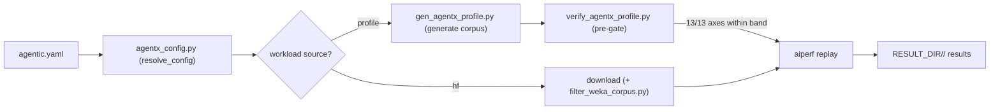

# AgentX benchmarking core

AgentX runs a **list of agentic trace-replay workloads** against **one** served
endpoint. For each workload the suite either **generates** a synthetic
`weka_trace` corpus from a distribution profile or **downloads** a real captured
HuggingFace (HF) trace, **verifies** the corpus as a hard pre-gate, **replays**
it with aiperf, and writes a per-workload result dir plus a combined suite
summary. The whole run is described by one `agentic.yaml` (a `serving:` block, a
`run:` block, and a `workloads:` list); adding "N cases" just means adding N list
entries.



This document covers the **agentx core**: the config schema, the profile/preset
model, the generate/verify tools, and the Tier 1 / Tier 2 knobs. The launcher /
disaggregated-serving integration and the deep env/run-path reference are out of
scope here (see [See also](#see-also)).

## File map

```
scripts/common/agentx/
  agentx_config.py        # config loader: parses agentic.yaml + profiles, resolves per-workload params, emits JSON/shell
  gen_agentx_profile.py   # seed-deterministic corpus generator (profile JSON -> session_XXXXX.json files)
  verify_agentx_profile.py# corpus verifier: 13-axis conformance table + "N/N axes within band" pre-gate
  filter_weka_corpus.py   # Tier 2 filter: trim a downloaded hf corpus (max_isl / max_turns / sample)
  agentic.example.yaml    # annotated canonical config; copy to agentic.yaml and edit
  profiles/               # shipped presets + authoring guide
    README.md             # profile/preset authoring guide (see profiles/README.md)
    conformance_256k.yaml # Case-A generated conformance profile (ExplainX targets)
    conformance_512k.yaml # Case-B longer-context conformance profile (ISL tail to 500k)
    inferencex_256k.yaml  # reusable source=hf preset (loader + bundled sweep + Tier 1 knobs)
    small.yaml            # tiny generated profile (fast smoke)
    custom.example.yaml   # annotated template for a user-defined profile
```

The two bash drivers that consume this core live one level up:
`scripts/common/benchmark_agentic_suite.sh` (the suite loop) and
`scripts/common/agentic_lib.sh` (corpus materialization + replay assembly).

## Quick start

A minimal valid `agentic.yaml` is just a workloads list; `serving:` and `run:`
fall back to their defaults:

```yaml
workloads:
  - { name: quick, preset: conformance_256k }
```

With no `serving:`/`run:` blocks, `resolve_config()` supplies `serving.model:
auto`, `serving.max_model_len: 0` (auto-detect), `serving.port: auto`,
`serving.server_metrics: auto`, `run.concurrency: 16`, and `run.duration: 900`.
See [SCENARIOS.md](SCENARIOS.md) for copy-paste examples of every workload shape.

### What to expect / run timing

Per workload, wall-time is dominated by a **cache-warmup** phase followed by the
**measured replay window**:

- **Measured window** — `run.duration` (default `900`s = 15 min); this is the
  aiperf `--benchmark-duration`.
- **Cache warmup** — `--agentic-cache-warmup-duration` (default `60`s; `300`s
  for large model families such as DeepSeek/Kimi/GLM) runs *before* measurement,
  bounded by `--warmup-grace-period` (default `1800`s).
- **Corpus generation** — for `source: profile` workloads this is a one-time
  step cached under `SUITE_CORPUS_DIR` (fast; scales with `n_sessions`) and
  reused on later runs unless `SUITE_CORPUS_FORCE=1`. `source: hf` workloads
  download instead of generate.
- **Concurrency sweeps** — a `concurrency` **list** runs each value in sequence,
  so it multiplies wall-time (see [SCENARIOS.md](SCENARIOS.md)).

## Glossary

- **Profile** — a set of distribution targets (`isl_p`, `osl_p`, `delay_p`,
  `turns`, `cache_hit`, `clamps`) plus a `seed`/`n_sessions` that
  `gen_agentx_profile.py` turns into a reproducible corpus. See
  [profiles/README.md](profiles/README.md).
- **Preset** — a shipped profile file in `profiles/<name>.yaml` that a workload
  inherits via `preset: <name>`. A preset can carry distribution params
  (`source: profile`), an hf `loader` + Tier 1/Tier 2 knobs (`source: hf`),
  and/or run knobs (`concurrency`/`duration`).
- **Workload** — one entry in the `workloads:` list; one result subdir.
- **Corpus** — the per-session `session_XXXXX.json` files aiperf replays. Lives
  under `SUITE_CORPUS_DIR/<name>` (a reusable cache), **not** under `RESULT_DIR`.
- **ISL** — input sequence length (input tokens per request).
- **OSL** — output sequence length (output tokens per request).

**Tier 1 (replay-level knobs)** steer how the trace is replayed and are stripped
from the generator profile dict (`_CONTROL_KEYS` in `agentx_config.py`):

- `concurrency` — session-tree concurrency (scalar or list; a list sweeps).
- `num_dataset_entries` — how many hf trace sessions to pull (hf only).
- `trajectory: { min, max }` — start-window ratio for captured traces.

**Tier 2 (corpus filter)** trims a *downloaded* hf corpus before replay
(`filter_weka_corpus.py`), applied in this order:

- `max_turns` — truncate each session to its first N turns.
- `max_isl` — drop a session if any (post-truncation) turn's input exceeds N.
- `sample` — randomly keep N sessions (fixed `seed=42`).

## Config schema

The schema is defined by `resolve_config()` in `agentx_config.py`. It reads three
top-level keys.

### `serving:` — one endpoint for the whole run

| key | default | notes |
| --- | --- | --- |
| `model` | `auto` | `auto` resolves the served-model id from `/v1/models`; or set explicitly. |
| `max_model_len` | `0` | `0` auto-detects the served window; a set value always wins. See below. |
| `port` | `auto` | `auto` -> recipe default (sglang router `2322` / vLLM shim port). |
| `server_metrics` | `auto` | `auto` -> recipe host:port list; or space-separated endpoints. |

### `run:` — default replay knobs

| key | default | notes |
| --- | --- | --- |
| `concurrency` | `16` | scalar or list; a list sweeps per workload. |
| `duration` | `900` | measured window (s); the scenario minimum for a valid submission is 900. |

### `workloads:` — a list of entries

Each entry is merged over its `preset:` chain (`_merge_preset()`; entry keys win)
and resolved by `_resolve_workload_entry()`. Recognized control keys
(`_CONTROL_KEYS`, stripped from any generator profile):

| key | applies to | meaning |
| --- | --- | --- |
| `name` | all | workload name; becomes the result subdir. |
| `source` | all | `profile` (generate) or `hf` (download). Defaults to `profile`. |
| `preset` | all | inherit `profiles/<name>.yaml`. |
| `loader` | `hf` | aiperf `--public-dataset` id (sets the context-gating ISL tail). |
| `filter` | `hf` | Tier 2 map: `max_isl` / `max_turns` / `sample`. |
| `num_dataset_entries` | `hf` | Tier 1: trace sessions to pull. |
| `trajectory` | all | Tier 1: `{ min, max }` start-window ratio (`0.0 <= min <= max <= 1.0`). |
| `concurrency` | all | per-entry override of `run.concurrency`. |
| `duration` | all | per-entry override of `run.duration`. |

For `source: profile`, the entry additionally carries (or inherits) the profile
distribution fields (`model_tag`, `id_prefix`, `seed`, `n_sessions`,
`block_size`, `isl_p`, `osl_p`, `delay_p`, `turns`, `cache_hit`, `clamps`,
`verify`) documented in [profiles/README.md](profiles/README.md).

## Environment overrides

Environment variables override file values (applied in `resolve_config()`):

- `MODEL` -> `serving.model`
- `MAX_MODEL_LEN` -> `serving.max_model_len`
- `AGENTIC_PORT` -> `serving.port`
- `AGENTIC_SERVER_METRICS` -> `serving.server_metrics`
- `AGENTIC_CONC` -> `run.concurrency`
- `DURATION` -> `run.duration`
- `AGENTIC_WORKLOAD=<name>` — restrict the run to that single named entry (also
  enables the config-less shorthand; see below).

```bash
AGENTIC_WORKLOAD=conformance_256k MAX_MODEL_LEN=262144 AGENTIC_CONC=4 \
  AGENTIC_CONFIG=agentic.yaml bash scripts/common/benchmark_agentic_suite.sh
```

With no `--config`, `_synth_config_from_env()` synthesizes a one-entry config
from `AGENTIC_WORKLOAD`: `inferencex` maps to the shipped hf loader (`_HF_PRESETS`),
and any other name is treated as `preset: <name>` (so `conformance_256k` /
`conformance_512k` resolve to their shipped profiles).

## `max_model_len` guidance

- **Prefer `0` / auto** (the default). The suite auto-detects the served window
  from `/v1/models` (`resolve_served_max_model_len` in `agentic_lib.sh`) and
  never over-estimates it.
- **Pin a value** only when either (a) auto-detect returns `0` because the
  endpoint doesn't expose it (e.g. the vLLM disagg `/v1/models` shim), or
  (b) you want to force a smaller cap than the model actually supports.
- **ISL-tail interaction:** if a workload's ISL tail exceeds the served window,
  `context_compat_check()` WARNs and caps `--max-context-length` at the window;
  set `AGENTIC_STRICT_CONTEXT=1` to SKIP that workload instead.

## Preview / debug

Two distinct mechanisms:

**Config-level (Python, no server).** Inspect what the loader resolves:

```bash
# resolve a YAML profile to JSON (what gen/verify consume)
python3 agentx_config.py --profile profiles/conformance_256k.yaml --emit-json

# dump the fully-resolved config (serving/run/workloads)
python3 agentx_config.py --config agentic.yaml --dump-json

# emit SUITE_* globals the bash driver eval's
python3 agentx_config.py --config agentic.yaml --emit-config-shell

# emit WL_* for one workload (writes the resolved profile JSON to P)
python3 agentx_config.py --config agentic.yaml --workload conformance_256k \
  --profile-out /tmp/p.json --emit-workload-shell
```

**Runtime (bash, no server).** `DRY_RUN=1` prints the resolved N-workload plan
and each assembled aiperf command without contacting an endpoint:

```bash
DRY_RUN=1 AGENTIC_CONFIG=agentic.yaml bash scripts/common/benchmark_agentic_suite.sh
```

See [SCENARIOS.md](SCENARIOS.md#scenario-9-dry_run1-preview) for the exact
`DRY_RUN` output shape.

## Troubleshooting

- **Verify pre-gate fails (`not N/N`).** `materialize_corpus()` aborts the run
  when the corpus doesn't match the profile's own `verify:` targets. Check the
  profile's `verify.turns_p` / `cache_target` / `band_overrides`, and if you just
  edited the profile, regenerate with `SUITE_CORPUS_FORCE=1` (see below).
- **Stale cached corpus.** Corpora are cached at `SUITE_CORPUS_DIR/<name>`
  (default `/tmp/agentx_corpora`). Editing a profile does **not** invalidate the
  cache; set `SUITE_CORPUS_FORCE=1` to regenerate.
- **Unknown preset name.** `preset: <name>` loads `profiles/<name>.yaml`; a
  missing/misspelled name yields an empty base merge (or a `FileNotFoundError`).
  Confirm the file exists under `profiles/`.

## See also

Intentionally out of scope here (pointers only):

- Launcher / disaggregated-serving integration.
- Full env / run-path reference (`agentic_lib.sh` install + endpoint helpers).
- Result-JSON interpretation (`suite_summary.json`, aggregate metrics).
- Post-run health check: `scripts/common/validate_agentic_result.sh`.
