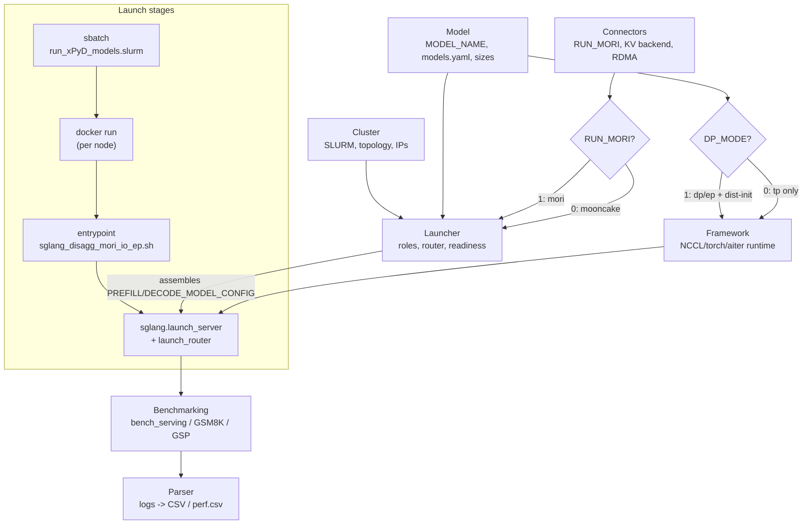

# sglang_disagg Configuration Taxonomy

> Config catalog as of commit `01b1650` (branch `pr171`, 2026-06-24). Line numbers below are pinned to this commit; prefer the named section when the file drifts.

Documentation only. This file catalogs every environment variable, CLI parameter, and config value used by `scripts/sglang_disagg/`, grouped by functional responsibility. It changes no behavior.

## How to read this document

- **Primary bucket**: the section where a value is documented in full. Every value has exactly one.
- **Overlaps**: other buckets where the value plays a secondary role (see [Cross-cutting Values](#cross-cutting-values)).
- **Set by**: `user` (set explicitly), `computed` (derived from other values), `conditional` (only set in a particular mode).
- **Required**: `yes`, `no` (has a default), or `conditional` (with the gating condition).
- **Type**: `env-only` (read by a library at runtime), `flag-only` (a CLI argument), `env->flag` (a shell var passed into a CLI flag).
- **Source** uses `file § section` plus the line at this commit.

The seven buckets are: [Cluster](#1-cluster), [Framework](#2-framework), [Connectors](#3-connectors), [Parser](#4-parser), [Benchmarking](#5-benchmarking), [Launcher](#6-launcher), [Model](#7-model).

> Note: the bucket **order in this document is optimized for review isolation** (each section is checkable against its source in isolation). It intentionally differs from the runtime **workflow order** shown in the diagram below.

## Bucket overview and config flow

---

## 1. Cluster

SLURM allocation, physical topology, and host/fabric identity.

### User-set

| Name | Source | Default | Set by | Required | Type | Meaning | Overlaps |
|------|--------|---------|--------|----------|------|---------|----------|
| `xP` | `run_xPyD_models.slurm` (108) | `1` | user | no | env->flag | Number of prefill nodes. Drives node count, IP layout, and TP/EP scaling. | Model, Framework |
| `yD` | `run_xPyD_models.slurm` (109) | `1` | user | no | env->flag | Number of decode nodes. | Model, Framework |
| `GPUS_PER_NODE` | `sglang_disagg_mori_io_ep.sh § Parallelism Settings` (99) | `8` | user | no | env | GPUs per node; multiplies xP/yD for DP/EP/TP sizes. | Model |
| `USE_CX7_NICS` | `mori_ep_env.sh § NIC mode selection` (10); passed at `run_xPyD_models.slurm` (400) | `1` in env file, `0` as passed by slurm | user | no | env | Selects the 8 CX7 rail NICs vs the mlx5_1 mgmt NIC. Note the default mismatch between the two files. | Connectors |
| `MASTER_PORT` | `sglang_disagg_mori_io_ep.sh § Environment Configuration` (38); set to `39566` in `run_xPyD_models.slurm` (304) | `23731` | user | no | env | Rendezvous port advertised to workers. | Launcher |
| sbatch directives (`-N`, `-n`, `--ntasks-per-node`, `--switches=2`, `--gres=gpu:8`, `--time`, `--output`/`--error`) | `run_xPyD_models.slurm § sbatch header` (2-15) | see file | user | yes | flag-only | SLURM allocation shape and IB-switch/rail policy. | - |

### Computed

| Name | Source | Default | Set by | Required | Type | Meaning | Overlaps |
|------|--------|---------|--------|----------|------|---------|----------|
| `NUM_NODES` / `NNODES` | `run_xPyD_models.slurm` (220, 320) | `xP + yD` | computed | - | env | Total nodes; validated against the allocation. | Launcher |
| `MASTER_NODE` / `MASTER_ADDR` | `run_xPyD_models.slurm` (301-303) | first sorted node / its IP | computed | - | env | Master node hostname and IP used as the sync anchor (`:2322`). | Launcher |
| `SELECTED_NODES` | `run_xPyD_models.slurm` (242) | first `NUM_NODES`, sorted | computed | - | - | Alphabetically sorted node subset; ordering must match IP layout. | - |
| `IPS` / `IPADDRS` | `run_xPyD_models.slurm` (306-348) | discovered via `hostname -I` | computed | - | env | Comma-separated node IPs; `[0..xP-1]`=prefill, `[xP..]`=decode. | Launcher |
| `IP_ARRAY`, `IP_FIRST_PREFILL`, `IP_FIRST_DECODE` | `sglang_disagg_mori_io_ep.sh § Cluster Topology` (205-208) | from `IPADDRS` | computed | - | - | Parsed IP list and per-role first IPs (router backends, dist-init). | Framework, Launcher |
| `host_ip` / `host_name` | `sglang_disagg_mori_io_ep.sh` (84-85) | `ip route` / `hostname` | computed | - | - | This node's bind IP and name. | - |
| `SLURM_*` overrides (`SLURM_NNODES`, `SLURM_NTASKS`, `SLURM_JOB_NODELIST`, `SLURM_JOB_NAME`, ...) | `run_xPyD_models.slurm § SLURM env overrides` (250-270) | derived | computed | - | env | Rewrites the SLURM env to the selected node subset before `srun`. | - |
| `USER_NAME` | `run_xPyD_models.slurm` (300, 347) | `whoami` | computed | - | env | Used in log paths / perf metadata. | Parser |
| `SLURM_JOB_ID` / `SLURM_JOBID` | `run_xPyD_models.slurm § SLURM env overrides` (263-274), passthrough at (379) | from SLURM allocation, `0` in-container fallback | computed | - | env | Job id used to namespace all log dirs (`/run_logs/${SLURM_JOB_ID}/`). | Launcher, Parser, Benchmarking |

---

## 2. Framework

SGLang / torch / NCCL / aiter runtime tuning that is not tied to the KV transport. Most values live in `mori_ep_env.sh` and are `env-only` with `${VAR:-default}` overrides.

### User-set (NCCL fabric tuning, `mori_ep_env.sh § NCCL configuration`)

| Name | Source | Default | Set by | Required | Type | Meaning | Overlaps |
|------|--------|---------|--------|----------|------|---------|----------|
| `NCCL_IB_HCA` | `mori_ep_env.sh` (28) | `${_DEFAULT_IB}` | user | no | env-only | NICs NCCL uses for the collective (TP/all-reduce) fabric. | Cluster, Connectors |
| `NCCL_IB_GID_INDEX` | `mori_ep_env.sh` (31) | `3` | user | no | env-only | RoCE v2 GID index. | - |
| `NCCL_CROSS_NIC` | `mori_ep_env.sh` (34) | `1` | user | no | env-only | Allow multiple NICs per GPU. | - |
| `NCCL_NET_GDR_LEVEL` | `mori_ep_env.sh` (37) | `3` | user | no | env-only | GPUDirect RDMA level (PXB crossing). | - |
| `NCCL_IB_DISABLE` | `mori_ep_env.sh` (40) | `0` | user | no | env-only | Force IB transport over sockets. | - |
| `NCCL_IB_QPS_PER_CONNECTION` | `mori_ep_env.sh` (44) | `4` | user | no | env-only | QPs per connection (CX7 parallelism). | - |
| `NCCL_IB_SPLIT_DATA_ON_QPS` | `mori_ep_env.sh` (47) | `1` | user | no | env-only | Split data across QPs. | - |
| `NCCL_BUFFSIZE` | `mori_ep_env.sh` (51) | `8388608` | user | no | env-only | 8MB NCCL buffer for NDR 400G. | - |
| `NCCL_IB_TIMEOUT` / `NCCL_IB_RETRY_CNT` | `mori_ep_env.sh` (54-55) | `22` / `7` | user | no | env-only | IB op timeout and retry count. | - |
| `NCCL_IB_SL` / `NCCL_IB_TC` | `mori_ep_env.sh` (58, 61) | `0` / `106` | user | no | env-only | Service level and traffic class (RoCE QoS). | - |
| `NCCL_IB_PCI_RELAXED_ORDERING` | `mori_ep_env.sh` (64) | `1` | user | no | env-only | PCIe relaxed ordering. | - |
| `NCCL_IB_ADAPTIVE_ROUTING` | `mori_ep_env.sh` (67) | `1` | user | no | env-only | Adaptive routing if fabric supports it. | - |
| `NCCL_TOPO_DUMP_FILE` | `mori_ep_env.sh` (70) | `/tmp/nccl_topo.xml` | user | no | env-only | Topology auto-detection dump path. | - |
| `NCCL_DEBUG` / `NCCL_DEBUG_SUBSYS` | `mori_ep_env.sh` (72-73) | `INFO` / `INIT,NET,GRAPH` | user | no | env-only | NCCL logging verbosity. | - |
| `GLOO_SOCKET_IFNAME` | `mori_ep_env.sh` (91), `sglang_disagg_mori_io_ep.sh § setup_sglang_worker_env` (291) | default-route iface / `eth0` | user | no | env-only | Control-plane socket interface for Gloo. Primary=Framework (consuming library). | Cluster |
| `NCCL_SOCKET_IFNAME` | `mori_ep_env.sh` (92), `sglang_disagg_mori_io_ep.sh` (292) | `${GLOO_SOCKET_IFNAME}` / `eth0` | user | no | env-only | Control-plane socket interface for NCCL. | Cluster |
| `GLOO_TIMEOUT_MS` | `mori_ep_env.sh § Timeouts` (98) | `300000` | user | no | env-only | Gloo collective timeout. | - |
| `TORCH_DIST_INIT_BARRIER_TIMEOUT` | `mori_ep_env.sh` (99) | `300` | user | no | env-only | torch dist init barrier timeout. | - |
| `SGLANG_DISAGGREGATION_BOOTSTRAP_TIMEOUT` | `mori_ep_env.sh` (100) | `1200` | user | no | env-only | Disagg bootstrap timeout. | Connectors |
| `SGLANG_DISAGGREGATION_WAITING_TIMEOUT` | `mori_ep_env.sh` (101), `sglang_disagg_mori_io_ep.sh` (295) | `1200` | user | no | env-only | Disagg waiting timeout. | Connectors |
| `PYTHONDONTWRITEBYTECODE` | `mori_ep_env.sh § Runtime optimizations` (106) | `1` | user | no | env-only | Skip `.pyc` writes. | - |
| `SGLANG_USE_AITER` | `mori_ep_env.sh` (107), `sglang_disagg_mori_io_ep.sh` (293) | `1` | user | no | env-only | Enable AITER kernels. | - |
| `SGLANG_ROUTER_STDOUT_LOGS` | `mori_ep_env.sh` (108) | `0` | user | no | env-only | Router stdout logging toggle. | Launcher |
| `PYTHONPATH` | `mori_ep_env.sh` (111) | prepends `/sgl-workspace/aiter` | user | no | env-only | Adds aiter to import path when present. | - |
| generic `launch_server` flags (`--attention-backend aiter`, `--watchdog-timeout`, `--mem-fraction-static`, `--cuda-graph-bs`, `--disable-cuda-graph`, `--disable-radix-cache`) | `models.yaml` (base/prefill/decode) | per model | user | yes | flag-only | Runtime/engine tuning applied per role. Values live in Model config; the knobs themselves are framework runtime. | Model |
| `--trust-remote-code`, `--decode-log-interval 1`, `--log-level-http warning` | `sglang_disagg_mori_io_ep.sh § launch blocks` (354, 367, 369) | constants | user | yes | flag-only | Always-applied engine flags. | Launcher |

### Computed / conditional (distributed process-group rendezvous)

| Name | Source | Default | Set by | Required | Type | Meaning | Overlaps |
|------|--------|---------|--------|----------|------|---------|----------|
| `DIST_INIT_PORT` | `sglang_disagg_mori_io_ep.sh § Cluster Topology` (210) | `5757` | conditional | conditional (DP_MODE=1) | env->flag | Port for the torch/sglang process-group rendezvous (TP/DP/EP group), not KV transport. | Cluster |
| `PREFILL_DIST_INIT_ADDR` / `DECODE_DIST_INIT_ADDR` | `sglang_disagg_mori_io_ep.sh` (213-214) | `IP_FIRST_*:DIST_INIT_PORT` | computed | conditional (DP_MODE=1) | env->flag | `--dist-init-addr` for prefill/decode groups (used at 361/583/670). | Cluster |
| `PREFILL_NNODES` / `DECODE_NNODES` | `sglang_disagg_mori_io_ep.sh` (211-212) | `xP` / `yD` | computed | conditional (DP_MODE=1) | env->flag | `--nnodes` per role for the process group. | Cluster, Model |

---

## 3. Connectors

KV-cache transport and disaggregation transport selection. Split by backend mode.

### Backend selection (always)

| Name | Source | Default | Set by | Required | Type | Meaning | Overlaps |
|------|--------|---------|--------|----------|------|---------|----------|
| `RUN_MORI` | `run_xPyD_models.slurm § Backend selection` (87) | `0` | user | no | env | Selects transport: `1`=MoRI IO, `0`=Mooncake. | Parser (perf tag) |
| `KV_TRANSFER_BACKEND` | set `mooncake` at `run_xPyD_models.slurm` (91); default `mori` at `sglang_disagg_mori_io_ep.sh` (189) | `mori` | conditional | no | env->flag | Value passed to `--disaggregation-transfer-backend` (190-191). | - |
| `--disaggregation-transfer-backend` | `sglang_disagg_mori_io_ep.sh` (190-191) | `${KV_TRANSFER_BACKEND}` | computed | yes | flag-only | Per-role transport backend flag. | - |
| `--disaggregation-mode` | `sglang_disagg_mori_io_ep.sh § launch blocks` (348, 657) | `prefill` / `decode` | user | yes | flag-only | Marks the server as a prefill or decode endpoint. | Launcher |
| `IB_DEVICES` | `mori_ep_env.sh § CORE DEVICE LIST` (23) | `${_DEFAULT_IB}` (CX7 rails or mlx5_1) | user | yes | env->flag | RDMA NICs for KV transfer; passed to `--disaggregation-ib-device` (351/573/660). | Cluster |

### MoRI-specific (`RUN_MORI=1`; the `SGLANG_MORI_*`/dispatch knobs require `DP_MODE=1`)

| Name | Source | Default | Set by | Required | Type | Meaning | Overlaps |
|------|--------|---------|--------|----------|------|---------|----------|
| `MORI_RDMA_DEVICES` | `mori_ep_env.sh § MORI configuration` (79) | `${_DEFAULT_IB}` | user | conditional (RUN_MORI=1) | env-only | NIC set MoRI uses for EP. | Cluster |
| `MORI_IB_GID_INDEX` | `mori_ep_env.sh` (82) | `3` | user | conditional (RUN_MORI=1) | env-only | MoRI GID index (matches NCCL). | - |
| `MORI_QPS_PER_CONNECTION` | `mori_ep_env.sh` (85) | `4` | user | conditional (RUN_MORI=1) | env-only | MoRI QPs per connection. | - |
| `MORI_SOCKET_IFNAME` | `mori_ep_env.sh § Socket interface` (93) | `${GLOO_SOCKET_IFNAME}` | user | conditional (RUN_MORI=1) | env-only | MoRI control-plane socket interface. Primary=Connectors (consuming library). | Cluster |
| `SGLANG_MORI_FP8_DISP` | `mori_ep_env.sh § MoRI EP tuning` (116), `sglang_disagg_mori_io_ep.sh` (294) | `True` (`False` if model name has `mxfp4`) | user | conditional (DP_MODE=1) | env-only | FP8 dispatch for MoRI EP. | Model |
| `SGLANG_MORI_FP4_DISP` | `mori_ep_env.sh` (118) | `False` | user | conditional (DP_MODE=1) | env-only | FP4 dispatch toggle. | - |
| `SGLANG_MORI_FP8_COMB` | `mori_ep_env.sh` (119) | `False` | user | conditional (DP_MODE=1) | env-only | FP8 combine toggle. | - |
| `MORI_MAX_DISPATCH_TOKENS_DECODE` | `mori_ep_env.sh` (120) | `160` | user | conditional (DP_MODE=1) | env-only | Max dispatch tokens per rank (decode). | - |
| `SGLANG_MORI_DISPATCH_INTER_KERNEL_SWITCH_THRESHOLD` | `mori_ep_env.sh` (121), `sglang_disagg_mori_io_ep.sh` (639) | `2 * MORI_MAX_DISPATCH_TOKENS_DECODE` | computed | conditional (DP_MODE=1) | env-only | Inter-kernel switch threshold. | - |
| `SGLANG_MORI_NUM_MAX_DISPATCH_TOKENS_PER_RANK` | `sglang_disagg_mori_io_ep.sh` (640) | `${MORI_MAX_DISPATCH_TOKENS_DECODE}` | computed | conditional (DP_MODE=1) | env-only | Per-rank max dispatch tokens (decode). | - |
| `MORI_SHMEM_HEAP_SIZE` | `mori_ep_env.sh` (123) | `17179869184` (16 GiB) | user | conditional (DP_MODE=1) | env-only | MoRI shared-memory heap (4 GiB default too small for EP>=32). | - |
| `--moe-a2a-backend mori` | `models.yaml` (`dp_flags`, DeepSeek-V3/R1) | - | user | conditional (DP_MODE=1) | flag-only | Routes MoE all-to-all through MoRI EP. | Model |

### Mooncake-specific (`RUN_MORI=0`)

| Name | Source | Default | Set by | Required | Type | Meaning | Overlaps |
|------|--------|---------|--------|----------|------|---------|----------|
| `KV_TRANSFER_BACKEND=mooncake` | `run_xPyD_models.slurm § Backend selection` (91) | set when `RUN_MORI=0` | conditional | conditional (RUN_MORI=0) | env->flag | Forces the Mooncake transport; MoRI env is unused. | - |

---

## 4. Parser

Log-to-CSV conversion and perf metadata. See [`parse_to_csv.py`](parse_to_csv.py) (production, wired into `benchmark_xPyD.sh`) and [`benchmark_parser.py`](benchmark_parser.py) (standalone diagnostic).

### CLI arguments

| Name | Source | Default | Set by | Required | Type | Meaning | Overlaps |
|------|--------|---------|--------|----------|------|---------|----------|
| `log_file` | `parse_to_csv.py § main` (176) | - | user | yes | flag-only | Benchmark log to parse. | - |
| `-o` / `--output` | `parse_to_csv.py` (177) | `<log>_results.csv` | user | no | flag-only | Results CSV path (max throughput per config). | - |
| `--perf-csv` | `parse_to_csv.py` (178) | - | user | no | flag-only | Also emit madengine `perf.csv`. | - |
| `--model-name` | `parse_to_csv.py` (179) | `""` | user | no | flag-only | Model name recorded in `perf.csv`. | Model |
| `logfile` / `--csv` / `--compact` / `--no-screen` | `benchmark_parser.py § main` (138-162) | - / auto / off / off | user | varies | flag-only | Standalone parser inputs (pandas table + optional CSV). | - |

### Env consumed for `perf.csv` tagging (`parse_to_csv.py § _get_run_metadata`, 101-129)

| Name | Source | Default | Set by | Required | Type | Meaning | Overlaps |
|------|--------|---------|--------|----------|------|---------|----------|
| `xP`, `yD` | env (104-105) | `1`, `1` | user | no | env | Deployment shape tag `disagg_xPyD`. | Cluster |
| `DP_MODE` | env (106) | `0` | user | no | env | Selects backend tag `mori_dp`. | Model |
| `RUN_MORI` | env (107) | `0` | user | no | env | Selects backend tag `mori_io` vs `mooncake`. | Connectors |
| `GPUS_PER_NODE` | env (108) | `8` | user | no | env | Used to compute `n_gpus`. | Cluster |
| `DOCKER_IMAGE_NAME` | env (125) | `""` | user | no | env | Recorded in `perf.csv`. | Launcher |
| `SLURM_JOB_NODELIST` | env (126) | `""` | user | no | env | Recorded as `machine_name`. | Cluster |

---

## 5. Benchmarking

Benchmark drivers that hit the router. This is the intended extension point for multiple benchmark types (throughput / accuracy / GSP, and future agentx). Two drivers exist today.

### Throughput sweep (`benchmark_xPyD.sh`, production; wired into the launcher)

| Name | Source | Default | Set by | Required | Type | Meaning | Overlaps |
|------|--------|---------|--------|----------|------|---------|----------|
| `BENCHMARK_ITR` | `run_xPyD_models.slurm` (349); `benchmark_xPyD.sh` (29) | `2` | user | no | env | Number of sweep iterations (iter 1+ parsed). | - |
| `BENCHMARK_COMBINATIONS` | `run_xPyD_models.slurm` (398); `benchmark_xPyD.sh` (27) | `1024/1024 8192/1024` | user | no | env | ISL/OSL combinations to sweep. | - |
| `CON` | `benchmark_xPyD.sh` (25) | `8 16 32 64 128 256 512` | user | yes | (in-script) | Concurrency levels swept per combination. | - |
| `p_con` | `benchmark_xPyD.sh` (35-37) | `max(2 * con, 16)` | computed | - | (in-script) | Prompt count per sweep step (`--num-prompt`), floored at 16. | - |
| `bench_serving` flags (`--backend sglang`, `--model $MODEL_PATH`, `--host 127.0.0.1`, `--port 2322`, `--dataset-name random`, `--random-input`, `--random-output`, `--random-range-ratio 1.0`, `--max-concurrency`, `--num-prompt`, `--pd-separated`) | `benchmark_xPyD.sh` (11-23, 40-52) | see file | user | yes | flag-only | Drives the sweep against the router on `:2322`. | Launcher, Model |
| `BENCHMARK_FILE` | `run_xPyD_models.slurm` (317) | cookbook path | user | no | env | Informational path recorded for the run. | Launcher |

### Accuracy + GSP sweep (`benchmark_xPyD_GSP.sh`, alternate driver)

| Name | Source | Default | Set by | Required | Type | Meaning | Overlaps |
|------|--------|---------|--------|----------|------|---------|----------|
| GSM8K accuracy (`benchmark/gsm8k/bench_sglang.py --parallel 1400 --num-questions 1400`) | `benchmark_xPyD_GSP.sh` (17) | constants | user | yes | flag-only | Accuracy benchmark against the running server. | - |
| GSP sweep flags (`--dataset-name generated-shared-prefix`, `--gsp-system-prompt-len`, `--gsp-question-len`, `--gsp-output-len`, `--gsp-num-groups`, `--gsp-prompts-per-group`, `--port 30000`) | `benchmark_xPyD_GSP.sh` (43-54) | see file | user | yes | flag-only | Shared-prefix throughput sweep. Note: targets `--port 30000`, not the router `:2322` used by `benchmark_xPyD.sh`. | Launcher |
| `CON` / `COMBINATIONS` | `benchmark_xPyD_GSP.sh` (30-31) | `32 64 128 256 512 1024` / `4096/100 2048/100 1024/1024 512/1500` | user | yes | (in-script) | GSP concurrency and ISL/OSL grid. | - |

### Smoke test

| Name | Source | Default | Set by | Required | Type | Meaning | Overlaps |
|------|--------|---------|--------|----------|------|---------|----------|
| `CURL_TEST_MODEL` | `sglang_disagg_mori_io_ep.sh § NODE_RANK 0` (520) | `${MODEL_PATH}` | user | no | env | Model field for the pre-benchmark `/v1/completions` smoke test. | Launcher, Model |

---

## 6. Launcher

Orchestration and control flow: role dispatch, router, readiness gating, and validation.

### User-set

| Name | Source | Default | Set by | Required | Type | Meaning | Overlaps |
|------|--------|---------|--------|----------|------|---------|----------|
| `DOCKER_IMAGE_NAME` | `run_xPyD_models.slurm` (99, 399) | none (hard error if unset) | user | yes | env | Container image run on every node. | Parser |
| `SKIP_BENCHMARK` | `run_xPyD_models.slurm` (114) | `0` | user | no | env | Skip the benchmark phase on NODE 0. | Benchmarking |
| `SKIP_CURL_TEST` | `run_xPyD_models.slurm` (115) | `0` | user | no | env | Skip the smoke test. | Benchmarking |
| `LOG_PATH` | `run_xPyD_models.slurm` (106) | `/shared_inference/$USER/model_blog_logs` | user | no | env | Host log directory (mounted as `/run_logs`). | - |
| `MODEL_DIR` | `run_xPyD_models.slurm` (118) | `/shared_inference/models_blog/` | user | no | env | Fallback model search root. | Model |
| `BARRIER_PORT` | `sglang_disagg_mori_io_ep.sh § Environment Configuration` (70) | `4342` | user | no | env | Container-creation barrier port. | - |
| readiness knobs (`SEARCH_SIGNAL`, `ROUTER_READY_TIMEOUT_SECONDS`, `ROUTER_POLL_SLEEP_SECONDS`) | `sglang_disagg_mori_io_ep.sh § NODE_RANK 0` (389-391) | `The server is fired up...` / `4000` / `10` | user | no | env | Log-grep readiness signal and poll timing before starting the router. | Parser |

### Computed / constants

| Name | Source | Default | Set by | Required | Type | Meaning | Overlaps |
|------|--------|---------|--------|----------|------|---------|----------|
| `RUN_FILE` / `RUN_FILE_FULL` | `run_xPyD_models.slurm` (86, 354) | `sglang_disagg_mori_io_ep.sh` | computed | - | env | The unified entrypoint always used. | - |
| `MOONCAKE_REPO_DIR` / `MOONCAKE_COOKBOOK_PATH` | `run_xPyD_models.slurm` (105, 316) | `$(pwd)` / `/opt/mooncake-cookbook` | computed | - | env | Host repo dir and its in-container mount. | - |
| `DOCKER_CONT_NAME` | `run_xPyD_models.slurm` (353) | `container_${MODEL_NAME}_${JOB_ID}` | computed | - | env | Per-job container name. | - |
| `NODE_RANK` | `sglang_disagg_mori_io_ep.sh` (39), from `SLURM_PROCID` | `0` | computed | yes | env | Selects the role branch (0=prefill+router, `1..xP-1`=prefill, `xP..`=decode). | - |
| `PREFILL_NODE_RANK` / `DECODE_NODE_RANK` | `sglang_disagg_mori_io_ep.sh` (338/558, 631) | derived from `NODE_RANK` | computed | - | env->flag | Per-role `--node-rank` (DP_MODE=1). | Framework |
| `PREFILL_ARGS` / `DECODE_ARGS` | `sglang_disagg_mori_io_ep.sh § Router backend URLs` (236-253) | from `IP_ARRAY` | computed | - | flag-only | Router `--prefill`/`--decode` backend URLs (`:3000`). | Cluster |
| router config (`--pd-disaggregation`, `--host 0.0.0.0`, `--port 2322`) | `sglang_disagg_mori_io_ep.sh § NODE_RANK 0` (448-453) | constants | computed | yes | flag-only | sglang_router (proxy) launch. | - |
| server bind (`--host ${host_ip}`, `--port 3000`) | `sglang_disagg_mori_io_ep.sh § launch blocks` (352-353) | constants | computed | yes | flag-only | Per-worker HTTP bind. | Cluster |
| load-balance method (`--load-balance-method`, `--prefill-round-robin-balance`) | `sglang_disagg_mori_io_ep.sh` (343-350) | `round_robin` (`follow_bootstrap_room` if DP_MODE=1) | computed | yes | flag-only | Router LB; DP_MODE=1 pins requests to the DP rank owning the bootstrap slot. | Model |
| proxy PD-readiness probe (`ROUTER_HTTP_BASE`, wait/interval) | `sglang_disagg_mori_io_ep.sh` (495-515) | `http://127.0.0.1:2322` / 300s / 10s | computed | - | env | Polls `/v1/completions` until the full PD path is live. | Benchmarking |
| allowlists (`VALID_MODELS`, `MORI_EP_VALID_MODELS`, `MORI_DP_MODE1_ALLOWED_MODELS`) | `run_xPyD_models.slurm` (30-71); `sglang_disagg_mori_io_ep.sh` (12-15) | fixed arrays | computed | yes | (in-script) | Model validation gates (DP_MODE=1 restricted to DeepSeek-V3/R1). | Model |
| `PREFILL_LOG` / `DECODE_LOG` | `sglang_disagg_mori_io_ep.sh § launch blocks` (373, 601 / 682) | `/run_logs/${SLURM_JOB_ID:-0}/{prefill,decode}_NODE${NODE_RANK}.log` | computed | - | env | Per-role server log paths (`tee`'d); consumed by the parser. | Cluster, Parser |

### Docker runtime (reference only)

Container-runtime flags are not sglang-disagg config per se and are intentionally not catalogued individually. See `run_xPyD_models.slurm § srun docker run` (359-404): `--device /dev/dri|/dev/kfd|/dev/infiniband`, `--network host`, `--ipc host`, `--group-add video`, `--cap-add SYS_PTRACE`, `--security-opt seccomp=unconfined`, `--privileged`, volume mounts (`$HOME`, `/shared_inference`, `/mnt/m2m_nobackup`, `${LOG_PATH}`, repo), `--shm-size 64G`, `--ulimit nofile=1048576:1048576`, and the `-e` env passthrough.

---

## 7. Model

Model selection and per-model engine configuration. `models.yaml` is the active config source consumed by `sglang_disagg_mori_io_ep.sh` (not legacy).

### User-set

| Name | Source | Default | Set by | Required | Type | Meaning | Overlaps |
|------|--------|---------|--------|----------|------|---------|----------|
| `MODEL_NAME` | `run_xPyD_models.slurm` (117) | `None` (validated) | user | yes | env | Selects the model and its `models.yaml` entry. | Launcher, Parser |
| `DP_MODE` | `run_xPyD_models.slurm` (110) | `0` | user | no | env | `0`=TP (all models), `1`=DP+EP (DeepSeek-V3/R1 only). Selects the YAML flag set. | Parser, Launcher, Connectors |
| `MODELS_YAML` | `sglang_disagg_mori_io_ep.sh` (126) | `${SCRIPT_DIR}/models.yaml` | user | no | env | Override path to the model-flags YAML consumed by the reader. | Launcher |
| `models.yaml` keys (`base_flags`, `tp_flags`, `dp_flags`, `prefill.tp`, `prefill.dp`, `decode.tp`, `decode.dp`, `experimental_flags`) | [`models.yaml`](models.yaml) | per model | user | yes | flag-only | Per-model, per-role engine flags loaded by the YAML reader (134-176). | Framework, Connectors |
| `GENERIC_TP_SIZE` | `sglang_disagg_mori_io_ep.sh § Parallelism Settings` (100) | `8` | user | no | env->flag | Per-worker TP size when `DP_MODE=0`. | Cluster |

### Computed

| Name | Source | Default | Set by | Required | Type | Meaning | Overlaps |
|------|--------|---------|--------|----------|------|---------|----------|
| `MODEL_PATH` | `run_xPyD_models.slurm § Model path selection` (189-214) | first existing of 3 roots | computed | yes | env->flag | Resolved model directory (validated on all nodes); `--model-path`. | - |
| `PARALLEL_MODE` | `sglang_disagg_mori_io_ep.sh` (50-54) | `tp` (or `dp` if DP_MODE=1) | computed | - | env | Chooses which YAML flag set to load. | - |
| `PREFILL_TP_SIZE` / `DECODE_TP_SIZE` | `sglang_disagg_mori_io_ep.sh` (103-107) | `GENERIC_TP_SIZE`, or `xP/yD * GPUS_PER_NODE` if DP_MODE=1 | computed | yes | env->flag | `--tp-size` per role. | Cluster |
| `PREFILL_DP_SIZE` / `DECODE_DP_SIZE` | `sglang_disagg_mori_io_ep.sh` (114-115) | `xP/yD * GPUS_PER_NODE` | computed | conditional (DP_MODE=1) | env->flag | `--dp-size` per role. | Cluster |
| `PREFILL_EP_SIZE` / `DECODE_EP_SIZE` | `sglang_disagg_mori_io_ep.sh` (112-113) | `xP/yD * GPUS_PER_NODE` | computed | conditional (DP_MODE=1) | env->flag | `--ep-size` per role. | Cluster |
| `MODEL_BASE_FLAGS`, `MODEL_MODE_FLAGS`, `MODEL_PREFILL_FLAGS`, `MODEL_DECODE_FLAGS`, `MODEL_EXPERIMENTAL_FLAGS` | `sglang_disagg_mori_io_ep.sh § Model-Specific Configuration from YAML` (165-171) | from YAML | computed | - | env->flag | Individual flag groups extracted from `models.yaml`. | - |
| `PREFILL_MODEL_CONFIG` / `DECODE_MODEL_CONFIG` | `sglang_disagg_mori_io_ep.sh` (178-179), +transfer backend (190-191) | assembled | computed | yes | env->flag | Final per-role flag string passed to `launch_server`. | Connectors, Framework |

---

## Cross-cutting Values

When a value serves multiple roles, the Primary bucket is chosen by these rules, in priority order:

1. **Control flow wins** — if it gates which code path runs, it is Launcher.
2. **Transport identity wins** — if it selects RDMA devices or the backend for KV transfer, it is Connectors.
3. **Tuning wins** — if it only affects performance, not correctness, it is Framework.
4. **Source of truth wins** — if it is the user-facing model knob, it is Model.

| Value | Primary | Secondary | Rationale |
|-------|---------|-----------|-----------|
| `NCCL_IB_*` | Framework | Cluster (fabric identity), Connectors (if MoRI reuses NICs) | Tunes the NCCL collective fabric, not the KV transport. |
| `GLOO_SOCKET_IFNAME`, `NCCL_SOCKET_IFNAME` | Framework | Cluster | Assigned by consuming library (Gloo/NCCL); value is the physical iface. |
| `MORI_SOCKET_IFNAME` | Connectors | Cluster | Consumed by the MoRI transport. |
| `IB_DEVICES` | Connectors | Cluster | Selects KV-transfer RDMA NICs (`--disaggregation-ib-device`); `NCCL_IB_HCA` consumes the same list for Framework. |
| `DIST_INIT_PORT`, `PREFILL_/DECODE_DIST_INIT_ADDR` | Framework | Cluster | torch/sglang process-group rendezvous (DP_MODE=1), not KV transport; endpoint IPs come from topology. |
| `TP` / `DP` / `EP` sizes | Model | Cluster | Model parallelism degrees that scale with `xP*GPUS_PER_NODE`. |
| `RUN_MORI` | Connectors | Parser | Selects the KV backend; also read for the perf.csv tag. |
| `DP_MODE` | Model | Parser, Launcher, Connectors | Selects the YAML flag set; also a perf tag, an allowlist gate, and a MoRI-EP switch. |
| `SKIP_BENCHMARK`, `SEARCH_SIGNAL` | Launcher | Benchmarking, Parser | Control flow / readiness signal grepped from logs. |
| `CURL_TEST_MODEL` | Benchmarking | Launcher, Model | Smoke-test payload model, defaults to `MODEL_PATH`. |

---

## Legacy Configuration (appendix)

Do NOT use in new deployments. The active launcher is `sglang_disagg_mori_io_ep.sh` with `mori_ep_env.sh` and `models.yaml`.

### `set_env_vars.sh` (superseded by `mori_ep_env.sh`)

| Name | Superseded by | Notes |
|------|---------------|-------|
| `IBDEVICES` | `IB_DEVICES` (`mori_ep_env.sh`) | Hardcoded `mlx5_0,mlx5_2,...`; consumed only by `sglang_disagg_server.sh`. |
| `NCCL_SOCKET_IFNAME` (with appended `mlx5_*`) | `NCCL_SOCKET_IFNAME` (`mori_ep_env.sh`) | Legacy appends NIC names to the socket iface. |
| `GLOO_SOCKET_IFNAME` | `GLOO_SOCKET_IFNAME` (`mori_ep_env.sh`) | - |
| `NCCL_IB_DISABLE=1` | `NCCL_IB_DISABLE` (`mori_ep_env.sh`, default `0`) | Legacy disables IB; active path enables it. |
| `NCCL_IGNORE_CPU_AFFINITY=1` | (not carried forward) | Legacy-only. |
| `HSA_NO_SCRATCH_RECLAIM=1` | (not carried forward) | Legacy-only; not present in the active path. |

### `sglang_disagg_server.sh` (superseded by `sglang_disagg_mori_io_ep.sh`)

| Name | Superseded by | Notes |
|------|---------------|-------|
| `declare -A MODEL_PREFILL_CONFIGS` / `MODEL_DECODE_CONFIGS` | `models.yaml` (`prefill.*` / `decode.*`) | Bash associative arrays of `--tp-size` per model -> YAML config. |
| `--disaggregation-transfer-backend mooncake` (hardcoded) | `--disaggregation-transfer-backend ${KV_TRANSFER_BACKEND}` | Modern path selects MoRI or Mooncake. |
| `--stream-output`, `MC_TE_METRIC=true` | (not carried forward) | Legacy prefill/decode launch options. |
| server `--port 2322` | server `--port 3000` (router on `2322`) | Modern path separates server and router ports. |

---

## Verification

- **Forward** (source -> tables): every `export`/assignment/CLI flag found by grepping the active files (`run_xPyD_models.slurm`, `sglang_disagg_mori_io_ep.sh`, `mori_ep_env.sh`, `models.yaml`, `benchmark_xPyD.sh`, `benchmark_xPyD_GSP.sh`, `parse_to_csv.py`, `benchmark_parser.py`) appears in exactly one Primary bucket.
- **Inverse** (tables -> source): every value named above exists in at least one source file at commit `01b1650`.
- **Orphans**: an automated flag sweep of the active files found no undocumented engine/router/benchmark config. Flags that appear in source but are intentionally NOT catalogued as sglang-disagg config fall into three invocation-plumbing categories:
  - Socket-sync utility args wired from Launcher/Cluster values: `--local-ip`, `--local-port`, `--node-ips`, `--node-ports`, `--enable-port` (`socket_barrier.py`), `--remote-ip`, `--remote-port` (`socket_wait.py`).
  - Container/tooling invocation flags: `--entrypoint`, `--name`, `--rm`, `--no-run-if-empty` (docker/xargs), `--ignore-installed`, `--force-reinstall` (pip), `--max-time` (curl probe).
  - SLURM allocation flags: `--job-name`, `--switches`, `--gres`, `--time`, `--nodelist`, `--nodes`, `--spread-job` (the last is in a comment, intentionally removed) — covered collectively under Cluster sbatch directives.
  - Legacy-only values (`set_env_vars.sh`, `sglang_disagg_server.sh`) live in the appendix, not the main buckets.

### Counts

| Metric | Count |
|--------|-------|
| Primary buckets | 7 |
| Cataloged values (main buckets) | ~100 across Cluster/Framework/Connectors/Parser/Benchmarking/Launcher/Model |
| Cross-cutting straddlers | 10 |
| Legacy values (appendix) | 10 |
| Orphans (undocumented, active path) | 0 |
