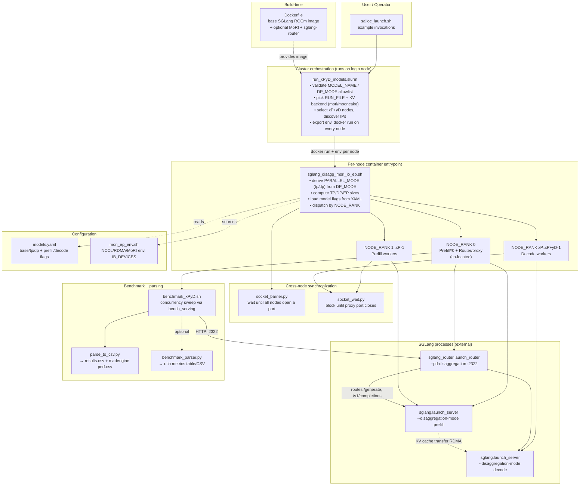
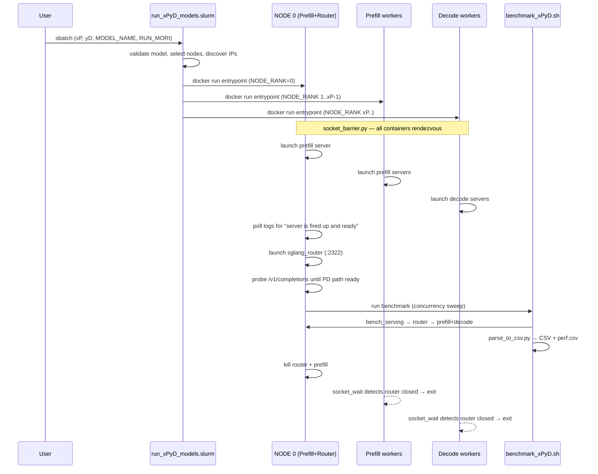

# sglang_disagg — Design & Responsibility Overview

## What this module is

`scripts/sglang_disagg/` is a **benchmarking harness for SGLang Prefill/Decode (PD)
disaggregated inference on AMD (ROCm) GPUs**, orchestrated over a **SLURM** cluster.
It launches separate prefill and decode SGLang servers across nodes, fronts them with
a router/proxy, runs a concurrency-sweep benchmark, and parses the results into CSV.

The code here is almost entirely **bash orchestration + small Python utilities** — it
wraps SGLang (`sglang.launch_server`, `sglang_router`, `sglang.bench_serving`) rather
than implementing the inference itself.

> For a full breakdown of every environment variable, CLI parameter, and config value
> grouped by responsibility (cluster / framework / connectors / parser / benchmarking /
> launcher / model), see [CONFIG.md](CONFIG.md).

## Layered structure

```
Build layer      docker/sglang_disagg_inference.ubuntu.amd.Dockerfile   (SGLang + MoRI image)
                             │
Cluster layer    run_xPyD_models.slurm     (sbatch: node selection, IP discovery, docker run per node)
                             │
Entrypoint       sglang_disagg_mori_io_ep.sh   (per-node role dispatch: prefill / decode / router)
   layer                     │
Config layer     models.yaml   mori_ep_env.sh   (model flags; RDMA/NCCL/MoRI env)
                             │
Sync layer       socket_barrier.py   socket_wait.py   (cross-node rendezvous / shutdown wait)
                             │
Benchmark        benchmark_xPyD.sh   (bench_serving concurrency sweep)
   layer                     │
Parse layer      parse_to_csv.py   benchmark_parser.py   (logs → CSV / perf.csv)
```

## File responsibilities

| File | Responsibility |
|------|----------------|
| `docker/sglang_disagg_inference.ubuntu.amd.Dockerfile` | Build the runtime image: SGLang ROCm base + optional MoRI (pinned commit) + `sglang-router`. |
| `run_xPyD_models.slurm` | Cluster orchestration: validate `MODEL_NAME`/`DP_MODE`, choose KV backend (`RUN_MORI`), select `xP+yD` nodes, discover IPs, `docker run` the entrypoint on every node. |
| `sglang_disagg_mori_io_ep.sh` | Per-node container entrypoint. Derives `PARALLEL_MODE` (tp/dp), computes TP/DP/EP sizes, loads model flags from YAML, and dispatches by `NODE_RANK` into prefill / decode / router roles. |
| `models.yaml` | Per-model CLI flags: `base_flags`, `tp_flags`/`dp_flags`, and role-specific `prefill`/`decode` flags. Backend-agnostic. |
| `mori_ep_env.sh` | NCCL / RDMA / MoRI environment variables, `IB_DEVICES` (NIC selection). |
| `set_env_vars.sh` | Legacy NCCL/IB env (used only by the legacy `sglang_disagg_server.sh`). |
| `socket_barrier.py` | Startup rendezvous — opens a local port and waits until all nodes have opened theirs. |
| `socket_wait.py` | Lifecycle wait — blocks while a remote port (router :2322) stays open; returns when it closes. |
| `benchmark_xPyD.sh` | Concurrency-sweep benchmark driven through the router via `sglang.bench_serving`. |
| `parse_to_csv.py` | Production parser: benchmark log → results CSV + madengine `perf.csv`. |
| `benchmark_parser.py` | Standalone richer diagnostic parser (pandas; latency + throughput metrics). Not wired into the pipeline. |
| `sglang_disagg_server.sh` | Legacy Mooncake-only launcher (bash assoc-array configs, port 2322 servers, no MoRI/DP). Superseded by `sglang_disagg_mori_io_ep.sh`. |
| `salloc_launch.sh` | Example `salloc`/`sbatch` invocation commands. |

## Responsibility diagram



## Runtime sequence (one job)



## Port reference

| Purpose | Modern launcher (`sglang_disagg_mori_io_ep.sh`) | Legacy launcher (`sglang_disagg_server.sh`) |
|---------|--------------------------------------------------|----------------------------------------------|
| Prefill / decode server | `3000` | `2322` |
| Router / proxy | `2322` | `2322` |
| `dist-init` (DP_MODE=1 rendezvous) | `5757` (`DIST_INIT_PORT`) | n/a |
| Startup barrier | `BARRIER_PORT` (default `4342`) | hardcoded `4342` |

## Key design decisions

- **Single unified launcher, two KV backends.** `run_xPyD_models.slurm` always uses
  `sglang_disagg_mori_io_ep.sh`; `RUN_MORI` toggles `--disaggregation-transfer-backend`
  between `mori` (RDMA-based MoRI IO) and `mooncake`. The backend is deliberately kept
  out of `models.yaml` so model configs stay backend-agnostic.
- **Two parallelism modes via `DP_MODE`.** `DP_MODE=0` → TP-only (all models);
  `DP_MODE=1` → DP-attention + MoRI expert parallelism, restricted by an allowlist to
  DeepSeek-V3/R1 (enforced redundantly in both the slurm script and the entrypoint).
- **Router co-located on prefill NODE 0** — no dedicated proxy node. IP layout
  convention: `IP[0..xP-1]` = prefill, `IP[xP..]` = decode. Nodes are alphabetically
  sorted so `srun` PROCID ordering matches the IP array.
- **File-based + socket-based synchronization.** Readiness is detected by grepping
  worker logs on a shared `/run_logs` mount for
  `"The server is fired up and ready to roll!"`; lifecycle coordination uses
  `socket_barrier.py` (startup rendezvous) and `socket_wait.py` (workers block until the
  router's port 2322 closes, then self-terminate). DP ranks are intentionally *not*
  gated on the dist-init port because torch rendezvous would otherwise deadlock.
- **Two parsers with different scopes.** `parse_to_csv.py` is the production one wired
  into `benchmark_xPyD.sh` (max-throughput CSV + madengine `perf.csv`).
  `benchmark_parser.py` is a richer standalone diagnostic (pandas, latency percentiles)
  not called by the pipeline.
- **`sglang_disagg_server.sh` is legacy** (Mooncake-only, superseded by the YAML-driven
  MoRI/EP launcher).
