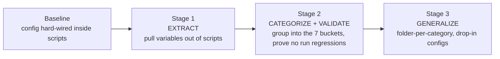
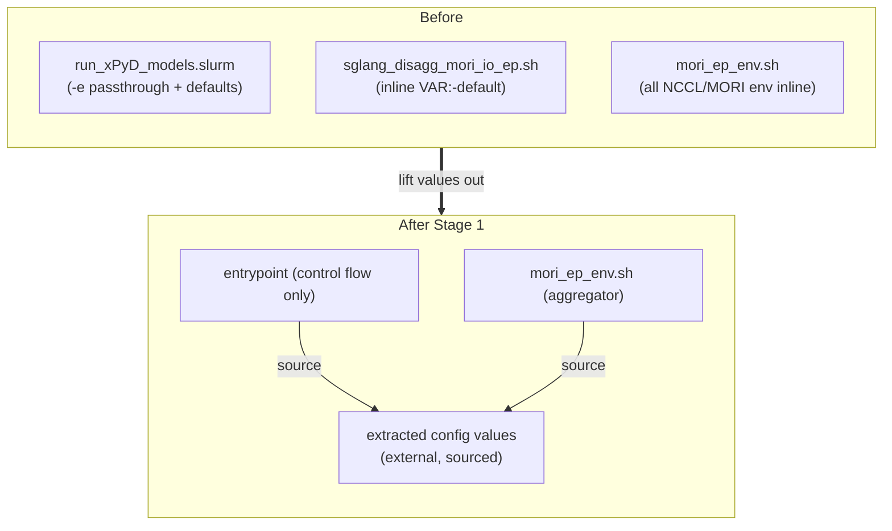
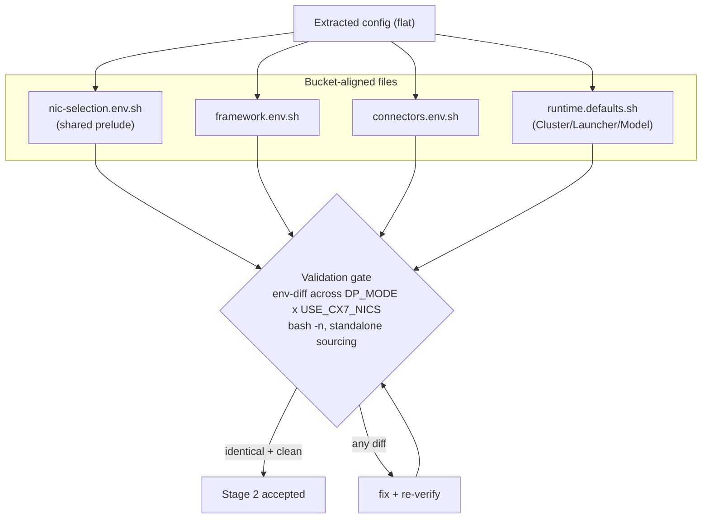
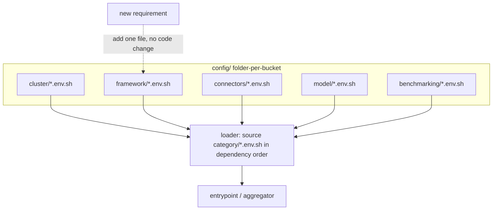

# sglang_disagg config refactor - staged roadmap

This refactor is delivered in three independently reviewable stages. Each stage is
behavior-preserving and builds on the previous one. See [CONFIG.md](CONFIG.md) for the
configuration taxonomy and [DESIGN.md](DESIGN.md) for the high-level design.

## Overview

Status: this PR lands Stage 1 + Stage 2 together (the extraction is already bucket-aligned).
Stage 3 is a follow-on this work unblocks.

## Stage 1 - Extract variables out of the scripts

Goal: decouple *values* from *control flow*. Scripts stop hard-coding env/defaults and
instead source external config. Runtime behavior is identical.

Verify: resolved `env` is byte-identical before/after.

## Stage 2 - Categorize into the 7 buckets + validate

Goal: give the extracted values a home aligned to the CONFIG.md taxonomy, and gate on
"no run issues."

## Stage 3 - Generalize into a folder-per-category, drop-in structure

Goal: make it trivial to add a new config - drop a file into the right category folder;
it is auto-discovered and sourced. No script edits needed to add config.

Extensibility contract: adding a backend / model / tuning knob = add a single file under
the matching category folder; the loader picks it up automatically.
