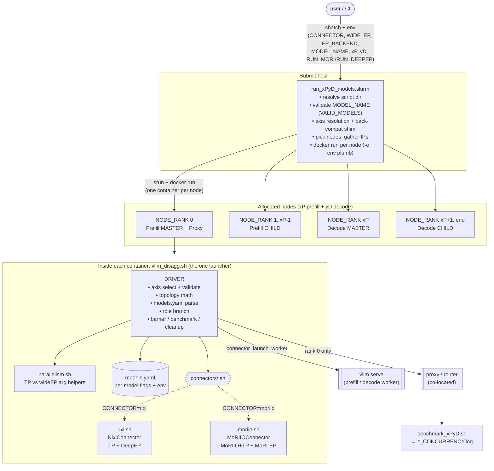
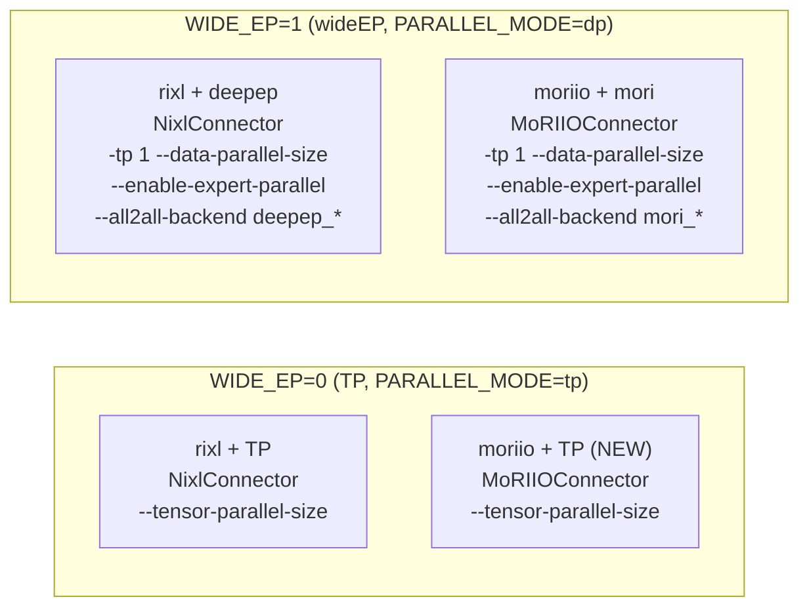
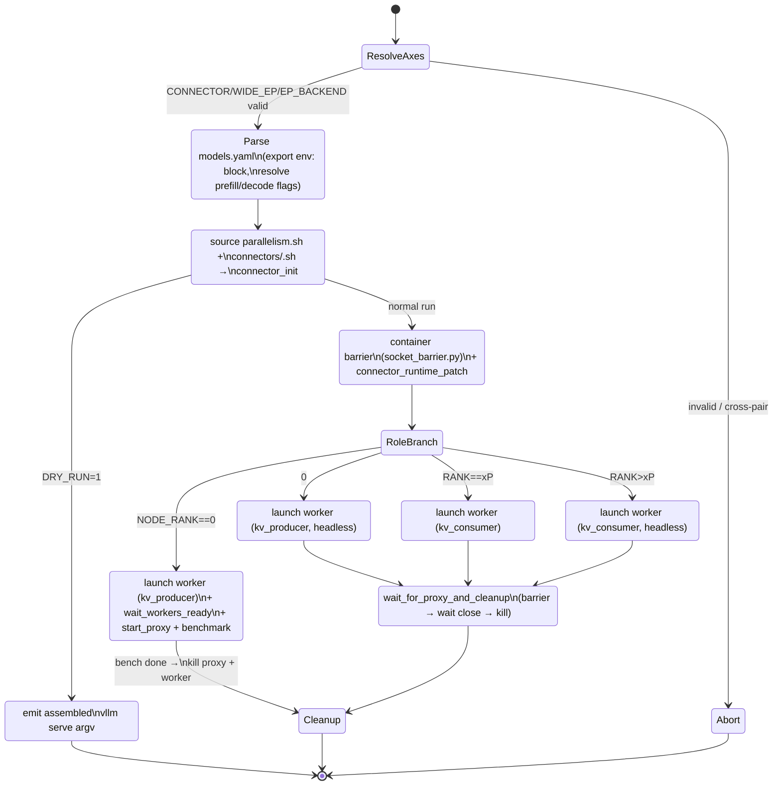
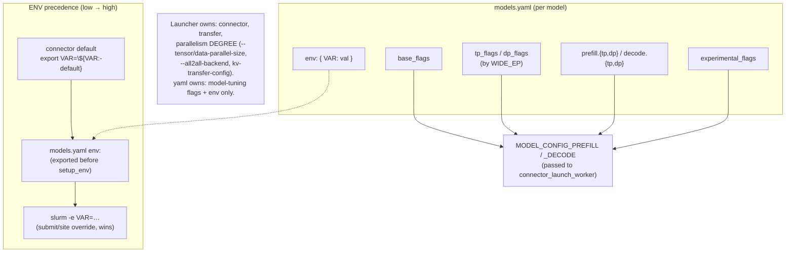
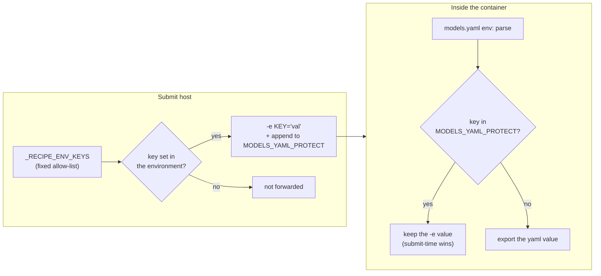
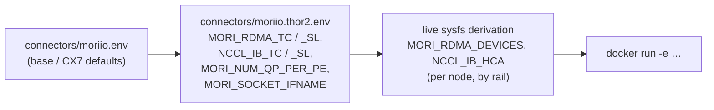

# vllm_dissag — Architecture & State Diagrams

Visual reference for the unified two-axis launcher. Diagrams are [Mermaid](https://mermaid.js.org/)
(rendered by GitHub). Covers: component layout, axis→behavior resolution, the per-node runtime state
machine, and the driver↔connector hook sequence.

---

## 1. Component architecture

How the pieces fit, from sbatch down to the per-node `vllm serve` workers.



---

## 2. Axis resolution — how inputs map to behavior

The driver collapses legacy flags + explicit axes into `CONNECTOR × WIDE_EP (× EP_BACKEND)`, then
validates. This is the decision flow at the top of `vllm_disagg.sh`.

```mermaid
flowchart TD
    start([env in]) --> q0{CONNECTOR set?}

    q0 -->|no| shim{legacy flag?}
    shim -->|RUN_MORI=1| m["CONNECTOR=moriio\nWIDE_EP=1\nEP_BACKEND=mori"]
    shim -->|RUN_DEEPEP=1| d["CONNECTOR=rixl\nWIDE_EP=1\nEP_BACKEND=deepep"]
    shim -->|neither| def["CONNECTOR=rixl\nWIDE_EP=0  (TP)"]
    q0 -->|yes| explicit["use explicit\nCONNECTOR / WIDE_EP / EP_BACKEND"]

    m --> vconn
    d --> vconn
    def --> vconn
    explicit --> vconn

    vconn{validate CONNECTOR\nin rixl|moriio}
    vconn -->|invalid| err1[["abort: invalid CONNECTOR"]]
    vconn -->|valid| vwide{validate WIDE_EP\nin 0|1}
    vwide -->|invalid| err2[["abort: invalid WIDE_EP"]]
    vwide -->|valid| qwide{WIDE_EP == 1?}

    qwide -->|no  (TP)| okTP["EP_BACKEND = n/a"]
    qwide -->|yes wideEP| qpair{connector ↔ EP_BACKEND}
    qpair -->|moriio + mori| okM["OK: all2all = mori_*"]
    qpair -->|rixl + deepep| okD["OK: all2all = deepep_*"]
    qpair -->|moriio + deepep| err3[["abort: cross-pair"]]
    qpair -->|rixl + mori| err4[["abort: cross-pair"]]

    okTP --> done([source connector + parallelism])
    okM --> done
    okD --> done
```

### The 2×2 capability matrix



---

## 3. Per-node runtime state machine

What one container does after the driver resolves axes. Branch is by `NODE_RANK`; rank 0 additionally
runs the proxy + benchmark.



> Note: PrefillChild / DecodeChild only exist when `xP>1` / `yD>1` (wideEP, multi-node DP). In TP 1P/1D
> there is just rank 0 (prefill master + proxy) and rank xP (decode master).

---

## 4. Driver ↔ connector hook contract (sequence)

Every connector implements the same six hooks; the driver calls them in a fixed order. This is what
makes adding a backend a ~self-contained file.

```mermaid
sequenceDiagram
    participant D as vllm_disagg.sh (driver)
    participant Y as models.yaml
    participant P as parallelism.sh
    participant C as connectors/<CONNECTOR>.sh
    participant V as vllm serve / proxy

    D->>Y: parse env: + prefill/decode flags (by PARALLEL_MODE)
    D->>P: source (parallelism_is_wide_ep, role_args)
    D->>C: source + connector_init()  ⟶ ports, PROXY_TYPE, CONTAINER_BARRIER_PORT
    D->>C: connector_runtime_patch()  (moriio: no-op, fixes in-source; rixl: no-op, deepep seds in setup_env)
    Note over D: branch on NODE_RANK
    D->>C: connector_launch_worker(role, dp_size, dp_addr, kv_role, log_prefix[, start_rank])
    C->>C: connector_setup_env(EP_BACKEND)  ⟶ fabric env (MoRI/RDMA or UCX/NIXL)
    C->>C: build kv-transfer-config (MoRIIO vs Nixl shape)
    C->>V: vllm serve … (assembled argv)  ⟶ WORKER_PID
    alt NODE_RANK == 0
        D->>C: connector_wait_workers_ready()  (grep "Application startup complete")
        D->>C: connector_start_proxy()  ⟶ proxy_pid (+ curl probe for moriio)
        D->>V: benchmark_xPyD.sh → *_CONCURRENCY.log
    else child / decode-master
        D->>D: wait_for_proxy_and_cleanup(WORKER_PID)
    end
```

### Hook responsibilities

| Hook | rixl.sh | moriio.sh |
|------|---------|-----------|
| `connector_init` | ports 2584/router; PROXY_TYPE; barrier 5000/15000 | ports 20005/10001; per-role MoRI backend; barrier 2222 |
| `connector_setup_env` | UCX/NIXL (TP) or RocSHMEM/UCX/NIXL+#39276 sed (deepep) | MoRI/RDMA/RocSHMEM + caches |
| `connector_runtime_patch` | no-op (deepep patches inline in setup_env) | no-op (disagg fixes are in-source in the image's vLLM) |
| `connector_launch_worker` | TP server **or** deepep DP+EP server | MoRIIO+TP server **or** MoRI-EP DP+EP server |
| `connector_wait_workers_ready` | TP: socket_barrier; deepep: log-signal | log-signal on prefill+decode masters |
| `connector_start_proxy` | vllm_router / toy_proxy over all P/D IPs | moriio_toy_proxy (or router) + curl probe |

---

## 5. Per-model config & env layering

Where each piece of configuration lives, and the precedence when they overlap.



### The third tier, and why it needs a protect-list

`models.yaml`'s `env:` block is exported **inside** the container, after the submit-time
`-e` values are already in the environment — so without help, the yaml would clobber a
deliberate per-run override. That is backwards: a site override must win.

`MODELS_YAML_PROTECT` fixes it. The submitting script walks a fixed key list
(`_RECIPE_ENV_KEYS`) and, for each key **the operator actually set**, both forwards it with
`-e` and appends its name to a space-separated protect-list. Inside the container, the yaml
parser skips any key on that list.



Two consequences worth knowing before adding a knob:

- **A key absent from `_RECIPE_ENV_KEYS` cannot be overridden at submit time.** The shell
  accepts the `export`, nothing errors, and the yaml value is used — a silent no-op. Adding
  a tunable means adding it to that list, not just to the yaml.
- The list is **space-separated and passed as one `-e` value**, so every forwarded value is
  single-quoted. The whole `docker run` is re-parsed by a remote shell, and an unquoted
  multi-word value (`CUDAGRAPH_CAPTURE_SIZES="1 2 4 …"`, or the protect-list itself) would
  split into extra argv words and corrupt the command line.

### Per-fabric env layering (`FABRIC_PROFILE`)

Fabric transport settings are a property of the *cluster*, not the model or the connector,
so they form their own layer between the two. The non-SLURM launcher loads
`connectors/<CONNECTOR>.env` and then, if `FABRIC_PROFILE` is set (default `thor2`),
`connectors/<CONNECTOR>.<FABRIC_PROFILE>.env` over the top.



The last hop is the subtle one. Two keys present in the profile file are **fallbacks that
are expected to be overwritten**: the `bnxt_re` device↔rail mapping is not stable across
reboots, so the device list is re-derived from `/sys/class/infiniband` at launch, per node.
Docker applies `-e` last-wins, so those keys legitimately appear more than once on the
command line and the *tail* value is the live one. Different rail orders on different nodes
in the same run is the derivation working, not configuration drift.

A missing profile file is a hard exit rather than a fallback to base — running a Thor2
fabric with ConnectX defaults yields a slow, working, wrong result, which is worse than not
starting. `FABRIC_PROFILE=-` is the explicit escape hatch to base-only.

---

## File map

| File | Role |
|------|------|
| `run_xPyD_models.slurm` | sbatch entry: node pick, validation, axis shim, `docker run` env plumb |
| `launch_disagg_skyriver.sh` | non-SLURM entry: same job over an SSH+docker mesh (no scheduler, no shared FS) |
| `connectors/moriio.thor2.env` | `FABRIC_PROFILE=thor2` overlay — Broadcom Thor2 RoCEv2 TC/SL/QP values |
| `diag/{rail_routes,run_ep_probe,preflight_nodes,kv_capacity}.sh` | pre-flight + post-run probes (fabric reachability, EP handshake, node idle, KV pool) |
| `vllm_disagg.sh` | **the launcher** — axis resolve, yaml parse, role branch, barrier/benchmark/cleanup |
| `parallelism.sh` | TP-vs-wideEP shared helpers |
| `connectors/rixl.sh` | NixlConnector profile (TP + DeepEP) |
| `connectors/moriio.sh` | MoRIIOConnector profile (MoRIIO+TP + MoRI-EP) |
| `connectors/{rixl,moriio}.env` | per-connector platform env (expandable_segments:False etc.), forwarded via `docker -e` |
| `models.yaml` | per-model flags + env catalog |
| `tests/gate_check.sh` | combo-gate unit tests (model × connector × WIDE_EP allow/reject) |
| `tests/argv_assert.sh` | per-cell `vllm serve` flag/env assertions from the driver's `DRY_RUN=1` output |
| `tests/run_all.sh` | runs all offline gates (gate_check + argv_assert) |
| `tests/{drive_cell,harvest,run_interactive}.sh` | interactive-allocation live-test drivers |
| `tests/TEST_PLAN.md` | before/after verification plan |
| `benchmark_xPyD.sh`, `benchmark_long_context.sh`, `benchmark_niah.{sh,py}`, `benchmark_parser.py`, `parse_to_csv.py` | benchmark + parsing (NIAH = long-context retrieval, vllm#47042) |
| `socket_barrier.py`, `socket_wait.py`, `salloc_launch.sh` | node coordination + salloc helper |
